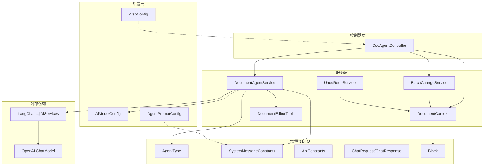
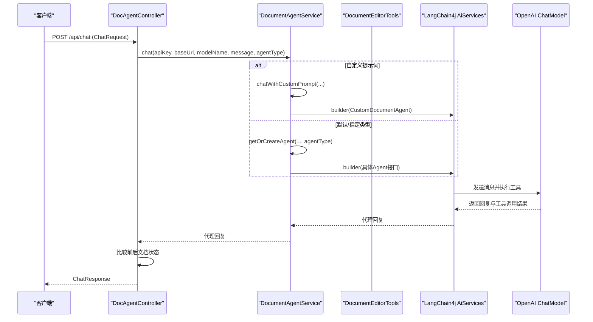
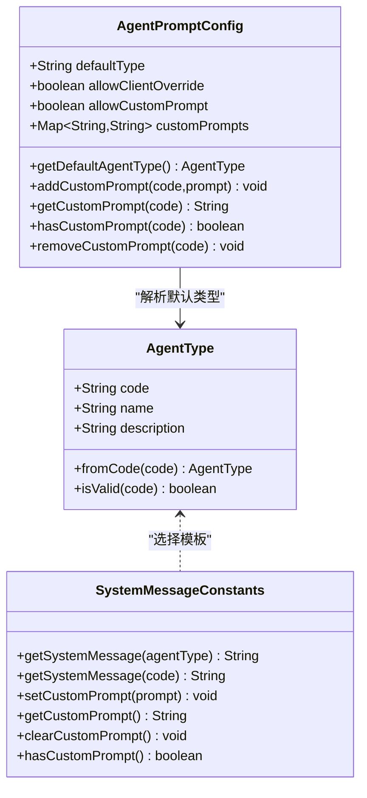
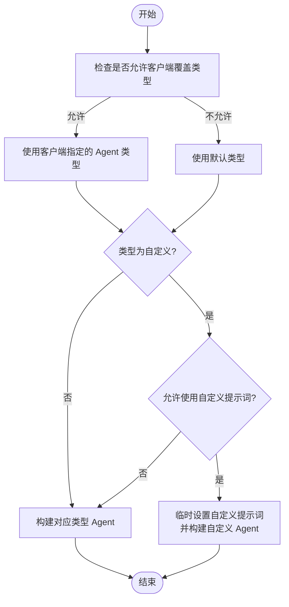
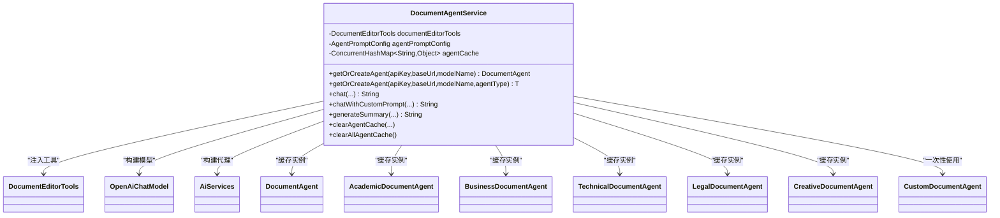
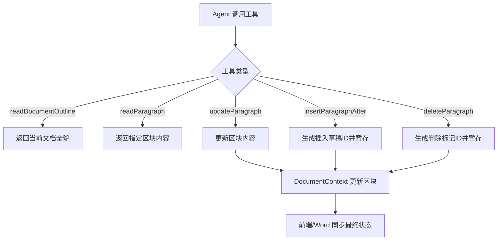
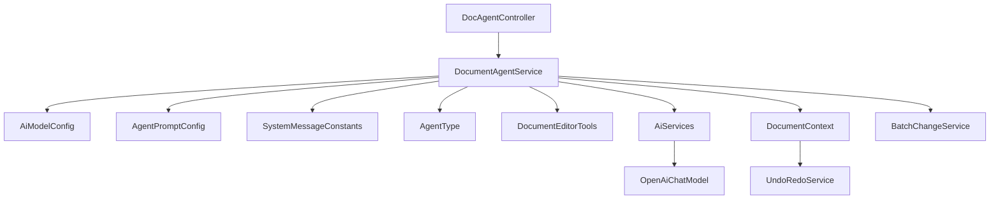

# AI 代理系统

<cite>
**本文引用的文件**
- [AgentType.java](file://src/main/java/com/example/docs_agent/constant/AgentType.java)
- [SystemMessageConstants.java](file://src/main/java/com/example/docs_agent/constant/SystemMessageConstants.java)
- [AgentPromptConfig.java](file://src/main/java/com/example/docs_agent/config/AgentPromptConfig.java)
- [DocumentAgentService.java](file://src/main/java/com/example/docs_agent/service/DocumentAgentService.java)
- [DocAgentController.java](file://src/main/java/com/example/docs_agent/controller/DocAgentController.java)
- [AiModelConfig.java](file://src/main/java/com/example/docs_agent/config/AiModelConfig.java)
- [WebConfig.java](file://src/main/java/com/example/docs_agent/config/WebConfig.java)
- [ChatRequest.java](file://src/main/java/com/example/docs_agent/dto/ChatRequest.java)
- [ChatResponse.java](file://src/main/java/com/example/docs_agent/dto/ChatResponse.java)
- [application.properties](file://src/main/resources/application.properties)
- [DocumentEditorTools.java](file://src/main/java/com/example/docs_agent/service/DocumentEditorTools.java)
- [ApiConstants.java](file://src/main/java/com/example/docs_agent/constant/ApiConstants.java)
- [Block.java](file://src/main/java/com/example/docs_agent/entity/Block.java)
- [DocumentContext.java](file://src/main/java/com/example/docs_agent/service/DocumentContext.java)
- [UndoRedoService.java](file://src/main/java/com/example/docs_agent/service/UndoRedoService.java)
- [BatchChangeService.java](file://src/main/java/com/example/docs_agent/service/BatchChangeService.java)
- [DocsAgentApplication.java](file://src/main/java/com/example/docs_agent/DocsAgentApplication.java)
</cite>

## 目录
1. [简介](#简介)
2. [项目结构](#项目结构)
3. [核心组件](#核心组件)
4. [架构总览](#架构总览)
5. [详细组件分析](#详细组件分析)
6. [依赖分析](#依赖分析)
7. [性能考虑](#性能考虑)
8. [故障排查指南](#故障排查指南)
9. [结论](#结论)
10. [附录](#附录)

## 简介
本项目是一个基于大模型的智能文档编辑代理系统，通过多种 Agent 类型（通用文档助手、学术论文助手、商业文案助手、技术文档助手、法律合同助手、创意写作助手、自定义助手）为用户提供面向不同场景的文档编辑与内容优化能力。系统采用 LangChain4j 的 AiServices 架构，结合工具化文档编辑能力，实现“所想即所得”的文档修改体验。同时，系统提供了灵活的提示词配置机制与工厂模式的 Agent 管理，支持缓存、摘要生成、批量变更、撤销/重做等高级功能。

## 项目结构
系统采用 Spring Boot 分层架构，主要模块如下：
- constant：系统常量与枚举（Agent 类型、系统消息模板、API 常量）
- config：配置类（AI 模型配置、Agent 提示词配置、Web 跨域配置）
- controller：RESTful API 控制器（文档状态、聊天、摘要、提示词管理等）
- service：业务服务（Agent 工厂、文档上下文、工具箱、批量变更、撤销/重做、语法检查等）
- dto：请求/响应数据传输对象
- entity：领域实体（Block）
- util：工具类
- resources：静态资源与配置文件

图表来源
- [DocAgentController.java:32-636](file://src/main/java/com/example/docs_agent/controller/DocAgentController.java#L32-L636)
- [DocumentAgentService.java:19-389](file://src/main/java/com/example/docs_agent/service/DocumentAgentService.java#L19-L389)
- [DocumentContext.java:12-205](file://src/main/java/com/example/docs_agent/service/DocumentContext.java#L12-L205)
- [DocumentEditorTools.java:10-105](file://src/main/java/com/example/docs_agent/service/DocumentEditorTools.java#L10-L105)
- [BatchChangeService.java:16-268](file://src/main/java/com/example/docs_agent/service/BatchChangeService.java#L16-L268)
- [UndoRedoService.java:9-192](file://src/main/java/com/example/docs_agent/service/UndoRedoService.java#L9-L192)
- [AiModelConfig.java:10-50](file://src/main/java/com/example/docs_agent/config/AiModelConfig.java#L10-L50)
- [AgentPromptConfig.java:11-88](file://src/main/java/com/example/docs_agent/config/AgentPromptConfig.java#L11-L88)
- [WebConfig.java:7-25](file://src/main/java/com/example/docs_agent/config/WebConfig.java#L7-L25)
- [AgentType.java:5-87](file://src/main/java/com/example/docs_agent/constant/AgentType.java#L5-L87)
- [SystemMessageConstants.java:6-234](file://src/main/java/com/example/docs_agent/constant/SystemMessageConstants.java#L6-L234)
- [ApiConstants.java:3-53](file://src/main/java/com/example/docs_agent/constant/ApiConstants.java#L3-L53)
- [ChatRequest.java:5-27](file://src/main/java/com/example/docs_agent/dto/ChatRequest.java#L5-L27)
- [ChatResponse.java:6-38](file://src/main/java/com/example/docs_agent/dto/ChatResponse.java#L6-L38)
- [Block.java:6-47](file://src/main/java/com/example/docs_agent/entity/Block.java#L6-L47)

章节来源
- [DocsAgentApplication.java:1-11](file://src/main/java/com/example/docs_agent/DocsAgentApplication.java#L1-L11)
- [application.properties:1-37](file://src/main/resources/application.properties#L1-L37)

## 核心组件
- Agent 类型系统：通过 AgentType 枚举定义七种 Agent 角色，涵盖通用、学术、商业、技术、法律、创意与自定义场景。
- 提示词配置机制：SystemMessageConstants 提供内置系统消息模板；AgentPromptConfig 支持从配置文件加载与动态管理自定义提示词。
- DocumentAgentService 工厂：统一创建、缓存与管理不同类型的 Agent 实例，支持默认与自定义提示词的对话。
- 文档上下文与工具箱：DocumentContext 维护内存中的文档区块；DocumentEditorTools 暴露读取、更新、插入、删除等工具供模型调用。
- 控制器与 API：DocAgentController 提供聊天、摘要、提示词管理、批量变更、撤销/重做等接口。

章节来源
- [AgentType.java:10-87](file://src/main/java/com/example/docs_agent/constant/AgentType.java#L10-L87)
- [SystemMessageConstants.java:10-234](file://src/main/java/com/example/docs_agent/constant/SystemMessageConstants.java#L10-L234)
- [AgentPromptConfig.java:15-88](file://src/main/java/com/example/docs_agent/config/AgentPromptConfig.java#L15-L88)
- [DocumentAgentService.java:19-389](file://src/main/java/com/example/docs_agent/service/DocumentAgentService.java#L19-L389)
- [DocumentContext.java:12-205](file://src/main/java/com/example/docs_agent/service/DocumentContext.java#L12-L205)
- [DocumentEditorTools.java:10-105](file://src/main/java/com/example/docs_agent/service/DocumentEditorTools.java#L10-L105)
- [DocAgentController.java:28-636](file://src/main/java/com/example/docs_agent/controller/DocAgentController.java#L28-L636)

## 架构总览
系统采用“控制器-服务-工具-模型”分层设计，核心交互流程如下：

图表来源
- [DocAgentController.java:345-428](file://src/main/java/com/example/docs_agent/controller/DocAgentController.java#L345-L428)
- [DocumentAgentService.java:140-278](file://src/main/java/com/example/docs_agent/service/DocumentAgentService.java#L140-L278)
- [DocumentEditorTools.java:24-105](file://src/main/java/com/example/docs_agent/service/DocumentEditorTools.java#L24-L105)

## 详细组件分析

### Agent 类型系统
- 通用文档助手：基础文档编辑与排版，适合各类文档的常规修改。
- 学术论文助手：专注学术写作的严谨性与规范性，支持结构优化、语言润色与格式规范。
- 商业文案助手：提升营销与商业文档的说服力与专业性，强调价值主张与行动引导。
- 技术文档助手：强调技术准确性、清晰度与用户导向，优化 API 文档与技术手册。
- 法律合同助手：确保法律文书的严谨性、准确性和条款完整性，提供风险提示与合规检查。
- 创意写作助手：优化叙事结构、人物塑造与文学表达，尊重作者风格与创作意图。
- 自定义助手：允许用户自定义系统提示词，通过配置或接口动态注入。

图表来源
- [AgentType.java:10-87](file://src/main/java/com/example/docs_agent/constant/AgentType.java#L10-L87)
- [SystemMessageConstants.java:169-223](file://src/main/java/com/example/docs_agent/constant/SystemMessageConstants.java#L169-L223)
- [AgentPromptConfig.java:45-86](file://src/main/java/com/example/docs_agent/config/AgentPromptConfig.java#L45-L86)

章节来源
- [AgentType.java:10-87](file://src/main/java/com/example/docs_agent/constant/AgentType.java#L10-L87)
- [SystemMessageConstants.java:39-158](file://src/main/java/com/example/docs_agent/constant/SystemMessageConstants.java#L39-L158)
- [AgentPromptConfig.java:15-88](file://src/main/java/com/example/docs_agent/config/AgentPromptConfig.java#L15-L88)

### 提示词配置机制
- SystemMessageConstants：集中管理各 Agent 类型的系统消息模板，并提供自定义提示词的存储与访问接口。自定义提示词通过并发安全的 Map 存储，并在需要时与基础工具指令拼接。
- AgentPromptConfig：支持从配置文件读取默认 Agent 类型、是否允许前端覆盖类型、是否允许使用自定义提示词，以及按 Agent 类型代码存储自定义提示词。
- 动态配置流程：控制器在接收聊天请求时，根据配置决定是否允许客户端覆盖 Agent 类型；当类型为自定义且允许使用自定义提示词时，通过 DocumentAgentService 的自定义对话接口注入提示词。

图表来源
- [DocAgentController.java:365-403](file://src/main/java/com/example/docs_agent/controller/DocAgentController.java#L365-L403)
- [DocumentAgentService.java:253-278](file://src/main/java/com/example/docs_agent/service/DocumentAgentService.java#L253-L278)
- [AgentPromptConfig.java:23-34](file://src/main/java/com/example/docs_agent/config/AgentPromptConfig.java#L23-L34)

章节来源
- [SystemMessageConstants.java:169-223](file://src/main/java/com/example/docs_agent/constant/SystemMessageConstants.java#L169-L223)
- [AgentPromptConfig.java:15-88](file://src/main/java/com/example/docs_agent/config/AgentPromptConfig.java#L15-L88)
- [DocAgentController.java:365-403](file://src/main/java/com/example/docs_agent/controller/DocAgentController.java#L365-L403)

### DocumentAgentService 工厂模式
- 接口定义：为每种 Agent 类型定义独立接口（如通用、学术、商业、技术、法律、创意），并在接口上标注系统消息注解。
- 实例创建与缓存：根据 API Key、基础 URL、模型名与 Agent 类型组合生成缓存键，使用并发 Map 缓存 Agent 实例，避免重复初始化。
- 工具集成：通过 AiServices.builder 将 DocumentEditorTools 注入到 Agent，使模型能够调用工具读取与修改文档。
- 自定义提示词：通过临时设置 SystemMessageConstants 的自定义提示词，并使用自定义接口实现注入，保证一次性的提示词覆盖。
- 摘要生成：提供专用的摘要生成方法，直接调用模型生成文本，不参与工具链。

图表来源
- [DocumentAgentService.java:36-311](file://src/main/java/com/example/docs_agent/service/DocumentAgentService.java#L36-L311)
- [DocumentEditorTools.java:14-105](file://src/main/java/com/example/docs_agent/service/DocumentEditorTools.java#L14-L105)

章节来源
- [DocumentAgentService.java:19-389](file://src/main/java/com/example/docs_agent/service/DocumentAgentService.java#L19-L389)

### 文档上下文与工具箱
- DocumentContext：维护区块 ID 到 Word 段落索引的映射与内存中的区块集合，提供读取、更新、清空、撤销/重做等功能。
- DocumentEditorTools：向模型暴露工具，包括读取文档全貌、读取指定段落、更新段落、在指定段落后插入新段落、删除段落等。
- 批量变更与撤销/重做：BatchChangeService 支持批量接受/拒绝变更；UndoRedoService 提供撤销/重做历史管理。

图表来源
- [DocumentEditorTools.java:24-105](file://src/main/java/com/example/docs_agent/service/DocumentEditorTools.java#L24-L105)
- [DocumentContext.java:62-81](file://src/main/java/com/example/docs_agent/service/DocumentContext.java#L62-L81)
- [BatchChangeService.java:28-268](file://src/main/java/com/example/docs_agent/service/BatchChangeService.java#L28-L268)
- [UndoRedoService.java:69-154](file://src/main/java/com/example/docs_agent/service/UndoRedoService.java#L69-L154)

章节来源
- [DocumentContext.java:12-205](file://src/main/java/com/example/docs_agent/service/DocumentContext.java#L12-L205)
- [DocumentEditorTools.java:10-105](file://src/main/java/com/example/docs_agent/service/DocumentEditorTools.java#L10-L105)
- [BatchChangeService.java:16-268](file://src/main/java/com/example/docs_agent/service/BatchChangeService.java#L16-L268)
- [UndoRedoService.java:9-192](file://src/main/java/com/example/docs_agent/service/UndoRedoService.java#L9-L192)

### 控制器与 API
- 文档状态管理：提供初始化、锁定选区、增量保存到 Word、获取当前文档状态等接口。
- 聊天与提示词：支持按 Agent 类型聊天、获取 Agent 类型列表、获取指定类型提示词、设置/获取/清除自定义提示词、获取 Agent 配置。
- 摘要生成：根据摘要类型与最大长度生成不同风格的摘要，并提取关键要点。
- 批量变更：支持批量接受/拒绝变更，以及一键接受/拒绝所有待处理变更。

章节来源
- [DocAgentController.java:28-636](file://src/main/java/com/example/docs_agent/controller/DocAgentController.java#L28-L636)

## 依赖分析
- 外部依赖：LangChain4j AiServices 与 OpenAI ChatModel，负责代理构建与模型调用。
- 内部耦合：控制器依赖服务层；服务层依赖配置、常量与工具；工具依赖上下文；工厂依赖工具与配置。
- 配置驱动：AI 模型参数与 Agent 提示词配置由 application.properties 与配置类驱动，支持运行时调整。

图表来源
- [DocAgentController.java:32-636](file://src/main/java/com/example/docs_agent/controller/DocAgentController.java#L32-L636)
- [DocumentAgentService.java:19-389](file://src/main/java/com/example/docs_agent/service/DocumentAgentService.java#L19-L389)
- [AiModelConfig.java:13-50](file://src/main/java/com/example/docs_agent/config/AiModelConfig.java#L13-L50)
- [AgentPromptConfig.java:15-88](file://src/main/java/com/example/docs_agent/config/AgentPromptConfig.java#L15-L88)
- [SystemMessageConstants.java:10-234](file://src/main/java/com/example/docs_agent/constant/SystemMessageConstants.java#L10-L234)
- [AgentType.java:10-87](file://src/main/java/com/example/docs_agent/constant/AgentType.java#L10-L87)
- [DocumentEditorTools.java:14-105](file://src/main/java/com/example/docs_agent/service/DocumentEditorTools.java#L14-L105)
- [DocumentContext.java:16-205](file://src/main/java/com/example/docs_agent/service/DocumentContext.java#L16-L205)
- [UndoRedoService.java:13-192](file://src/main/java/com/example/docs_agent/service/UndoRedoService.java#L13-L192)
- [BatchChangeService.java:16-268](file://src/main/java/com/example/docs_agent/service/BatchChangeService.java#L16-L268)

章节来源
- [application.properties:14-28](file://src/main/resources/application.properties#L14-L28)

## 性能考虑
- 实例缓存：DocumentAgentService 使用并发 Map 以 API Key、基础 URL、模型名与 Agent 类型为键缓存代理实例，避免重复初始化与网络开销。
- 聊天记忆窗口：通过配置项控制聊天记忆窗口大小，平衡上下文长度与性能。
- 摘要生成：摘要生成使用专用模型调用，不参与工具链，减少不必要的工具调用开销。
- 文档长度限制：摘要接口对输入文档长度进行限制，避免超长上下文导致的性能与稳定性问题。
- 并发安全：提示词存储使用并发容器，避免多线程冲突。

章节来源
- [DocumentAgentService.java:111-162](file://src/main/java/com/example/docs_agent/service/DocumentAgentService.java#L111-L162)
- [AiModelConfig.java:38-42](file://src/main/java/com/example/docs_agent/config/AiModelConfig.java#L38-L42)
- [DocAgentController.java:590-595](file://src/main/java/com/example/docs_agent/controller/DocAgentController.java#L590-L595)

## 故障排查指南
- Agent 执行异常：控制器捕获异常并返回统一错误信息，日志记录详细堆栈，便于定位问题。
- 文档为空：聊天与摘要接口在文档为空时返回提示信息，指导用户先初始化文档内容。
- 自定义提示词不可用：若配置禁止使用自定义提示词，控制器会返回相应错误，需检查配置项。
- 缓存清理：当提示词或配置变更后，可通过清理 Agent 缓存使新配置生效。
- 工具调用无效：若 Agent 未调用工具，文档状态不会变化，需确认提示词是否包含必要的工具指令。

章节来源
- [DocAgentController.java:377-408](file://src/main/java/com/example/docs_agent/controller/DocAgentController.java#L377-L408)
- [DocumentAgentService.java:183-191](file://src/main/java/com/example/docs_agent/service/DocumentAgentService.java#L183-L191)

## 结论
本系统通过清晰的分层设计与工厂模式的 Agent 管理，实现了多场景、可扩展的智能文档编辑能力。提示词配置机制与动态注入策略使得系统既具备稳定的内置能力，又支持灵活的定制化需求。配合文档上下文与工具箱，系统能够在保障安全性的同时，提供高效、可控的文档修改体验。

## 附录

### 自定义 Agent 开发指南
- 提示词编写最佳实践
  - 明确角色与职责：为 Agent 设定清晰的能力边界与编辑原则。
  - 保持指令一致性：确保工具使用指令与角色设定一致，避免模型绕过工具直接输出文本。
  - 适配目标受众：根据应用场景调整语言风格与表达方式。
- Agent 生命周期管理
  - 工厂缓存：利用 DocumentAgentService 的缓存机制降低实例创建成本。
  - 配置驱动：通过 AgentPromptConfig 管理默认类型与自定义提示词，支持运行时调整。
  - 状态同步：通过 DocumentContext 与工具箱确保模型修改与内存状态一致。
- 性能优化策略
  - 合理设置聊天记忆窗口，避免过长上下文影响性能。
  - 对超长文档进行截断或分段处理，保证摘要与聊天质量。
  - 使用专用模型调用生成摘要，避免工具链开销。

章节来源
- [SystemMessageConstants.java:169-223](file://src/main/java/com/example/docs_agent/constant/SystemMessageConstants.java#L169-L223)
- [AgentPromptConfig.java:15-88](file://src/main/java/com/example/docs_agent/config/AgentPromptConfig.java#L15-L88)
- [DocumentAgentService.java:111-162](file://src/main/java/com/example/docs_agent/service/DocumentAgentService.java#L111-L162)
- [DocAgentController.java:590-595](file://src/main/java/com/example/docs_agent/controller/DocAgentController.java#L590-L595)