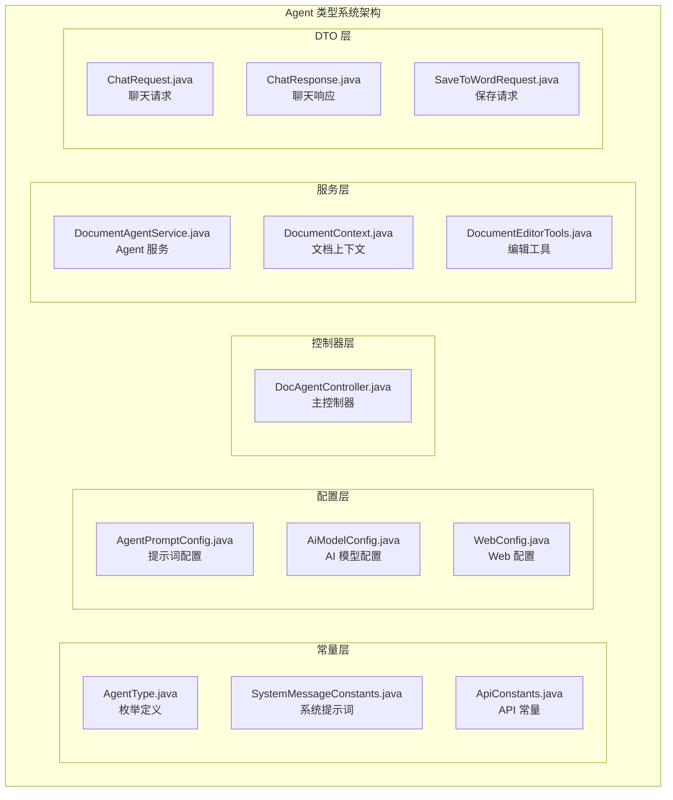
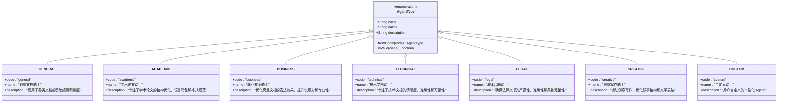
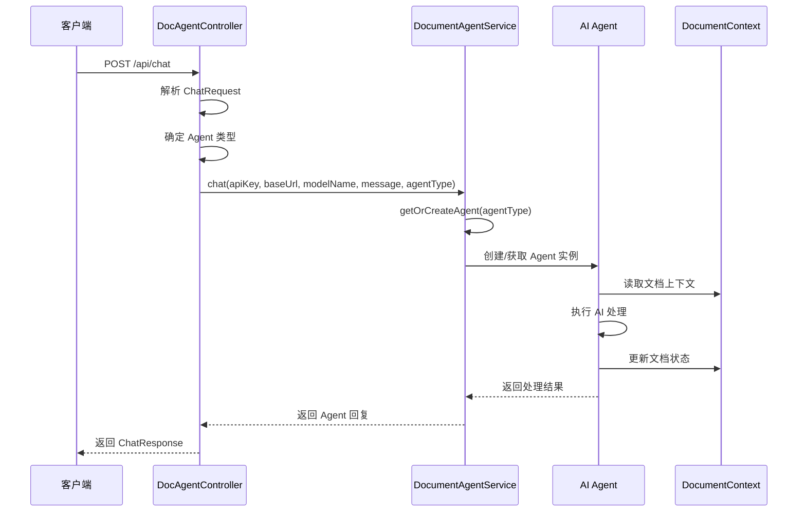
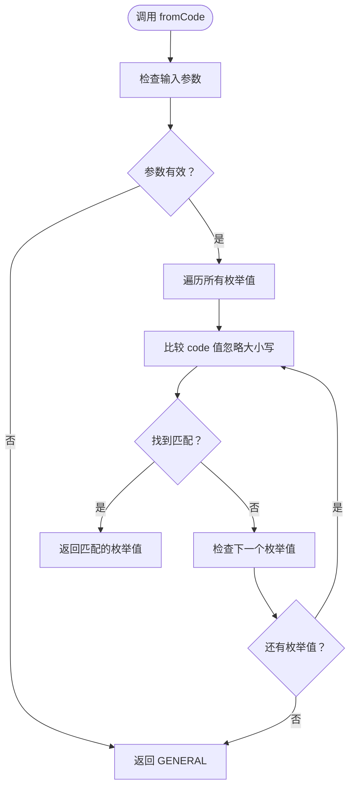
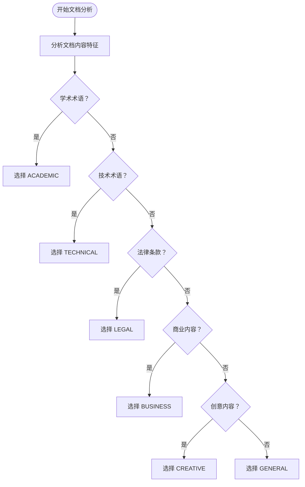
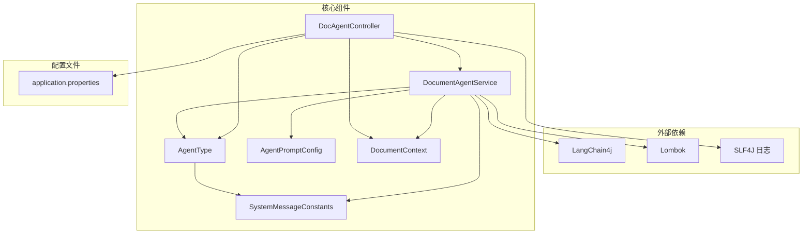

# Agent 类型系统

<cite>
**本文档引用的文件**
- [AgentType.java](file://src/main/java/com/example/docs_agent/constant/AgentType.java)
- [SystemMessageConstants.java](file://src/main/java/com/example/docs_agent/constant/SystemMessageConstants.java)
- [AgentPromptConfig.java](file://src/main/java/com/example/docs_agent/config/AgentPromptConfig.java)
- [DocAgentController.java](file://src/main/java/com/example/docs_agent/controller/DocAgentController.java)
- [DocumentAgentService.java](file://src/main/java/com/example/docs_agent/service/DocumentAgentService.java)
- [ChatRequest.java](file://src/main/java/com/example/docs_agent/dto/ChatRequest.java)
- [DocumentContext.java](file://src/main/java/com/example/docs_agent/service/DocumentContext.java)
- [application.properties](file://src/main/resources/application.properties)
</cite>

## 目录
1. [简介](#简介)
2. [项目结构](#项目结构)
3. [核心组件](#核心组件)
4. [架构概览](#架构概览)
5. [详细组件分析](#详细组件分析)
6. [依赖关系分析](#依赖关系分析)
7. [性能考虑](#性能考虑)
8. [故障排除指南](#故障排除指南)
9. [结论](#结论)

## 简介

Agent 类型系统是文档智能编辑平台的核心功能模块，基于 LangChain4j 框架构建，为不同场景提供专门的 AI Agent 助手。该系统通过枚举类型管理七种预定义的 Agent 类型，每种类型都针对特定的文档编辑需求进行了专业化设计，同时提供了灵活的扩展机制以支持自定义 Agent。

系统采用分层架构设计，通过控制器层接收 API 请求，服务层管理 Agent 实例和缓存，常量层定义系统提示词，配置层提供运行时参数控制。这种设计确保了系统的可扩展性、可维护性和高性能。

## 项目结构

Agent 类型系统位于 `src/main/java/com/example/docs_agent/` 目录下，采用按功能域划分的包结构：



**图表来源**
- [AgentType.java:1-87](file://src/main/java/com/example/docs_agent/constant/AgentType.java#L1-L87)
- [SystemMessageConstants.java:1-234](file://src/main/java/com/example/docs_agent/constant/SystemMessageConstants.java#L1-L234)
- [DocAgentController.java:1-636](file://src/main/java/com/example/docs_agent/controller/DocAgentController.java#L1-L636)

**章节来源**
- [AgentType.java:1-87](file://src/main/java/com/example/docs_agent/constant/AgentType.java#L1-L87)
- [SystemMessageConstants.java:1-234](file://src/main/java/com/example/docs_agent/constant/SystemMessageConstants.java#L1-L234)
- [DocAgentController.java:1-636](file://src/main/java/com/example/docs_agent/controller/DocAgentController.java#L1-L636)

## 核心组件

### AgentType 枚举系统

AgentType 是整个系统的核心枚举类，定义了七种预设的 Agent 类型。每个枚举值包含三个关键属性：`code`（代码标识）、`name`（显示名称）和 `description`（功能描述）。



**图表来源**
- [AgentType.java:10-45](file://src/main/java/com/example/docs_agent/constant/AgentType.java#L10-L45)

### 系统提示词管理

SystemMessageConstants 类负责管理所有 Agent 类型的系统提示词，采用静态常量的方式存储，并提供动态获取和自定义提示词的支持。

**章节来源**
- [AgentType.java:1-87](file://src/main/java/com/example/docs_agent/constant/AgentType.java#L1-L87)
- [SystemMessageConstants.java:1-234](file://src/main/java/com/example/docs_agent/constant/SystemMessageConstants.java#L1-L234)

## 架构概览

Agent 类型系统采用典型的三层架构模式，通过清晰的职责分离实现了高内聚低耦合的设计。



**图表来源**
- [DocAgentController.java:354-428](file://src/main/java/com/example/docs_agent/controller/DocAgentController.java#L354-L428)
- [DocumentAgentService.java:203-240](file://src/main/java/com/example/docs_agent/service/DocumentAgentService.java#L203-L240)

**章节来源**
- [DocAgentController.java:1-636](file://src/main/java/com/example/docs_agent/controller/DocAgentController.java#L1-L636)
- [DocumentAgentService.java:1-389](file://src/main/java/com/example/docs_agent/service/DocumentAgentService.java#L1-L389)

## 详细组件分析

### Agent 类型详解

#### GENERAL（通用文档助手）
- **代码标识**: `general`
- **核心功能**: 基础文档编辑和排版
- **适用场景**: 通用文档处理、基础格式调整、内容优化
- **使用限制**: 无特殊限制，适用于所有文档类型
- **设计特点**: 作为默认 Agent，提供最基础但最稳定的文档编辑能力

#### ACADEMIC（学术论文助手）
- **代码标识**: `academic`
- **核心功能**: 学术论文的专业编辑和格式规范
- **适用场景**: 学术论文、研究报告、毕业论文
- **使用限制**: 需要遵循学术写作规范，避免过度修改原意
- **设计特点**: 专注于学术语言优化、结构完整性检查、引用格式规范

#### BUSINESS（商业文案助手）
- **代码标识**: `business`
- **核心功能**: 商业文档的表达效果优化
- **适用场景**: 商业计划书、营销方案、产品介绍
- **使用限制**: 需要保持商业信息的准确性和说服力
- **设计特点**: 强调营销语言优化、价值主张提炼、行动引导设计

#### TECHNICAL（技术文档助手）
- **代码标识**: `technical`
- **核心功能**: 技术文档的清晰度和准确性
- **适用场景**: 技术手册、API 文档、开发指南
- **使用限制**: 必须确保技术术语的准确性和一致性
- **设计特点**: 注重技术准确性、代码示例质量、用户导向设计

#### LEGAL（法律合同助手）
- **代码标识**: `legal`
- **核心功能**: 法律文书的严谨性检查
- **适用场景**: 合同协议、法律文件、合规文档
- **使用限制**: 仅提供编辑建议，不构成法律意见
- **设计特点**: 强调条款完整性、语言严谨性、风险提示

#### CREATIVE（创意写作助手）
- **代码标识**: `creative`
- **核心功能**: 创意内容的文学表达优化
- **适用场景**: 小说、故事、创意写作
- **使用限制**: 尊重作者创作风格和意图
- **设计特点**: 关注叙事结构、人物塑造、场景描写

#### CUSTOM（自定义助手）
- **代码标识**: `custom`
- **核心功能**: 用户自定义的个性化 Agent
- **适用场景**: 特殊业务需求、定制化工作流程
- **使用限制**: 需要配合自定义提示词使用
- **设计特点**: 灵活的扩展机制，支持动态配置

### 设计模式分析

#### 枚举值定义模式
AgentType 采用标准的 Java 枚举定义，每个枚举值包含完整的元数据信息：
- **构造函数**: 接收 code、name、description 参数
- **字段封装**: 使用 `@Getter` 注解提供只读访问
- **类型安全**: 编译时保证枚举值的有效性

#### Code 映射机制
系统通过 `code` 字段实现人类可读的标识符与内部枚举值的映射：
- **统一标识**: 使用小写字母和连字符命名约定
- **国际化友好**: code 值便于前端显示和用户理解
- **向后兼容**: 保持稳定的标识符避免破坏性变更

#### 查找逻辑实现
`fromCode()` 方法实现了高效的枚举值查找：


**图表来源**
- [AgentType.java:63-70](file://src/main/java/com/example/docs_agent/constant/AgentType.java#L63-L70)

#### 验证功能实现
`isValid()` 方法提供了快速的类型验证：
- **性能优化**: 使用相同的查找算法但只返回布尔值
- **安全性**: 防止无效的 Agent 类型参数
- **用户体验**: 提供清晰的错误反馈

**章节来源**
- [AgentType.java:57-85](file://src/main/java/com/example/docs_agent/constant/AgentType.java#L57-L85)

### 实际使用示例

#### API 调用示例

**基本聊天请求**
```json
{
  "message": "请帮我优化这段文档的表达",
  "agentType": "academic",
  "customSystemPrompt": null
}
```

**自定义 Agent 使用**
```json
{
  "message": "请检查代码示例的正确性",
  "agentType": "custom",
  "customSystemPrompt": "你是一个专业的代码审查专家，专注于检查代码示例的语法正确性和最佳实践"
}
```

**批量 Agent 类型查询**
```json
GET /api/agent-types
```

**系统提示词获取**
```json
GET /api/agent-prompt/technical
```

#### 自动类型选择策略

系统支持基于文档内容的智能 Agent 类型选择：



**图表来源**
- [DocAgentController.java:365-373](file://src/main/java/com/example/docs_agent/controller/DocAgentController.java#L365-L373)

**章节来源**
- [ChatRequest.java:1-27](file://src/main/java/com/example/docs_agent/dto/ChatRequest.java#L1-L27)
- [DocAgentController.java:354-428](file://src/main/java/com/example/docs_agent/controller/DocAgentController.java#L354-L428)

## 依赖关系分析

Agent 类型系统各组件之间的依赖关系体现了清晰的分层架构：



**图表来源**
- [DocumentAgentService.java:1-389](file://src/main/java/com/example/docs_agent/service/DocumentAgentService.java#L1-L389)
- [DocAgentController.java:1-636](file://src/main/java/com/example/docs_agent/controller/DocAgentController.java#L1-L636)

**章节来源**
- [DocumentAgentService.java:1-389](file://src/main/java/com/example/docs_agent/service/DocumentAgentService.java#L1-L389)
- [DocAgentController.java:1-636](file://src/main/java/com/example/docs_agent/controller/DocAgentController.java#L1-L636)

## 性能考虑

### 缓存策略
系统采用多层缓存机制优化性能：

1. **Agent 实例缓存**: 使用 `ConcurrentHashMap` 存储已创建的 Agent 实例
2. **配置缓存**: 缓存 Agent 类型配置和系统提示词
3. **文档状态缓存**: 维护文档的内存状态以支持撤销/重做功能

### 内存管理
- **弱引用策略**: 避免长时间运行导致的内存泄漏
- **超时机制**: 设置合理的连接超时和请求超时
- **资源清理**: 提供显式的资源清理接口

### 并发安全
- **线程安全**: 所有共享状态使用线程安全的数据结构
- **原子操作**: 关键操作使用原子操作确保数据一致性
- **锁策略**: 最小化锁的粒度避免性能瓶颈

## 故障排除指南

### 常见问题诊断

**Agent 类型无效**
- 检查 `agentType` 参数是否为有效的枚举值
- 验证配置文件中的 `agent.prompt.allow-client-override` 设置
- 确认客户端是否正确传递了 Agent 类型参数

**文档为空错误**
- 确保在调用聊天功能前已初始化文档状态
- 检查 `/api/init-document` 接口是否正确调用
- 验证文档内容是否包含有效文本

**自定义提示词不生效**
- 检查 `agent.prompt.allow-custom-prompt` 配置
- 确认自定义提示词是否正确设置
- 验证 Agent 缓存是否需要清理

**性能问题**
- 监控 Agent 实例缓存大小
- 检查内存使用情况
- 优化文档内容长度避免超时

**章节来源**
- [DocAgentController.java:377-387](file://src/main/java/com/example/docs_agent/controller/DocAgentController.java#L377-L387)
- [DocumentAgentService.java:295-310](file://src/main/java/com/example/docs_agent/service/DocumentAgentService.java#L295-L310)

## 结论

Agent 类型系统通过精心设计的枚举体系、灵活的配置机制和高效的实现模式，为文档智能编辑提供了强大而易用的基础设施。系统的主要优势包括：

1. **类型安全**: 通过枚举确保 Agent 类型的正确性
2. **扩展性强**: 支持自定义 Agent 类型和提示词
3. **性能优化**: 多层缓存和并发安全设计
4. **易于使用**: 清晰的 API 接口和配置选项
5. **可维护性**: 分层架构和模块化设计

该系统为各种文档编辑场景提供了专业化的 AI 助手，通过七种预定义的 Agent 类型满足了从基础文档编辑到专业领域应用的广泛需求，同时保持了足够的灵活性以适应未来的扩展需求。