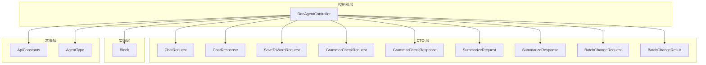
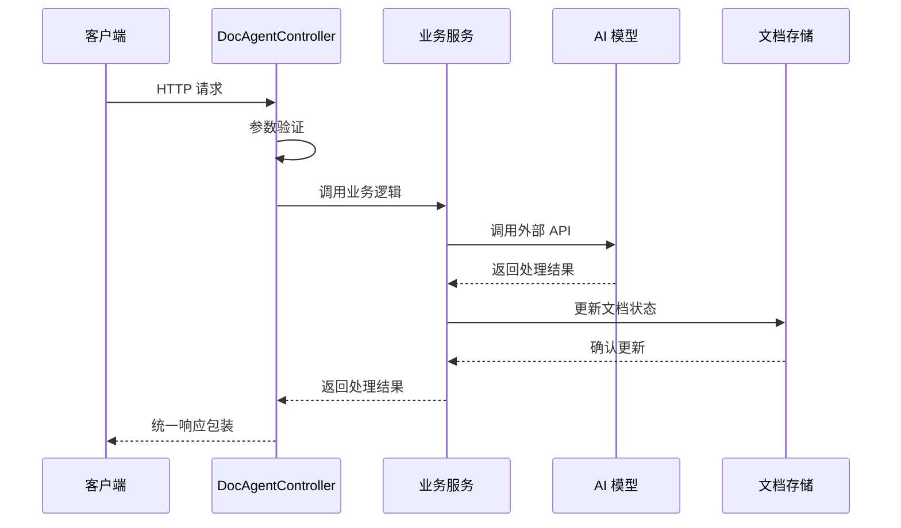
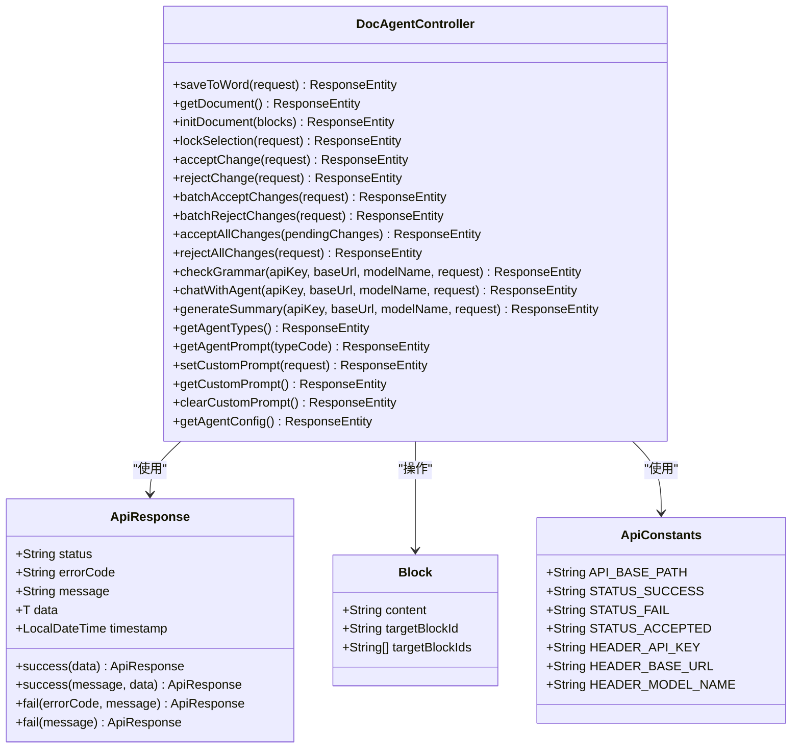

# API 接口文档

<cite>
**本文档引用的文件**
- [DocAgentController.java](file://src/main/java/com/example/docs_agent/controller/DocAgentController.java)
- [ApiConstants.java](file://src/main/java/com/example/docs_agent/constant/ApiConstants.java)
- [AgentType.java](file://src/main/java/com/example/docs_agent/constant/AgentType.java)
- [application.properties](file://src/main/resources/application.properties)
- [ChatRequest.java](file://src/main/java/com/example/docs_agent/dto/ChatRequest.java)
- [ChatResponse.java](file://src/main/java/com/example/docs_agent/dto/ChatResponse.java)
- [SaveToWordRequest.java](file://src/main/java/com/example/docs_agent/dto/SaveToWordRequest.java)
- [GrammarCheckRequest.java](file://src/main/java/com/example/docs_agent/dto/GrammarCheckRequest.java)
- [GrammarCheckResponse.java](file://src/main/java/com/example/docs_agent/dto/GrammarCheckResponse.java)
- [SummarizeRequest.java](file://src/main/java/com/example/docs_agent/dto/SummarizeRequest.java)
- [SummarizeResponse.java](file://src/main/java/com/example/docs_agent/dto/SummarizeResponse.java)
- [BatchChangeRequest.java](file://src/main/java/com/example/docs_agent/dto/BatchChangeRequest.java)
- [BatchChangeResult.java](file://src/main/java/com/example/docs_agent/dto/BatchChangeResult.java)
- [Block.java](file://src/main/java/com/example/docs_agent/entity/Block.java)
</cite>

## 目录
1. [简介](#简介)
2. [项目结构](#项目结构)
3. [核心组件](#核心组件)
4. [架构概览](#架构概览)
5. [详细组件分析](#详细组件分析)
6. [依赖分析](#依赖分析)
7. [性能考虑](#性能考虑)
8. [故障排除指南](#故障排除指南)
9. [结论](#结论)
10. [附录](#附录)

## 简介
本项目是一个基于 Spring Boot 的文档智能助手后端服务，提供 RESTful API 接口，支持文档内容的增删改查、增量保存到 Word、全文语法检查、智能摘要生成以及与 AI Agent 的对话交互。所有接口均通过统一的响应包装类进行返回，并在控制器中实现了完善的错误处理和日志记录。

## 项目结构
项目采用标准的 Spring Boot 结构，主要包含以下模块：
- controller 层：处理 HTTP 请求和响应
- dto 层：数据传输对象，定义请求和响应格式
- service 层：业务逻辑处理（在控制器中直接注入）
- entity 层：数据实体定义
- constant 层：常量定义
- config 层：配置类（AgentPromptConfig、AiModelConfig、WebConfig）



**图表来源**
- [DocAgentController.java:1-636](file://src/main/java/com/example/docs_agent/controller/DocAgentController.java#L1-L636)
- [ApiConstants.java:1-53](file://src/main/java/com/example/docs_agent/constant/ApiConstants.java#L1-L53)
- [AgentType.java:1-87](file://src/main/java/com/example/docs_agent/constant/AgentType.java#L1-L87)

**章节来源**
- [DocAgentController.java:1-636](file://src/main/java/com/example/docs_agent/controller/DocAgentController.java#L1-L636)
- [application.properties:1-37](file://src/main/resources/application.properties#L1-L37)

## 核心组件
本项目的核心组件包括：

### 统一响应包装
所有 API 响应都遵循统一的包装格式，包含状态码、错误码、消息和数据体。

### 常量定义
- API 基础路径：/api
- 请求头常量：X-API-Key、X-Base-URL、X-Model-Name
- 默认模型配置：SiliconFlow API
- 区块 ID 前缀：p_、insert_after_、delete_
- 特殊标记：[DELETED_MARKER]、AI_Target

### Agent 类型枚举
支持多种预设的 Agent 类型，包括通用文档助手、学术论文助手、商业文案助手等。

**章节来源**
- [ApiConstants.java:1-53](file://src/main/java/com/example/docs_agent/constant/ApiConstants.java#L1-L53)
- [AgentType.java:1-87](file://src/main/java/com/example/docs_agent/constant/AgentType.java#L1-L87)

## 架构概览
系统采用分层架构设计，控制器负责处理 HTTP 请求，服务层处理业务逻辑，DTO 层负责数据传输，实体层定义数据结构。



**图表来源**
- [DocAgentController.java:354-428](file://src/main/java/com/example/docs_agent/controller/DocAgentController.java#L354-L428)

## 详细组件分析

### /api/chat - AI 对话接口
用于与 AI Agent 进行对话交互，支持多种 Agent 类型和自定义提示词。

**HTTP 方法和 URL**
- 方法：POST
- 路径：/api/chat

**请求头参数**
- X-API-Key：AI 服务 API 密钥
- X-Base-URL：AI 服务基础 URL
- X-Model-Name：模型名称

**请求体参数**
- message：用户消息内容（必填）
- agentType：Agent 类型代码（可选，默认 general）
- customSystemPrompt：自定义系统提示词（可选）

**响应参数**
- reply：AI 回复内容
- document：当前文档状态（序列化后的区块内容）
- changed：文档是否发生变更
- status：状态描述
- error：错误信息（如有）

**请求示例**
```json
{
  "message": "请帮我优化这段文档",
  "agentType": "general",
  "customSystemPrompt": ""
}
```

**响应示例**
```json
{
  "reply": "这是 AI 的回复内容",
  "document": "序列化的文档状态",
  "changed": true,
  "status": "文档状态已更新",
  "error": null
}
```

**错误处理**
- 文档为空时返回警告信息
- Agent 执行异常时返回错误信息
- 参数验证失败返回 400 状态码

**章节来源**
- [DocAgentController.java:354-428](file://src/main/java/com/example/docs_agent/controller/DocAgentController.java#L354-L428)
- [ChatRequest.java:1-27](file://src/main/java/com/example/docs_agent/dto/ChatRequest.java#L1-L27)
- [ChatResponse.java:1-38](file://src/main/java/com/example/docs_agent/dto/ChatResponse.java#L1-L38)

### /api/save-to-word - 增量保存到 Word
将文档变更增量保存到 Word 文档中，只修改有变更的段落。

**HTTP 方法和 URL**
- 方法：POST
- 路径：/api/save-to-word

**请求体参数**
- docxPath：Word 文档路径（必填）

**响应参数**
- status：success 或 fail
- message：操作结果消息
- errorCode：错误码（如有）
- data：null

**请求示例**
```json
{
  "docxPath": "C:/documents/example.docx"
}
```

**响应示例**
```json
{
  "status": "success",
  "message": "文档保存成功",
  "errorCode": null,
  "data": null,
  "timestamp": "2024-01-01T12:00:00"
}
```

**错误处理**
- IO 异常时返回 500 状态码
- 保存失败时返回具体错误信息

**章节来源**
- [DocAgentController.java:51-66](file://src/main/java/com/example/docs_agent/controller/DocAgentController.java#L51-L66)
- [SaveToWordRequest.java:1-16](file://src/main/java/com/example/docs_agent/dto/SaveToWordRequest.java#L1-L16)

### /api/document - 获取文档状态
获取当前文档的所有区块映射状态。

**HTTP 方法和 URL**
- 方法：GET
- 路径：/api/document

**响应参数**
- status：success
- message：操作结果消息
- data：区块映射（key: 区块ID, value: Block 对象）
- timestamp：响应时间戳

**响应示例**
```json
{
  "status": "success",
  "message": null,
  "data": {
    "p_1": {
      "content": "段落1内容",
      "targetBlockId": null,
      "targetBlockIds": null
    }
  },
  "timestamp": "2024-01-01T12:00:00"
}
```

**章节来源**
- [DocAgentController.java:73-78](file://src/main/java/com/example/docs_agent/controller/DocAgentController.java#L73-L78)

### /api/grammar-check - 全文语法检查
对文档进行语法检查，支持选择特定区块进行检查。

**HTTP 方法和 URL**
- 方法：POST
- 路径：/api/grammar-check

**请求头参数**
- X-API-Key：AI 服务 API 密钥
- X-Base-URL：AI 服务基础 URL
- X-Model-Name：模型名称

**请求体参数**
- blockIds：要检查的区块ID列表（可选，为空则检查全部）
- autoApply：是否自动应用建议的修改（可选）

**响应参数**
- status：success 或 error
- message：检查结果消息
- totalChecked：检查的总段落数
- errorCount：发现的问题数量
- results：检查结果列表
- summary：检查总结

**检查结果项参数**
- blockId：区块ID
- originalText：原始文本
- hasError：是否有错误
- errorDescription：错误描述
- suggestedCorrection：建议的修正
- severity：严重程度（1=建议, 2=轻微, 3=严重）
- severityLabel：严重程度标签

**请求示例**
```json
{
  "blockIds": ["p_1", "p_2"],
  "autoApply": false
}
```

**响应示例**
```json
{
  "status": "success",
  "message": "检查完成",
  "totalChecked": 5,
  "errorCount": 2,
  "results": [
    {
      "blockId": "p_1",
      "originalText": "这是测试文本",
      "hasError": true,
      "errorDescription": "语法错误",
      "suggestedCorrection": "修正后的文本",
      "severity": 2,
      "severityLabel": "轻微"
    }
  ],
  "summary": "检查完成，发现2个问题"
}
```

**错误处理**
- 文档为空时返回错误状态
- 语法检查异常时返回错误信息

**章节来源**
- [DocAgentController.java:271-343](file://src/main/java/com/example/docs_agent/controller/DocAgentController.java#L271-L343)
- [GrammarCheckRequest.java:1-23](file://src/main/java/com/example/docs_agent/dto/GrammarCheckRequest.java#L1-L23)
- [GrammarCheckResponse.java:1-60](file://src/main/java/com/example/docs_agent/dto/GrammarCheckResponse.java#L1-L60)

### /api/summarize - 智能摘要生成
生成文档的智能摘要，支持多种摘要类型和长度限制。

**HTTP 方法和 URL**
- 方法：POST
- 路径：/api/summarize

**请求头参数**
- X-API-Key：AI 服务 API 密钥
- X-Base-URL：AI 服务基础 URL
- X-Model-Name：模型名称

**请求体参数**
- summaryType：摘要类型（可选，默认 outline）
  - brief：一句话摘要
  - outline：大纲式摘要
  - detailed：详细摘要
  - keypoints：关键要点
- maxLength：最大长度限制（可选，默认 500）
- language：目标语言（可选，默认 zh）

**响应参数**
- status：success 或 error
- message：摘要生成结果消息
- summary：摘要内容
- keyPoints：关键要点列表（可选）
- originalWordCount：原文档字数统计
- summaryWordCount：摘要字数统计
- summaryType：摘要类型
- compressionRatio：压缩比率

**请求示例**
```json
{
  "summaryType": "outline",
  "maxLength": 500,
  "language": "zh"
}
```

**响应示例**
```json
{
  "status": "success",
  "message": "摘要生成成功",
  "summary": "这是生成的摘要内容",
  "keyPoints": ["要点1", "要点2"],
  "originalWordCount": 1000,
  "summaryWordCount": 200,
  "summaryType": "outline",
  "compressionRatio": "20.0%"
}
```

**错误处理**
- 文档为空时返回错误状态
- 摘要生成异常时返回错误信息

**章节来源**
- [DocAgentController.java:559-634](file://src/main/java/com/example/docs_agent/controller/DocAgentController.java#L559-L634)
- [SummarizeRequest.java:1-27](file://src/main/java/com/example/docs_agent/dto/SummarizeRequest.java#L1-L27)
- [SummarizeResponse.java:1-55](file://src/main/java/com/example/docs_agent/dto/SummarizeResponse.java#L1-L55)

### 批量变更操作接口

#### /api/batch-accept - 批量接受变更
批量接受多个待处理的文档变更。

**HTTP 方法和 URL**
- 方法：POST
- 路径：/api/batch-accept

**请求体参数**
- changes：变更请求列表（必填）
- operationType：操作类型（固定为 accept）
- originalBlocks：原始区块状态（可选）

**响应参数**
- successIds：操作成功的区块ID列表
- failedIds：操作失败的区块ID列表
- successCount：成功数量
- failedCount：失败数量
- message：操作结果消息

**章节来源**
- [DocAgentController.java:182-187](file://src/main/java/com/example/docs_agent/controller/DocAgentController.java#L182-L187)
- [BatchChangeRequest.java:1-30](file://src/main/java/com/example/docs_agent/dto/BatchChangeRequest.java#L1-L30)
- [BatchChangeResult.java:1-40](file://src/main/java/com/example/docs_agent/dto/BatchChangeResult.java#L1-L40)

#### /api/batch-reject - 批量拒绝变更
批量拒绝多个待处理的文档变更。

**HTTP 方法和 URL**
- 方法：POST
- 路径：/api/batch-reject

**请求体参数**
- changes：变更请求列表（必填）
- operationType：操作类型（固定为 reject）
- originalBlocks：原始区块状态（可选）

**响应参数**
- successIds：操作成功的区块ID列表
- failedIds：操作失败的区块ID列表
- successCount：成功数量
- failedCount：失败数量
- message：操作结果消息

**章节来源**
- [DocAgentController.java:195-200](file://src/main/java/com/example/docs_agent/controller/DocAgentController.java#L195-L200)

#### /api/accept-all - 接受所有变更
接受所有当前待处理的变更。

**HTTP 方法和 URL**
- 方法：POST
- 路径：/api/accept-all

**请求体参数**
- pendingChanges：待处理变更映射（key: 区块ID, value: Block 对象）

**响应参数**
- successIds：操作成功的区块ID列表
- failedIds：操作失败的区块ID列表
- successCount：成功数量
- failedCount：失败数量
- message：操作结果消息

**章节来源**
- [DocAgentController.java:208-226](file://src/main/java/com/example/docs_agent/controller/DocAgentController.java#L208-L226)

#### /api/reject-all - 拒绝所有变更
拒绝所有当前待处理的变更。

**HTTP 方法和 URL**
- 方法：POST
- 路径：/api/reject-all

**请求体参数**
- changes：变更请求列表（必填）
- operationType：操作类型（固定为 reject）
- originalBlocks：原始区块状态（可选）

**响应参数**
- successIds：操作成功的区块ID列表
- failedIds：操作失败的区块ID列表
- successCount：成功数量
- failedCount：失败数量
- message：操作结果消息

**章节来源**
- [DocAgentController.java:234-260](file://src/main/java/com/example/docs_agent/controller/DocAgentController.java#L234-L260)

### Agent 类型管理接口

#### /api/agent-types - 获取所有可用的 Agent 类型
获取系统支持的所有 Agent 类型列表。

**HTTP 方法和 URL**
- 方法：GET
- 路径：/api/agent-types

**响应参数**
- code：Agent 类型代码
- name：Agent 类型名称
- description：Agent 类型描述

**章节来源**
- [DocAgentController.java:437-448](file://src/main/java/com/example/docs_agent/controller/DocAgentController.java#L437-L448)
- [AgentType.java:1-87](file://src/main/java/com/example/docs_agent/constant/AgentType.java#L1-L87)

#### /api/agent-prompt/{typeCode} - 获取指定 Agent 类型的系统提示词
获取指定 Agent 类型的系统提示词内容。

**HTTP 方法和 URL**
- 方法：GET
- 路径：/api/agent-prompt/{typeCode}

**路径参数**
- typeCode：Agent 类型代码（必填）

**响应参数**
- typeCode：Agent 类型代码
- typeName：Agent 类型名称
- prompt：系统提示词内容

**章节来源**
- [DocAgentController.java:456-467](file://src/main/java/com/example/docs_agent/controller/DocAgentController.java#L456-L467)

#### /api/custom-prompt - 自定义提示词管理
支持设置、获取和清除自定义系统提示词。

**HTTP 方法和 URL**
- GET /api/custom-prompt：获取当前自定义提示词状态
- POST /api/custom-prompt：设置自定义提示词
- DELETE /api/custom-prompt：清除自定义提示词

**POST 请求体参数**
- prompt：自定义提示词内容（必填）

**响应参数**
- hasCustomPrompt：是否存在自定义提示词
- allowCustomPrompt：是否允许使用自定义提示词
- prompt：自定义提示词内容（可选）
- length：提示词长度（可选）

**章节来源**
- [DocAgentController.java:475-530](file://src/main/java/com/example/docs_agent/controller/DocAgentController.java#L475-L530)

#### /api/agent-config - 获取当前 Agent 配置信息
获取 Agent 的当前配置状态。

**HTTP 方法和 URL**
- 方法：GET
- 路径：/api/agent-config

**响应参数**
- defaultType：默认 Agent 类型
- allowClientOverride：是否允许客户端覆盖
- allowCustomPrompt：是否允许使用自定义提示词
- hasCustomPrompt：是否存在自定义提示词

**章节来源**
- [DocAgentController.java:537-546](file://src/main/java/com/example/docs_agent/controller/DocAgentController.java#L537-L546)

### 文档状态管理接口

#### /api/init-document - 初始化文档状态
初始化文档状态，清空现有内容并设置新的区块。

**HTTP 方法和 URL**
- 方法：POST
- 路径：/api/init-document

**请求体参数**
- blocks：区块映射（key: 区块ID, value: 区块内容）

**响应参数**
- status：success
- message：操作结果消息
- data：null

**章节来源**
- [DocAgentController.java:86-96](file://src/main/java/com/example/docs_agent/controller/DocAgentController.java#L86-L96)

#### /api/lock-selection - 锁定选区
锁定用户选中的文本区域，创建 ai_selection 区块。

**HTTP 方法和 URL**
- 方法：POST
- 路径：/api/lock-selection

**请求体参数**
- selectedText：选中的文本内容（必填）
- blockId：区块ID（可选，默认 ai_selection）
- targetBlockId：目标区块ID（可选）

**响应参数**
- status：success
- message：操作结果消息
- data：null

**章节来源**
- [DocAgentController.java:104-126](file://src/main/java/com/example/docs_agent/controller/DocAgentController.java#L104-L126)

#### /api/accept - 接受变更
接受单个区块的变更，支持 ai_selection 与目标区块的同步更新。

**HTTP 方法和 URL**
- 方法：POST
- 路径：/api/accept

**请求体参数**
- blockId：区块ID（必填）
- newText：新文本内容（可选）
- targetBlockId：目标区块ID（可选）

**响应参数**
- status：success 或 accepted
- message：操作结果消息
- data：null

**章节来源**
- [DocAgentController.java:134-157](file://src/main/java/com/example/docs_agent/controller/DocAgentController.java#L134-L157)

#### /api/reject - 拒绝变更
拒绝单个区块的变更，恢复到原始状态。

**HTTP 方法和 URL**
- 方法：POST
- 路径：/api/reject

**请求体参数**
- blockId：区块ID（必填）
- oldText：原始文本内容（必填）
- targetBlockId：目标区块ID（可选）

**响应参数**
- status：success
- message：操作结果消息
- data：null

**章节来源**
- [DocAgentController.java:165-174](file://src/main/java/com/example/docs_agent/controller/DocAgentController.java#L165-L174)

## 依赖分析



**图表来源**
- [DocAgentController.java:1-636](file://src/main/java/com/example/docs_agent/controller/DocAgentController.java#L1-L636)
- [ApiResponse.java:1-84](file://src/main/java/com/example/docs_agent/dto/ApiResponse.java#L1-L84)
- [Block.java:1-47](file://src/main/java/com/example/docs_agent/entity/Block.java#L1-L47)
- [ApiConstants.java:1-53](file://src/main/java/com/example/docs_agent/constant/ApiConstants.java#L1-L53)

**章节来源**
- [DocAgentController.java:1-636](file://src/main/java/com/example/docs_agent/controller/DocAgentController.java#L1-L636)

## 性能考虑
1. **文档长度限制**：摘要生成功能对输入文档长度进行了限制（10000字符），避免超出模型上下文限制
2. **增量保存机制**：save-to-word 接口仅保存有变更的段落，提高性能
3. **缓存清理**：自定义提示词更改后会清理相关缓存，确保一致性
4. **日志级别控制**：通过配置文件控制日志级别，避免过度日志输出影响性能

## 故障排除指南

### 常见错误码
- INVALID_REQUEST：请求参数无效
- SAVE_ERROR：保存失败
- NOT_ALLOWED：操作不被允许
- ERROR：通用错误

### 调试技巧
1. **启用详细日志**：在 application.properties 中调整日志级别
2. **检查文档状态**：使用 /api/document 接口查看当前文档状态
3. **验证 API 密钥**：确保 X-API-Key 请求头正确设置
4. **检查模型配置**：确认 X-Base-URL 和 X-Model-Name 设置正确

### 错误处理策略
- 所有异常都会被记录到日志中
- API 响应使用统一的包装格式
- 对于外部服务调用异常，返回详细的错误信息
- 参数验证失败时返回 400 状态码

**章节来源**
- [DocAgentController.java:51-66](file://src/main/java/com/example/docs_agent/controller/DocAgentController.java#L51-L66)
- [DocAgentController.java:110-113](file://src/main/java/com/example/docs_agent/controller/DocAgentController.java#L110-L113)
- [application.properties:29-34](file://src/main/resources/application.properties#L29-L34)

## 结论
本项目提供了完整的文档智能助手 API 接口，涵盖了文档编辑、AI 对话、语法检查、摘要生成等核心功能。接口设计遵循 RESTful 规范，使用统一的响应包装，具有良好的扩展性和维护性。通过合理的错误处理和日志记录机制，确保了系统的稳定性和可调试性。

## 附录

### 认证方法
- 使用请求头进行认证：X-API-Key
- 支持自定义基础 URL 和模型名称
- Agent 类型可通过请求头或参数指定

### 请求头设置
- X-API-Key：AI 服务 API 密钥
- X-Base-URL：AI 服务基础 URL（默认 https://api.siliconflow.cn/v1）
- X-Model-Name：模型名称（默认 Qwen/Qwen3.5-397B-A17B）

### 参数验证规则
- 所有必填参数必须提供
- 文档为空时相关接口会返回相应错误
- Agent 类型必须为预定义的有效值
- 自定义提示词功能受配置限制

### 客户端实现建议
1. **错误重试机制**：对于网络异常，建议实现指数退避重试
2. **超时设置**：合理设置请求超时时间（默认 60 秒）
3. **状态同步**：定期调用 /api/document 接口同步文档状态
4. **缓存策略**：对静态配置和提示词内容进行本地缓存