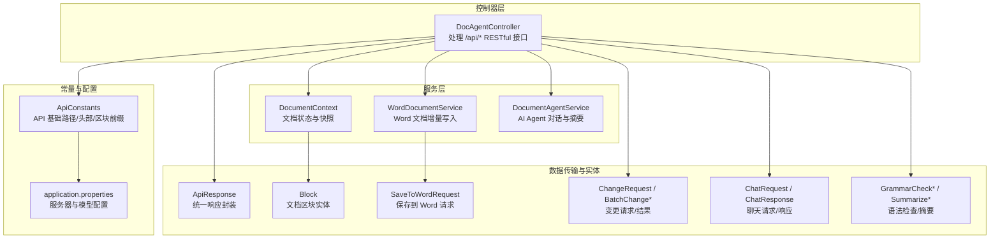
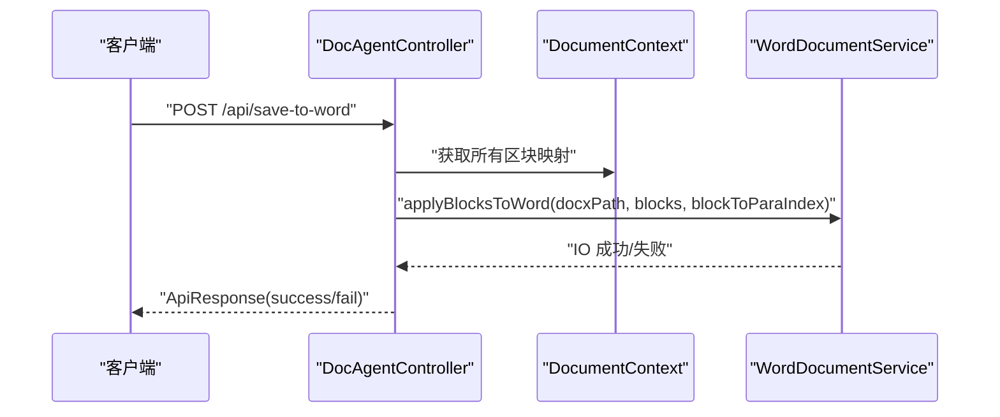
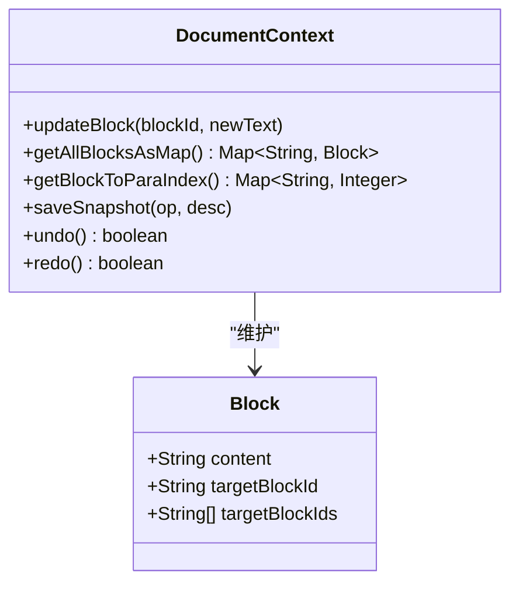
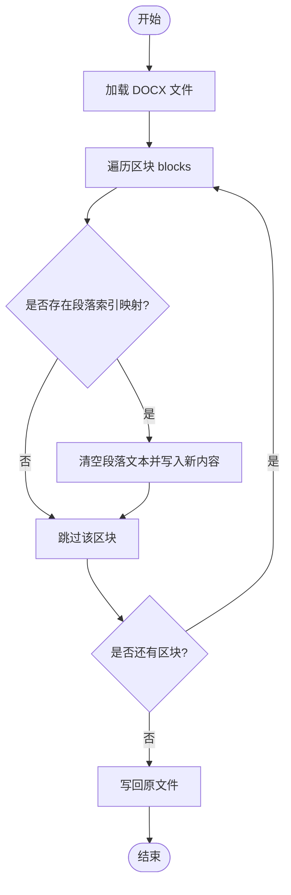
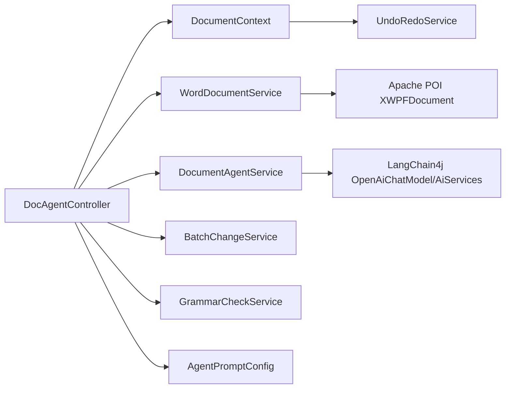

# 文档核心 API

<cite>
**本文引用的文件**
- [DocAgentController.java](file://src/main/java/com/example/docs_agent/controller/DocAgentController.java)
- [DocumentContext.java](file://src/main/java/com/example/docs_agent/service/DocumentContext.java)
- [WordDocumentService.java](file://src/main/java/com/example/docs_agent/service/WordDocumentService.java)
- [DocumentAgentService.java](file://src/main/java/com/example/docs_agent/service/DocumentAgentService.java)
- [ApiResponse.java](file://src/main/java/com/example/docs_agent/dto/ApiResponse.java)
- [ApiConstants.java](file://src/main/java/com/example/docs_agent/constant/ApiConstants.java)
- [Block.java](file://src/main/java/com/example/docs_agent/entity/Block.java)
- [SaveToWordRequest.java](file://src/main/java/com/example/docs_agent/dto/SaveToWordRequest.java)
- [ChangeRequest.java](file://src/main/java/com/example/docs_agent/dto/ChangeRequest.java)
- [BatchChangeRequest.java](file://src/main/java/com/example/docs_agent/dto/BatchChangeRequest.java)
- [BatchChangeResult.java](file://src/main/java/com/example/docs_agent/dto/BatchChangeResult.java)
- [ChatRequest.java](file://src/main/java/com/example/docs_agent/dto/ChatRequest.java)
- [ChatResponse.java](file://src/main/java/com/example/docs_agent/dto/ChatResponse.java)
- [GrammarCheckRequest.java](file://src/main/java/com/example/docs_agent/dto/GrammarCheckRequest.java)
- [GrammarCheckResponse.java](file://src/main/java/com/example/docs_agent/dto/GrammarCheckResponse.java)
- [SummarizeRequest.java](file://src/main/java/com/example/docs_agent/dto/SummarizeRequest.java)
- [SummarizeResponse.java](file://src/main/java/com/example/docs_agent/dto/SummarizeResponse.java)
- [application.properties](file://src/main/resources/application.properties)
</cite>

## 目录
1. [简介](#简介)
2. [项目结构](#项目结构)
3. [核心组件](#核心组件)
4. [架构总览](#架构总览)
5. [详细组件分析](#详细组件分析)
6. [依赖分析](#依赖分析)
7. [性能考虑](#性能考虑)
8. [故障排除指南](#故障排除指南)
9. [结论](#结论)
10. [附录](#附录)

## 简介
本文件面向“文档核心 API”的使用者与集成者，聚焦于以下核心接口：
- GET /api/document：获取当前文档状态（区块映射）
- POST /api/init-document：初始化文档状态（批量写入区块）
- POST /api/save-to-word：增量保存到 Word 文档（仅修改有变更的段落）

文档同时解释：
- 文档状态管理机制（DocumentContext）
- 区块结构（Block）
- Word 文档保存流程（WordDocumentService）
- 参数验证规则、状态码含义与常见错误处理
- 客户端实现指南与最佳实践建议

## 项目结构
后端采用 Spring Boot 结构，控制器位于 controller 层，业务逻辑分布在 service 层，数据传输对象（DTO）与实体位于 dto 与 entity 包中，常量定义位于 constant 包。

图表来源
- [DocAgentController.java:1-636](file://src/main/java/com/example/docs_agent/controller/DocAgentController.java#L1-L636)
- [DocumentContext.java:1-205](file://src/main/java/com/example/docs_agent/service/DocumentContext.java#L1-L205)
- [WordDocumentService.java:1-64](file://src/main/java/com/example/docs_agent/service/WordDocumentService.java#L1-L64)
- [DocumentAgentService.java:1-389](file://src/main/java/com/example/docs_agent/service/DocumentAgentService.java#L1-L389)
- [ApiResponse.java:1-84](file://src/main/java/com/example/docs_agent/dto/ApiResponse.java#L1-L84)
- [ApiConstants.java:1-53](file://src/main/java/com/example/docs_agent/constant/ApiConstants.java#L1-L53)
- [application.properties:1-37](file://src/main/resources/application.properties#L1-L37)

章节来源
- [DocAgentController.java:1-636](file://src/main/java/com/example/docs_agent/controller/DocAgentController.java#L1-L636)
- [ApiConstants.java:1-53](file://src/main/java/com/example/docs_agent/constant/ApiConstants.java#L1-L53)
- [application.properties:1-37](file://src/main/resources/application.properties#L1-L37)

## 核心组件
- 文档状态管理（DocumentContext）
  - 以 LinkedHashMap 维护区块顺序与内容，提供 get/update/clear/snapshot/undo/redo 等能力
  - 提供 getAllBlocksAsMap 与 getAllBlocksAsString 两种对外视图
- 区块结构（Block）
  - content：区块文本
  - targetBlockId/targetBlockIds：用于 ai_selection 等临时区块指向真实目标段落
- Word 文档保存（WordDocumentService）
  - 依据 blockToParaIndex 将内存中的区块内容增量写回 Word 段落
- 统一响应（ApiResponse）
  - status/errorCode/message/data/timestamp 标准化响应结构

章节来源
- [DocumentContext.java:1-205](file://src/main/java/com/example/docs_agent/service/DocumentContext.java#L1-L205)
- [Block.java:1-47](file://src/main/java/com/example/docs_agent/entity/Block.java#L1-L47)
- [WordDocumentService.java:1-64](file://src/main/java/com/example/docs_agent/service/WordDocumentService.java#L1-L64)
- [ApiResponse.java:1-84](file://src/main/java/com/example/docs_agent/dto/ApiResponse.java#L1-L84)

## 架构总览
下图展示了“文档核心 API”从请求到执行的关键链路，以及与 Word 文档写入的关系。

图表来源
- [DocAgentController.java:51-66](file://src/main/java/com/example/docs_agent/controller/DocAgentController.java#L51-L66)
- [WordDocumentService.java:31-62](file://src/main/java/com/example/docs_agent/service/WordDocumentService.java#L31-L62)
- [DocumentContext.java:103-106](file://src/main/java/com/example/docs_agent/service/DocumentContext.java#L103-L106)

## 详细组件分析

### 接口：GET /api/document
- 功能：获取当前文档状态（区块映射）
- 请求
  - 方法：GET
  - URL：/api/document
  - 请求体：无
  - 请求头：无
- 响应
  - 状态码：200
  - 响应体：统一响应结构，data 为 Map<String, Block>
- 参数验证
  - 无
- 错误码
  - 无（正常情况）
- 示例
  - 请求：GET /api/document
  - 响应：{
    "status": "success",
    "message": "",
    "errorCode": null,
    "data": {
      "p_1": {"content": "段落1内容", "targetBlockId": null, "targetBlockIds": null},
      "p_2": {"content": "段落2内容", "targetBlockId": null, "targetBlockIds": null}
    },
    "timestamp": "2025-04-05T12:00:00.123"
  }

章节来源
- [DocAgentController.java:73-78](file://src/main/java/com/example/docs_agent/controller/DocAgentController.java#L73-L78)
- [ApiResponse.java:48-75](file://src/main/java/com/example/docs_agent/dto/ApiResponse.java#L48-L75)

### 接口：POST /api/init-document
- 功能：初始化文档状态（批量写入区块）
- 请求
  - 方法：POST
  - URL：/api/init-document
  - 请求体：Map<String, String>，键为区块ID，值为对应文本
  - 请求头：无
- 响应
  - 状态码：200
  - 响应体：统一响应结构，data 为 null
- 参数验证
  - 无强制校验；服务端会逐条 updateBlock
- 错误码
  - 无（正常情况）
- 示例
  - 请求：POST /api/init-document
    {
      "p_1": "段落1内容",
      "p_2": "段落2内容"
    }
  - 响应：{
    "status": "success",
    "message": "文档初始化成功",
    "errorCode": null,
    "data": null,
    "timestamp": "2025-04-05T12:00:00.123"
  }

章节来源
- [DocAgentController.java:86-96](file://src/main/java/com/example/docs_agent/controller/DocAgentController.java#L86-L96)
- [DocumentContext.java:72-81](file://src/main/java/com/example/docs_agent/service/DocumentContext.java#L72-L81)

### 接口：POST /api/save-to-word
- 功能：增量保存到 Word 文档（仅修改有变更的段落）
- 请求
  - 方法：POST
  - URL：/api/save-to-word
  - 请求体：SaveToWordRequest
    - docxPath：Word 文档绝对或相对路径
  - 请求头：无
- 响应
  - 状态码：200 或 500
  - 响应体：统一响应结构
    - 成功：status="success"
    - 失败：status="fail"，errorCode="SAVE_ERROR"
- 参数验证
  - docxPath 非空（由框架校验，若缺失将返回 400）
- 错误码
  - SAVE_ERROR：IO 异常导致保存失败
- 示例
  - 请求：POST /api/save-to-word
    {
      "docxPath": "/path/to/doc.docx"
    }
  - 响应（成功）：{
    "status": "success",
    "message": "文档保存成功",
    "errorCode": null,
    "data": null,
    "timestamp": "2025-04-05T12:00:00.123"
  }
  - 响应（失败）：{
    "status": "fail",
    "message": "保存失败: ...",
    "errorCode": "SAVE_ERROR",
    "data": null,
    "timestamp": "2025-04-05T12:00:00.123"
  }

章节来源
- [DocAgentController.java:51-66](file://src/main/java/com/example/docs_agent/controller/DocAgentController.java#L51-L66)
- [SaveToWordRequest.java:1-16](file://src/main/java/com/example/docs_agent/dto/SaveToWordRequest.java#L1-L16)
- [WordDocumentService.java:31-62](file://src/main/java/com/example/docs_agent/service/WordDocumentService.java#L31-L62)

### 文档状态管理机制
- 数据结构
  - LinkedHashMap<String, Block> blocks：维护插入顺序与内容
  - Map<String, Integer> blockToParaIndex：区块ID到 Word 段落索引的映射
- 关键操作
  - updateBlock：新增或更新区块内容
  - getAllBlocksAsMap：返回不可变副本，供 API 序列化
  - saveSnapshot/undo/redo：基于快照的撤销/重做
- 并发与一致性
  - 服务层使用并发安全策略（例如缓存与快照），控制器层通过单例注入保证线程安全

图表来源
- [DocumentContext.java:19-205](file://src/main/java/com/example/docs_agent/service/DocumentContext.java#L19-L205)
- [Block.java:10-47](file://src/main/java/com/example/docs_agent/entity/Block.java#L10-L47)

章节来源
- [DocumentContext.java:19-205](file://src/main/java/com/example/docs_agent/service/DocumentContext.java#L19-L205)
- [Block.java:10-47](file://src/main/java/com/example/docs_agent/entity/Block.java#L10-L47)

### 区块结构
- 字段说明
  - content：区块文本内容
  - targetBlockId：目标段落ID（ai_selection 同步更新时使用）
  - targetBlockIds：多段落选区的目标ID列表
- 前缀与特殊ID
  - ApiConstants 中定义了段落、插入、删除等区块ID前缀，以及 ai_selection 等特殊ID

章节来源
- [Block.java:10-47](file://src/main/java/com/example/docs_agent/entity/Block.java#L10-L47)
- [ApiConstants.java:32-44](file://src/main/java/com/example/docs_agent/constant/ApiConstants.java#L32-L44)

### Word 文档保存流程
- 流程概览
  - 读取 Word 文档 → 遍历 blocks → 根据 blockToParaIndex 获取段落索引 → 清空段落文本并写入新内容 → 写回原文件
- 关键点
  - 仅对有映射关系的区块进行更新，避免无关段落改动
  - 使用 POI XWPFDocument 进行读写

图表来源
- [WordDocumentService.java:31-62](file://src/main/java/com/example/docs_agent/service/WordDocumentService.java#L31-L62)

章节来源
- [WordDocumentService.java:19-64](file://src/main/java/com/example/docs_agent/service/WordDocumentService.java#L19-L64)

### 参数验证规则与错误码
- 通用规则
  - 统一响应结构包含 status、errorCode、message、data、timestamp
  - 成功：status="success"；失败：status="fail"
- /api/save-to-word
  - 错误码：SAVE_ERROR（IO 异常）
- /api/init-document
  - 无强制校验；若请求体格式不正确，Spring 将返回 400
- /api/document
  - 无参数；无错误码
- 其他接口（如 /api/chat、/api/grammar-check、/api/summarize）
  - 使用请求头传递模型配置（X-API-Key、X-Base-URL、X-Model-Name）
  - 若文档为空，部分接口会返回特定错误提示

章节来源
- [ApiResponse.java:14-84](file://src/main/java/com/example/docs_agent/dto/ApiResponse.java#L14-L84)
- [DocAgentController.java:51-66](file://src/main/java/com/example/docs_agent/controller/DocAgentController.java#L51-L66)
- [DocAgentController.java:86-96](file://src/main/java/com/example/docs_agent/controller/DocAgentController.java#L86-L96)
- [DocAgentController.java:73-78](file://src/main/java/com/example/docs_agent/controller/DocAgentController.java#L73-L78)

## 依赖分析
- 控制器依赖
  - DocAgentController 依赖 DocumentContext、WordDocumentService、DocumentAgentService、BatchChangeService、GrammarCheckService、AgentPromptConfig
- 服务层依赖
  - DocumentContext 依赖 UndoRedoService（内部快照）
  - WordDocumentService 依赖 Apache POI（XWPFDocument）
  - DocumentAgentService 依赖 LangChain4j（OpenAiChatModel、AiServices、工具集）
- DTO/实体
  - SaveToWordRequest、ChangeRequest、BatchChangeRequest、BatchChangeResult、Block、ChatRequest/Response、GrammarCheck*、Summarize*

图表来源
- [DocAgentController.java:38-43](file://src/main/java/com/example/docs_agent/controller/DocAgentController.java#L38-L43)
- [DocumentContext.java:34-34](file://src/main/java/com/example/docs_agent/service/DocumentContext.java#L34-L34)
- [WordDocumentService.java:6-8](file://src/main/java/com/example/docs_agent/service/WordDocumentService.java#L6-L8)
- [DocumentAgentService.java:9-13](file://src/main/java/com/example/docs_agent/service/DocumentAgentService.java#L9-L13)

章节来源
- [DocAgentController.java:38-43](file://src/main/java/com/example/docs_agent/controller/DocAgentController.java#L38-L43)
- [DocumentContext.java:34-34](file://src/main/java/com/example/docs_agent/service/DocumentContext.java#L34-L34)
- [WordDocumentService.java:6-8](file://src/main/java/com/example/docs_agent/service/WordDocumentService.java#L6-L8)
- [DocumentAgentService.java:9-13](file://src/main/java/com/example/docs_agent/service/DocumentAgentService.java#L9-L13)

## 性能考虑
- 增量更新
  - WordDocumentService 仅对有映射关系的区块进行更新，避免全量扫描与写入
- 内存与顺序
  - DocumentContext 使用 LinkedHashMap 保持顺序，便于按文档阅读顺序处理
- 缓存与模型实例
  - DocumentAgentService 对不同配置与 Agent 类型进行缓存，减少重复初始化开销
- 配置项
  - application.properties 中提供默认模型配置与日志级别，可根据环境调整

章节来源
- [WordDocumentService.java:31-62](file://src/main/java/com/example/docs_agent/service/WordDocumentService.java#L31-L62)
- [DocumentContext.java:29-29](file://src/main/java/com/example/docs_agent/service/DocumentContext.java#L29-L29)
- [DocumentAgentService.java:111-162](file://src/main/java/com/example/docs_agent/service/DocumentAgentService.java#L111-L162)
- [application.properties:14-27](file://src/main/resources/application.properties#L14-L27)

## 故障排除指南
- 保存 Word 失败（SAVE_ERROR）
  - 检查 docxPath 是否有效、文件是否被占用、是否有写权限
  - 查看服务端日志定位具体 IO 异常
- 文档为空
  - 需先调用 /api/init-document 或确保扫描/同步流程已完成
  - 部分接口（如语法检查、摘要生成）在文档为空时会返回错误提示
- 模型配置问题
  - 确认请求头 X-API-Key、X-Base-URL、X-Model-Name 正确
  - application.properties 中的默认配置可作为参考
- 日志与调试
  - 适当提高日志级别（如 DEBUG）以观察区块更新与 Word 写入过程

章节来源
- [DocAgentController.java:51-66](file://src/main/java/com/example/docs_agent/controller/DocAgentController.java#L51-L66)
- [DocAgentController.java:280-290](file://src/main/java/com/example/docs_agent/controller/DocAgentController.java#L280-L290)
- [application.properties:29-34](file://src/main/resources/application.properties#L29-L34)

## 结论
本文档核心 API 提供了文档状态查询、初始化与增量保存 Word 的完整能力。通过 DocumentContext 的有序区块管理与 WordDocumentService 的定向更新，实现了高效、可控的文档编辑与持久化流程。配合统一响应结构与明确的错误码约定，便于客户端进行稳定集成与排错。

## 附录

### API 定义与示例

- GET /api/document
  - 请求：无
  - 响应：{
    "status": "success",
    "message": "",
    "errorCode": null,
    "data": { "<blockId>": { "content": "...", "targetBlockId": null, "targetBlockIds": null } },
    "timestamp": "..."
  }

- POST /api/init-document
  - 请求体：{ "<blockId>": "<content>", ... }
  - 响应：{
    "status": "success",
    "message": "文档初始化成功",
    "errorCode": null,
    "data": null,
    "timestamp": "..."
  }

- POST /api/save-to-word
  - 请求体：{ "docxPath": "/path/to/doc.docx" }
  - 响应（成功）：{
    "status": "success",
    "message": "文档保存成功",
    "errorCode": null,
    "data": null,
    "timestamp": "..."
  }
  - 响应（失败）：{
    "status": "fail",
    "message": "保存失败: ...",
    "errorCode": "SAVE_ERROR",
    "data": null,
    "timestamp": "..."
  }

### 客户端实现指南与最佳实践
- 先初始化文档
  - 调用 /api/init-document 传入区块映射，确保 blockToParaIndex 与 Word 段落一一对应
- 增量更新
  - 修改区块内容后，调用 /api/save-to-word 仅写回有变更的段落
- 错误处理
  - 对 SAVE_ERROR 进行重试与降级（如切换到备份路径或提示用户）
- 并发与幂等
  - 保持对同一文档的串行更新，避免并发写入冲突
- 配置管理
  - 优先通过请求头传递模型配置，必要时参考 application.properties 的默认值