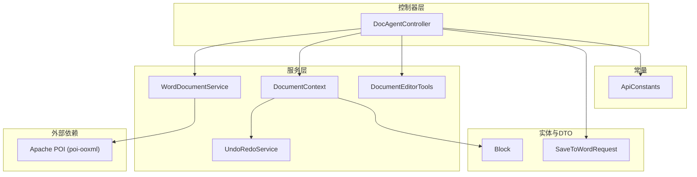
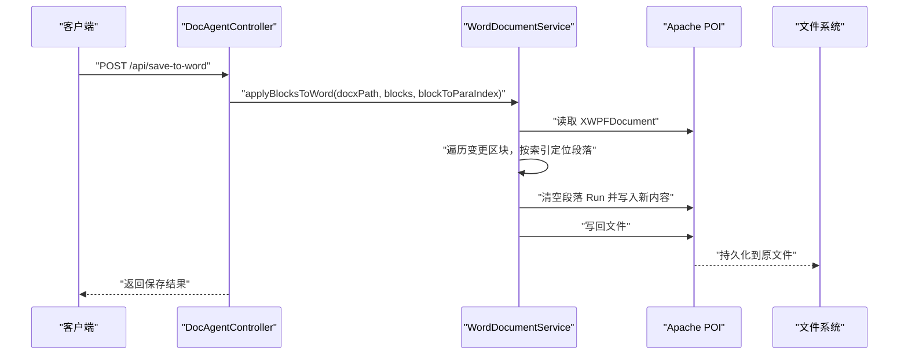
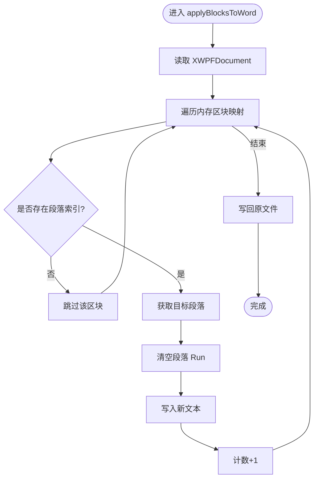
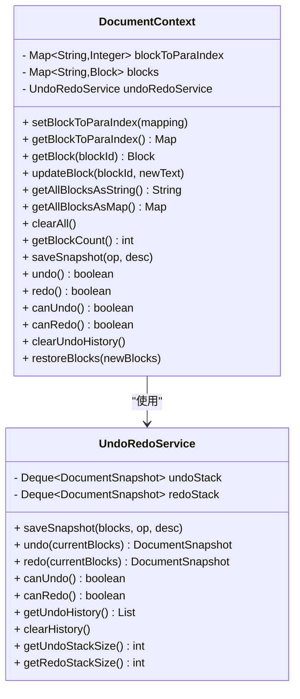
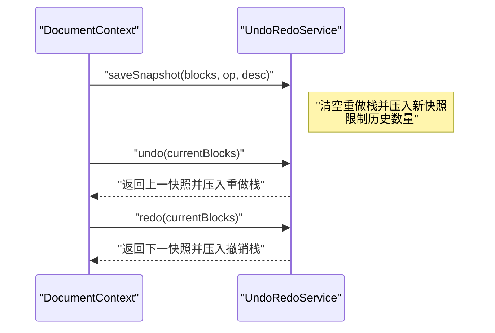
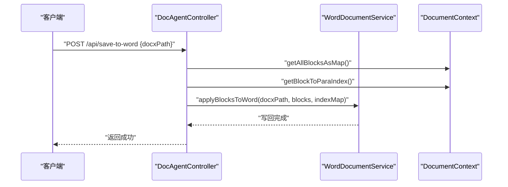
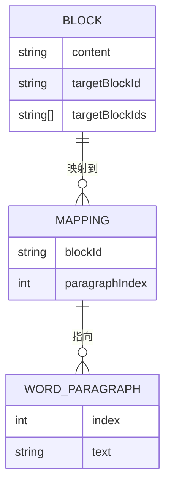
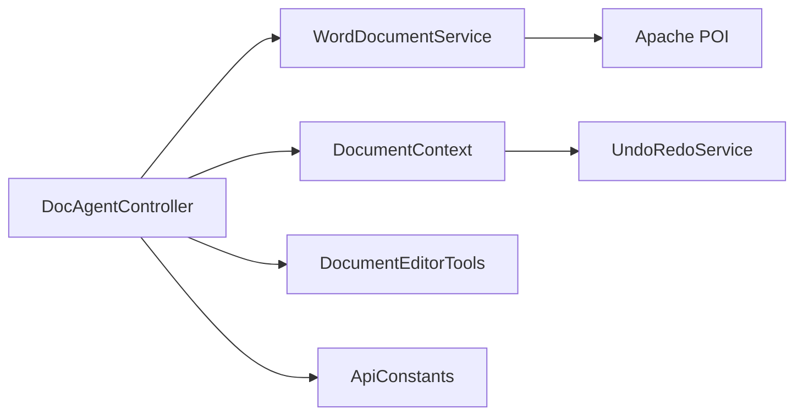
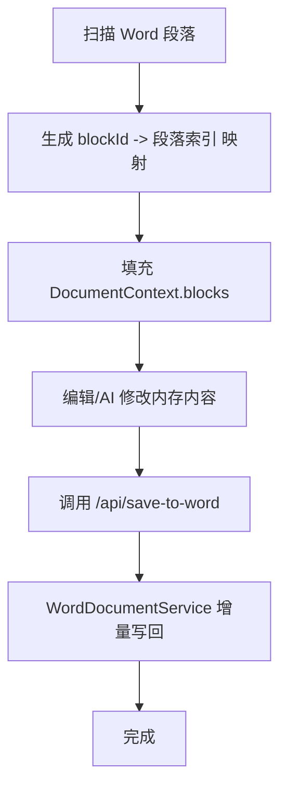

# Word 文档处理

<cite>
**本文引用的文件**
- [WordDocumentService.java](file://src/main/java/com/example/docs_agent/service/WordDocumentService.java)
- [Block.java](file://src/main/java/com/example/docs_agent/entity/Block.java)
- [DocumentContext.java](file://src/main/java/com/example/docs_agent/service/DocumentContext.java)
- [UndoRedoService.java](file://src/main/java/com/example/docs_agent/service/UndoRedoService.java)
- [DocumentEditorTools.java](file://src/main/java/com/example/docs_agent/service/DocumentEditorTools.java)
- [DocAgentController.java](file://src/main/java/com/example/docs_agent/controller/DocAgentController.java)
- [SaveToWordRequest.java](file://src/main/java/com/example/docs_agent/dto/SaveToWordRequest.java)
- [ApiConstants.java](file://src/main/java/com/example/docs_agent/constant/ApiConstants.java)
- [pom.xml](file://pom.xml)
</cite>

## 目录
1. [简介](#简介)
2. [项目结构](#项目结构)
3. [核心组件](#核心组件)
4. [架构总览](#架构总览)
5. [详细组件分析](#详细组件分析)
6. [依赖关系分析](#依赖关系分析)
7. [性能考量](#性能考量)
8. [故障排查指南](#故障排查指南)
9. [结论](#结论)
10. [附录](#附录)

## 简介
本技术文档围绕 Word 文档处理功能展开，重点解释 WordDocumentService 的实现方式，说明如何使用 Apache POI 读取与写入 Word 文档；详解增量保存机制，展示如何将内存中的文档状态转换为 Word 格式并尽量保持原有格式；阐述 Block 实体与 Word 文档结构的映射关系（段落、样式与格式），并提供从 Word 文件加载到内存、修改内容后的保存流程示例；最后给出格式兼容性处理、错误恢复机制与性能优化策略，并附常见问题排查与最佳实践建议。

## 项目结构
该项目采用基于功能分层的组织方式：
- controller 层：对外暴露 REST API，负责接收请求、协调服务层并返回响应。
- service 层：包含 Word 文档处理、文档上下文、撤销/重做、编辑工具等核心业务逻辑。
- entity 层：定义文档区块 Block 的数据结构。
- dto 层：封装请求/响应参数。
- constant 层：集中管理常量（如 API 基础路径、区块 ID 前缀等）。
- pom.xml：声明依赖，其中引入 Apache POI 用于处理 Office 文档。

图表来源
- [DocAgentController.java](file://src/main/java/com/example/docs_agent/controller/DocAgentController.java)
- [WordDocumentService.java](file://src/main/java/com/example/docs_agent/service/WordDocumentService.java)
- [DocumentContext.java](file://src/main/java/com/example/docs_agent/service/DocumentContext.java)
- [UndoRedoService.java](file://src/main/java/com/example/docs_agent/service/UndoRedoService.java)
- [DocumentEditorTools.java](file://src/main/java/com/example/docs_agent/service/DocumentEditorTools.java)
- [Block.java](file://src/main/java/com/example/docs_agent/entity/Block.java)
- [SaveToWordRequest.java](file://src/main/java/com/example/docs_agent/dto/SaveToWordRequest.java)
- [ApiConstants.java](file://src/main/java/com/example/docs_agent/constant/ApiConstants.java)
- [pom.xml](file://pom.xml)

章节来源
- [DocAgentController.java](file://src/main/java/com/example/docs_agent/controller/DocAgentController.java)
- [WordDocumentService.java](file://src/main/java/com/example/docs_agent/service/WordDocumentService.java)
- [DocumentContext.java](file://src/main/java/com/example/docs_agent/service/DocumentContext.java)
- [UndoRedoService.java](file://src/main/java/com/example/docs_agent/service/UndoRedoService.java)
- [DocumentEditorTools.java](file://src/main/java/com/example/docs_agent/service/DocumentEditorTools.java)
- [Block.java](file://src/main/java/com/example/docs_agent/entity/Block.java)
- [SaveToWordRequest.java](file://src/main/java/com/example/docs_agent/dto/SaveToWordRequest.java)
- [ApiConstants.java](file://src/main/java/com/example/docs_agent/constant/ApiConstants.java)
- [pom.xml](file://pom.xml)

## 核心组件
- WordDocumentService：负责将内存中的 Block 列表增量写回 Word 文档，通过段落索引映射定位目标段落并进行定点替换。
- DocumentContext：文档内存状态容器，维护区块 ID 到 Word 段落索引的映射，提供增删改查、撤销/重做与快照保存能力。
- UndoRedoService：管理文档操作历史，支持撤销与重做，限制最大历史条目数。
- DocumentEditorTools：向大模型暴露的工具集，提供读取文档、更新段落、插入/删除段落等能力。
- DocAgentController：对外提供 REST API，包括保存到 Word、获取/初始化文档、锁定选区、接受/拒绝变更、批量变更、语法检查、对话等接口。
- Block：文档区块实体，承载段落内容及目标区块 ID 等元信息。
- SaveToWordRequest：保存到 Word 的请求 DTO。
- ApiConstants：统一管理 API 基础路径、区块 ID 前缀、特殊标记等常量。
- pom.xml：声明 Apache POI 依赖，用于读写 Word 文档。

章节来源
- [WordDocumentService.java](file://src/main/java/com/example/docs_agent/service/WordDocumentService.java)
- [DocumentContext.java](file://src/main/java/com/example/docs_agent/service/DocumentContext.java)
- [UndoRedoService.java](file://src/main/java/com/example/docs_agent/service/UndoRedoService.java)
- [DocumentEditorTools.java](file://src/main/java/com/example/docs_agent/service/DocumentEditorTools.java)
- [DocAgentController.java](file://src/main/java/com/example/docs_agent/controller/DocAgentController.java)
- [Block.java](file://src/main/java/com/example/docs_agent/entity/Block.java)
- [SaveToWordRequest.java](file://src/main/java/com/example/docs_agent/dto/SaveToWordRequest.java)
- [ApiConstants.java](file://src/main/java/com/example/docs_agent/constant/ApiConstants.java)
- [pom.xml](file://pom.xml)

## 架构总览
整体架构采用“控制器-服务-实体”的分层设计，Word 文档处理通过 Apache POI 完成读写，内存中的 DocumentContext 作为“中间态”，在增量保存时仅对有变更的段落进行定点替换，从而降低写入开销并尽量保持原有格式。

图表来源
- [DocAgentController.java](file://src/main/java/com/example/docs_agent/controller/DocAgentController.java)
- [WordDocumentService.java](file://src/main/java/com/example/docs_agent/service/WordDocumentService.java)
- [pom.xml](file://pom.xml)

## 详细组件分析

### WordDocumentService 组件分析
- 职责：根据内存中的区块映射与段落索引，将变更内容定点写回到 Word 文档。
- 关键点：
  - 使用 Apache POI 的 XWPFDocument 读取与写回。
  - 仅对存在于映射中的区块进行处理，避免全量扫描。
  - 对每个目标段落清空其 Run 并写入新文本，实现“定点替换”。
  - 写回原文件，完成增量保存。
- 性能与格式保持：
  - 由于仅替换 Run 文本，不重建段落结构，有助于保持原有格式（如对齐、缩进、行距等）。
  - 若需保留复杂样式（如字体、颜色、加粗等），可在写入前复制段落样式，但当前实现未包含该逻辑。

图表来源
- [WordDocumentService.java](file://src/main/java/com/example/docs_agent/service/WordDocumentService.java)

章节来源
- [WordDocumentService.java](file://src/main/java/com/example/docs_agent/service/WordDocumentService.java)

### DocumentContext 组件分析
- 职责：维护文档内存状态，提供区块 CRUD、快照保存、撤销/重做、以及区块 ID 到 Word 段落索引的映射。
- 关键点：
  - 使用 LinkedHashMap 保证插入顺序，便于与 Word 段落一一对应。
  - 提供快照保存接口，配合 UndoRedoService 实现撤销/重做。
  - 提供不可变视图，避免外部直接修改内部状态。
- 与 Word 的映射：
  - 通过 setBlockToParaIndex 维护 blockId -> 段落索引 的映射，用于增量保存时快速定位目标段落。

图表来源
- [DocumentContext.java](file://src/main/java/com/example/docs_agent/service/DocumentContext.java)
- [UndoRedoService.java](file://src/main/java/com/example/docs_agent/service/UndoRedoService.java)

章节来源
- [DocumentContext.java](file://src/main/java/com/example/docs_agent/service/DocumentContext.java)
- [UndoRedoService.java](file://src/main/java/com/example/docs_agent/service/UndoRedoService.java)

### UndoRedoService 组件分析
- 职责：管理文档操作历史，支持撤销与重做，限制最大历史条目数。
- 关键点：
  - 使用双栈（撤销栈/重做栈）实现撤销/重做。
  - 保存快照时深拷贝区块内容，避免引用污染。
  - 提供历史查询与清空能力。

图表来源
- [UndoRedoService.java](file://src/main/java/com/example/docs_agent/service/UndoRedoService.java)
- [DocumentContext.java](file://src/main/java/com/example/docs_agent/service/DocumentContext.java)

章节来源
- [UndoRedoService.java](file://src/main/java/com/example/docs_agent/service/UndoRedoService.java)
- [DocumentContext.java](file://src/main/java/com/example/docs_agent/service/DocumentContext.java)

### DocumentEditorTools 组件分析
- 职责：向大模型暴露工具集，包括读取文档、读取指定段落、更新段落、插入/删除段落等。
- 关键点：
  - 通过 context.updateBlock 更新内存状态，插入/删除操作使用特殊前缀 ID 标识。
  - 日志记录便于追踪 Agent 的操作轨迹。

章节来源
- [DocumentEditorTools.java](file://src/main/java/com/example/docs_agent/service/DocumentEditorTools.java)
- [DocumentContext.java](file://src/main/java/com/example/docs_agent/service/DocumentContext.java)
- [ApiConstants.java](file://src/main/java/com/example/docs_agent/constant/ApiConstants.java)

### DocAgentController 组件分析
- 职责：对外提供 REST API，包括保存到 Word、获取/初始化文档、锁定选区、接受/拒绝变更、批量变更、语法检查、对话等。
- 关键点：
  - /api/save-to-word：调用 WordDocumentService 将内存中的区块映射与段落索引写回 Word。
  - 提供撤销/重做、批量变更、语法检查、摘要生成等辅助能力。
  - 对异常进行捕获并返回标准化响应。

图表来源
- [DocAgentController.java](file://src/main/java/com/example/docs_agent/controller/DocAgentController.java)
- [WordDocumentService.java](file://src/main/java/com/example/docs_agent/service/WordDocumentService.java)
- [DocumentContext.java](file://src/main/java/com/example/docs_agent/service/DocumentContext.java)

章节来源
- [DocAgentController.java](file://src/main/java/com/example/docs_agent/controller/DocAgentController.java)
- [WordDocumentService.java](file://src/main/java/com/example/docs_agent/service/WordDocumentService.java)
- [DocumentContext.java](file://src/main/java/com/example/docs_agent/service/DocumentContext.java)

### Block 实体与 Word 文档结构映射
- Block：表示文档中的一个段落或内容块，包含内容、目标区块 ID、目标区块 ID 列表等。
- 映射关系：
  - Word 段落索引与 Block ID：通过 DocumentContext 维护 blockId -> 段落索引 的映射。
  - 段落内容与 Block：WordDocumentService 依据映射定位段落，清空 Run 并写入 Block 的内容。
- 样式与格式：
  - 当前实现仅替换 Run 文本，不复制段落样式，因此格式保持有限。
  - 如需更强的格式保持，可在写入前复制段落样式（例如对齐、缩进、行距等），并在写入后恢复部分样式属性。

图表来源
- [Block.java](file://src/main/java/com/example/docs_agent/entity/Block.java)
- [DocumentContext.java](file://src/main/java/com/example/docs_agent/service/DocumentContext.java)
- [WordDocumentService.java](file://src/main/java/com/example/docs_agent/service/WordDocumentService.java)

章节来源
- [Block.java](file://src/main/java/com/example/docs_agent/entity/Block.java)
- [DocumentContext.java](file://src/main/java/com/example/docs_agent/service/DocumentContext.java)
- [WordDocumentService.java](file://src/main/java/com/example/docs_agent/service/WordDocumentService.java)

## 依赖关系分析
- 外部依赖：Apache POI (poi-ooxml)，用于读写 .docx 文件。
- 内部依赖：
  - DocAgentController 依赖 WordDocumentService、DocumentContext、DocumentEditorTools 等。
  - WordDocumentService 依赖 Apache POI。
  - DocumentContext 依赖 UndoRedoService。
  - ApiConstants 提供统一常量。

图表来源
- [DocAgentController.java](file://src/main/java/com/example/docs_agent/controller/DocAgentController.java)
- [WordDocumentService.java](file://src/main/java/com/example/docs_agent/service/WordDocumentService.java)
- [DocumentContext.java](file://src/main/java/com/example/docs_agent/service/DocumentContext.java)
- [UndoRedoService.java](file://src/main/java/com/example/docs_agent/service/UndoRedoService.java)
- [ApiConstants.java](file://src/main/java/com/example/docs_agent/constant/ApiConstants.java)
- [pom.xml](file://pom.xml)

章节来源
- [pom.xml](file://pom.xml)
- [DocAgentController.java](file://src/main/java/com/example/docs_agent/controller/DocAgentController.java)
- [WordDocumentService.java](file://src/main/java/com/example/docs_agent/service/WordDocumentService.java)
- [DocumentContext.java](file://src/main/java/com/example/docs_agent/service/DocumentContext.java)
- [UndoRedoService.java](file://src/main/java/com/example/docs_agent/service/UndoRedoService.java)
- [ApiConstants.java](file://src/main/java/com/example/docs_agent/constant/ApiConstants.java)

## 性能考量
- 增量保存：仅对存在映射的区块进行处理，避免全量扫描与写回，显著降低 I/O 开销。
- 写入策略：清空 Run 并写入新文本，减少段落结构重建次数，有利于保持格式。
- 历史限制：UndoRedoService 限制最大历史条目数，避免内存膨胀。
- 建议优化：
  - 对于超大文档，可考虑分批处理或延迟写回，减少一次性写入压力。
  - 若需强格式保持，可在写入前复制段落样式并在写入后恢复关键样式属性。
  - 使用流式写入或异步写回，提升并发场景下的吞吐。

[本节为通用性能建议，无需特定文件来源]

## 故障排查指南
- 保存失败（IO 异常）：
  - 检查文件路径是否正确、权限是否足够。
  - 确认文件未被其他进程占用。
  - 查看日志中的异常堆栈，定位具体失败点。
- 段落未更新：
  - 确认 blockToParaIndex 是否包含目标 blockId。
  - 确认段落索引未越界。
- 格式丢失：
  - 当前实现仅替换 Run 文本，不复制段落样式，导致格式可能丢失。
  - 建议在写入前复制并恢复关键样式属性。
- 撤销/重做无效：
  - 确认是否正确调用 saveSnapshot，以及撤销/重做栈是否被意外清空。
  - 检查历史条目数是否达到上限。

章节来源
- [DocAgentController.java](file://src/main/java/com/example/docs_agent/controller/DocAgentController.java)
- [WordDocumentService.java](file://src/main/java/com/example/docs_agent/service/WordDocumentService.java)
- [DocumentContext.java](file://src/main/java/com/example/docs_agent/service/DocumentContext.java)
- [UndoRedoService.java](file://src/main/java/com/example/docs_agent/service/UndoRedoService.java)

## 结论
本项目通过 DocumentContext 维护内存中的文档状态，结合 WordDocumentService 的增量保存机制，实现了对 Word 文档的高效写回。当前实现以“定点替换”为核心策略，优先保证性能与稳定性；若需更强的格式保持，可在现有基础上扩展样式复制与恢复逻辑。配合 UndoRedoService 的撤销/重做能力，系统具备良好的可控性与可追溯性。

[本节为总结性内容，无需特定文件来源]

## 附录

### 读写流程示例（概念性）
- 从 Word 文件加载到内存：
  - 由前端或外部工具扫描 Word 段落，生成 blockId -> 段落索引 的映射，并将各段落内容写入 DocumentContext。
- 修改内容后的保存：
  - 用户通过编辑工具或 AI Agent 修改内存中的 Block。
  - 调用 /api/save-to-word，WordDocumentService 仅对有映射的区块进行定点替换并写回原文件。

[本图为概念流程图，不直接映射到具体源码文件]

### 常见问题与最佳实践
- 常见问题
  - 保存后格式丢失：当前实现不复制段落样式，建议在写入前复制并恢复关键样式。
  - 段落未更新：检查 blockId 是否存在于映射中，以及索引是否越界。
  - 撤销/重做无效：确保每次修改前调用 saveSnapshot。
- 最佳实践
  - 保持 blockId 与段落索引的一致性，避免重复扫描。
  - 对超大文档采用分批处理或延迟写回策略。
  - 在写入前备份原文件，以便必要时回滚。
  - 使用日志记录关键操作，便于问题定位与审计。

[本节为通用建议，无需特定文件来源]