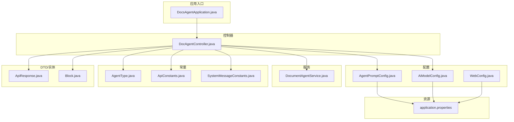
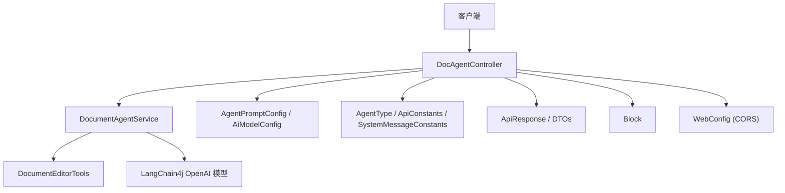
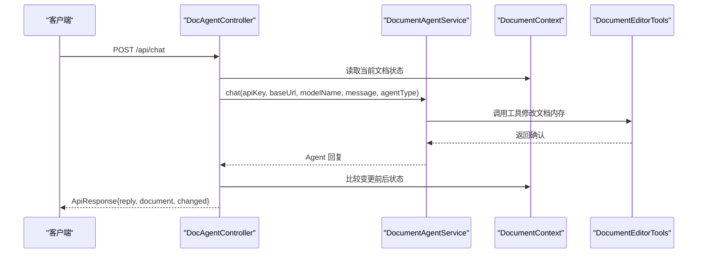
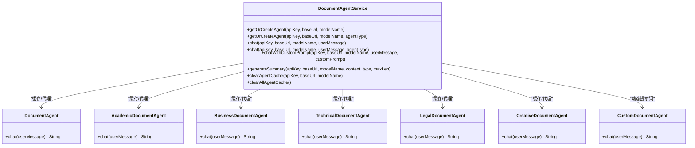
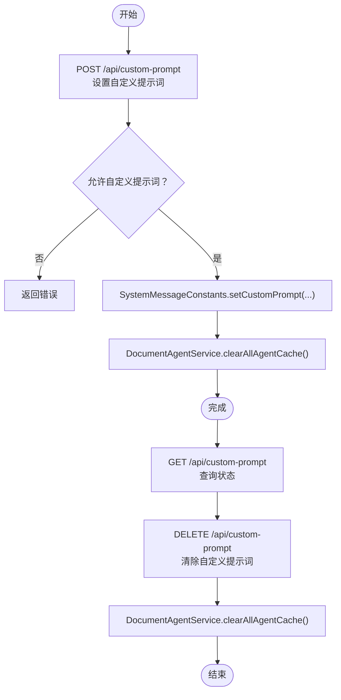
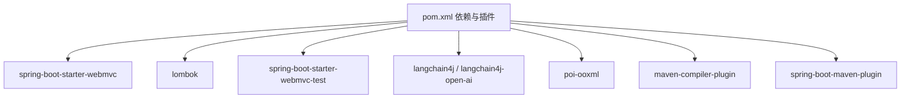

# 开发指南

<cite>
**本文引用的文件**
- [pom.xml](file://pom.xml)
- [DocsAgentApplication.java](file://src/main/java/com/example/docs_agent/DocsAgentApplication.java)
- [DocsAgentApplicationTests.java](file://src/test/java/com/example/docs_agent/DocsAgentApplicationTests.java)
- [application.properties](file://src/main/resources/application.properties)
- [.gitignore](file://.gitignore)
- [AgentPromptConfig.java](file://src/main/java/com/example/docs_agent/config/AgentPromptConfig.java)
- [AiModelConfig.java](file://src/main/java/com/example/docs_agent/config/AiModelConfig.java)
- [WebConfig.java](file://src/main/java/com/example/docs_agent/config/WebConfig.java)
- [DocAgentController.java](file://src/main/java/com/example/docs_agent/controller/DocAgentController.java)
- [DocumentAgentService.java](file://src/main/java/com/example/docs_agent/service/DocumentAgentService.java)
- [AgentType.java](file://src/main/java/com/example/docs_agent/constant/AgentType.java)
- [ApiConstants.java](file://src/main/java/com/example/docs_agent/constant/ApiConstants.java)
- [SystemMessageConstants.java](file://src/main/java/com/example/docs_agent/constant/SystemMessageConstants.java)
- [ApiResponse.java](file://src/main/java/com/example/docs_agent/dto/ApiResponse.java)
- [Block.java](file://src/main/java/com/example/docs_agent/entity/Block.java)
</cite>

## 目录
1. [简介](#简介)
2. [项目结构](#项目结构)
3. [核心组件](#核心组件)
4. [架构总览](#架构总览)
5. [详细组件分析](#详细组件分析)
6. [依赖分析](#依赖分析)
7. [性能考虑](#性能考虑)
8. [故障排查指南](#故障排查指南)
9. [结论](#结论)
10. [附录](#附录)

## 简介
本开发指南面向新加入的开发者，帮助快速理解并贡献高质量代码。内容涵盖代码规范与最佳实践、单元测试指南、构建与打包流程、Git 工作流与分支管理策略、调试技巧与工具推荐、代码审查清单与质量保证流程。项目基于 Spring Boot 4.0.3 与 Java 17，集成了 LangChain4j 与 Apache POI，提供文档编辑、AI 对话、语法检查与摘要生成等能力。

## 项目结构
项目采用标准 Maven + Spring Boot 结构，按功能域分包组织：
- config：配置类（AI 模型、Agent 提示词、Web 跨域）
- constant：常量定义（API 基础路径、请求头、系统提示词、Agent 类型）
- controller：REST 控制器（统一 API 基础路径 /api）
- dto：数据传输对象（请求/响应封装）
- entity：领域实体（Block）
- service：业务服务（DocumentAgentService、Word 文档处理等）
- exception：全局异常处理（预留）
- resources：静态资源、模板与应用配置

图表来源
- [DocsAgentApplication.java:1-11](file://src/main/java/com/example/docs_agent/DocsAgentApplication.java#L1-L11)
- [DocAgentController.java:1-636](file://src/main/java/com/example/docs_agent/controller/DocAgentController.java#L1-L636)
- [DocumentAgentService.java:1-389](file://src/main/java/com/example/docs_agent/service/DocumentAgentService.java#L1-L389)
- [AgentPromptConfig.java:1-88](file://src/main/java/com/example/docs_agent/config/AgentPromptConfig.java#L1-L88)
- [AiModelConfig.java:1-50](file://src/main/java/com/example/docs_agent/config/AiModelConfig.java#L1-L50)
- [WebConfig.java:1-25](file://src/main/java/com/example/docs_agent/config/WebConfig.java#L1-L25)
- [AgentType.java:1-87](file://src/main/java/com/example/docs_agent/constant/AgentType.java#L1-L87)
- [ApiConstants.java:1-53](file://src/main/java/com/example/docs_agent/constant/ApiConstants.java#L1-L53)
- [SystemMessageConstants.java:1-234](file://src/main/java/com/example/docs_agent/constant/SystemMessageConstants.java#L1-L234)
- [ApiResponse.java:1-84](file://src/main/java/com/example/docs_agent/dto/ApiResponse.java#L1-L84)
- [Block.java:1-47](file://src/main/java/com/example/docs_agent/entity/Block.java#L1-L47)
- [application.properties:1-37](file://src/main/resources/application.properties#L1-L37)

章节来源
- [pom.xml:1-111](file://pom.xml#L1-L111)
- [DocsAgentApplication.java:1-11](file://src/main/java/com/example/docs_agent/DocsAgentApplication.java#L1-L11)
- [application.properties:1-37](file://src/main/resources/application.properties#L1-L37)

## 核心组件
- 应用入口：Spring Boot 启动类，负责应用初始化与启动。
- 控制器：统一在 /api 下提供文档编辑、AI 对话、语法检查、摘要生成等接口。
- 服务层：封装 AI Agent 生命周期管理、工具调用、缓存与摘要生成。
- 配置：集中管理 AI 模型参数、Agent 提示词与跨域策略。
- 常量与 DTO：统一 API 响应格式、请求头、系统提示词模板与实体定义。

章节来源
- [DocAgentController.java:1-636](file://src/main/java/com/example/docs_agent/controller/DocAgentController.java#L1-L636)
- [DocumentAgentService.java:1-389](file://src/main/java/com/example/docs_agent/service/DocumentAgentService.java#L1-L389)
- [AgentPromptConfig.java:1-88](file://src/main/java/com/example/docs_agent/config/AgentPromptConfig.java#L1-L88)
- [AiModelConfig.java:1-50](file://src/main/java/com/example/docs_agent/config/AiModelConfig.java#L1-L50)
- [WebConfig.java:1-25](file://src/main/java/com/example/docs_agent/config/WebConfig.java#L1-L25)
- [ApiResponse.java:1-84](file://src/main/java/com/example/docs_agent/dto/ApiResponse.java#L1-L84)
- [Block.java:1-47](file://src/main/java/com/example/docs_agent/entity/Block.java#L1-L47)

## 架构总览
系统采用分层架构：控制器负责请求接入与响应封装；服务层负责业务编排与外部模型交互；配置层提供参数化能力；常量与 DTO 提供契约与数据结构。

图表来源
- [DocAgentController.java:1-636](file://src/main/java/com/example/docs_agent/controller/DocAgentController.java#L1-L636)
- [DocumentAgentService.java:1-389](file://src/main/java/com/example/docs_agent/service/DocumentAgentService.java#L1-L389)
- [AgentPromptConfig.java:1-88](file://src/main/java/com/example/docs_agent/config/AgentPromptConfig.java#L1-L88)
- [AiModelConfig.java:1-50](file://src/main/java/com/example/docs_agent/config/AiModelConfig.java#L1-L50)
- [WebConfig.java:1-25](file://src/main/java/com/example/docs_agent/config/WebConfig.java#L1-L25)
- [AgentType.java:1-87](file://src/main/java/com/example/docs_agent/constant/AgentType.java#L1-L87)
- [ApiConstants.java:1-53](file://src/main/java/com/example/docs_agent/constant/ApiConstants.java#L1-L53)
- [SystemMessageConstants.java:1-234](file://src/main/java/com/example/docs_agent/constant/SystemMessageConstants.java#L1-L234)
- [ApiResponse.java:1-84](file://src/main/java/com/example/docs_agent/dto/ApiResponse.java#L1-L84)
- [Block.java:1-47](file://src/main/java/com/example/docs_agent/entity/Block.java#L1-L47)

## 详细组件分析

### 控制器层：DocAgentController
职责
- 提供统一 API 基础路径 /api 的 REST 接口。
- 协调文档状态、AI 对话、语法检查、摘要生成与批量变更处理。
- 统一响应格式 ApiResponse，记录日志并处理异常。

关键流程示意：AI 对话与文档变更

图表来源
- [DocAgentController.java:354-428](file://src/main/java/com/example/docs_agent/controller/DocAgentController.java#L354-L428)
- [DocumentAgentService.java:183-240](file://src/main/java/com/example/docs_agent/service/DocumentAgentService.java#L183-L240)

章节来源
- [DocAgentController.java:1-636](file://src/main/java/com/example/docs_agent/controller/DocAgentController.java#L1-L636)

### 服务层：DocumentAgentService
职责
- 管理 AI Agent 的创建与缓存，按配置与类型区分缓存键。
- 提供多类型 Agent 接口（通用、学术、商业、技术、法律、创意），以及自定义提示词支持。
- 生成文档摘要，构建提示词模板并调用模型生成。

类关系图

图表来源
- [DocumentAgentService.java:1-389](file://src/main/java/com/example/docs_agent/service/DocumentAgentService.java#L1-L389)

章节来源
- [DocumentAgentService.java:1-389](file://src/main/java/com/example/docs_agent/service/DocumentAgentService.java#L1-L389)

### 配置层：AgentPromptConfig 与 AiModelConfig
职责
- AgentPromptConfig：管理默认 Agent 类型、是否允许前端覆盖、是否允许自定义提示词，以及自定义提示词的增删查。
- AiModelConfig：封装 AI 模型基础配置（API Key、Base URL、模型名、超时、聊天记忆窗口）。

流程示意：自定义提示词设置与清理

图表来源
- [AgentPromptConfig.java:45-57](file://src/main/java/com/example/docs_agent/config/AgentPromptConfig.java#L45-L57)
- [SystemMessageConstants.java:196-214](file://src/main/java/com/example/docs_agent/constant/SystemMessageConstants.java#L196-L214)
- [DocumentAgentService.java:307-310](file://src/main/java/com/example/docs_agent/service/DocumentAgentService.java#L307-L310)

章节来源
- [AgentPromptConfig.java:1-88](file://src/main/java/com/example/docs_agent/config/AgentPromptConfig.java#L1-L88)
- [AiModelConfig.java:1-50](file://src/main/java/com/example/docs_agent/config/AiModelConfig.java#L1-L50)

### 常量与数据模型
- AgentType：定义七种 Agent 类型及校验方法。
- ApiConstants：统一 API 基础路径、请求头、默认配置与区块 ID 前缀。
- SystemMessageConstants：内置各类型 Agent 的系统提示词模板，支持自定义提示词。
- ApiResponse：统一响应结构（状态、错误码、消息、数据、时间戳）。
- Block：文档区块实体，支持单目标段落与多目标段落映射。

章节来源
- [AgentType.java:1-87](file://src/main/java/com/example/docs_agent/constant/AgentType.java#L1-L87)
- [ApiConstants.java:1-53](file://src/main/java/com/example/docs_agent/constant/ApiConstants.java#L1-L53)
- [SystemMessageConstants.java:1-234](file://src/main/java/com/example/docs_agent/constant/SystemMessageConstants.java#L1-L234)
- [ApiResponse.java:1-84](file://src/main/java/com/example/docs_agent/dto/ApiResponse.java#L1-L84)
- [Block.java:1-47](file://src/main/java/com/example/docs_agent/entity/Block.java#L1-L47)

## 依赖分析
Maven 依赖概览
- Spring Boot Web MVC：提供 Web 层能力
- Lombok：减少样板代码
- Spring Boot Test：提供测试支持
- LangChain4j 与 LangChain4j OpenAI：AI 模型集成
- Apache POI OOXML：处理 Office 文档（Word/Excel）

构建插件
- maven-compiler-plugin：启用 Lombok 注解处理器
- spring-boot-maven-plugin：打包可执行 JAR

图表来源
- [pom.xml:37-108](file://pom.xml#L37-L108)

章节来源
- [pom.xml:1-111](file://pom.xml#L1-L111)

## 性能考虑
- Agent 缓存：服务层按配置与类型缓存 Agent 实例，避免重复初始化，降低延迟。
- 聊天记忆窗口：通过配置项控制上下文长度，平衡性能与上下文质量。
- 文档长度限制：摘要生成前对输入进行截断，防止超长上下文导致性能问题。
- 日志级别：生产环境建议提高日志级别，减少 DEBUG 输出带来的开销。

## 故障排查指南
常见问题与定位
- AI 模型调用失败：检查 application.properties 中的 AI 配置项（API Key、Base URL、模型名、超时）是否正确。
- CORS 问题：确认 WebConfig 中跨域规则是否满足前端域名与方法需求。
- 文档为空：控制器在处理聊天与语法检查前会校验文档状态，需先调用初始化接口或扫描全文。
- 日志编码：Windows 控制台中文乱码可通过 application.properties 中的日志编码配置解决。

章节来源
- [application.properties:14-37](file://src/main/resources/application.properties#L14-L37)
- [WebConfig.java:17-23](file://src/main/java/com/example/docs_agent/config/WebConfig.java#L17-L23)
- [DocAgentController.java:278-290](file://src/main/java/com/example/docs_agent/controller/DocAgentController.java#L278-L290)

## 结论
本指南提供了从代码结构、组件职责、配置管理到测试与构建的全栈开发指引。建议新开发者优先阅读控制器与服务层的交互流程，理解 Agent 缓存与提示词机制，再结合单元测试与 Git 工作流逐步深入贡献。

## 附录

### 代码规范与最佳实践
- 命名约定
  - 包名：com.example.docs_agent（小写）
  - 类名：帕斯卡命名（如 DocAgentController、DocumentAgentService）
  - 方法名：驼峰命名（如 saveToWord、chatWithAgent）
  - 常量：全大写下划线（如 API_BASE_PATH）
- 注释规范
  - 类与公共方法需提供简要说明，关键流程标注前置条件与副作用
  - 配置类与常量类补充用途与默认值说明
- 代码组织
  - 按功能域分包（config、controller、service、dto、entity、constant）
  - DTO 与实体分离，避免混用
  - 控制器仅做编排与响应封装，业务逻辑下沉至服务层

### 单元测试指南
- 测试框架：JUnit 5 + Spring Boot Test
- 建议
  - 为控制器编写集成测试，验证 API 行为与响应格式
  - 为服务层编写单元测试，Mock 外部依赖（如 LangChain4j 模型）
  - 关注边界条件（空文档、超时、异常传播）
- 覆盖率要求
  - 服务层核心方法行覆盖率不低于 80%，分支覆盖率不低于 60%
  - 控制器关键路径（正常/异常）100% 覆盖

章节来源
- [DocsAgentApplicationTests.java:1-14](file://src/test/java/com/example/docs_agent/DocsAgentApplicationTests.java#L1-L14)

### 构建与打包流程
- 本地构建
  - 使用 Maven Wrapper：./mvnw.cmd clean install
  - 打包可执行 JAR：./mvnw.cmd package
- 依赖管理
  - 通过 pom.xml 统一管理版本与传递依赖
  - 插件启用 Lombok 注解处理与 Spring Boot 打包排除 Lombok
- 构建优化
  - 使用增量编译与并行构建
  - 生产打包排除测试依赖，减小体积

章节来源
- [pom.xml:80-108](file://pom.xml#L80-L108)

### Git 工作流程与分支管理策略
- 分支策略
  - main：发布分支，保护不可直接推送
  - develop：开发分支，合并特性分支后向 main 合并
  - feature/*：特性开发分支，基于 develop 创建
  - hotfix/*：紧急修复分支，基于 main 创建
- 提交规范
  - 标题：类型(作用域): 概述（如 feat(controller): 新增语法检查接口）
  - 正文：动机与影响，必要时附带测试要点
- 合并与审查
  - PR 至 develop 或 main 均需至少一次代码审查
  - 合并前确保 CI 通过、测试通过、无冲突

章节来源
- [.gitignore:1-34](file://.gitignore#L1-L34)

### 调试技巧与开发工具推荐
- 调试
  - 使用日志级别与时间戳定位问题
  - 控制器中打印请求体与响应体关键字段
  - 服务层缓存清理（clearAllAgentCache）用于强制刷新
- 工具
  - Postman 或 curl：验证 /api 下接口
  - IDE 断点调试：定位服务层与控制器交互
  - Maven 命令行：快速验证构建与打包

章节来源
- [DocumentAgentService.java:307-310](file://src/main/java/com/example/docs_agent/service/DocumentAgentService.java#L307-L310)
- [application.properties:29-34](file://src/main/resources/application.properties#L29-L34)

### 代码审查清单
- 功能正确性
  - 接口行为与文档一致，边界条件覆盖
  - 错误处理与异常传播合理
- 可维护性
  - 命名清晰、注释充分、模块职责单一
  - 配置集中管理，避免魔法数
- 性能与安全
  - 避免不必要的对象创建与 IO
  - 参数校验与输入限制（如摘要长度）
  - 密钥与敏感信息不硬编码
- 测试
  - 单测覆盖核心逻辑，集成测关键链路
  - 覆盖正常/异常/边界场景