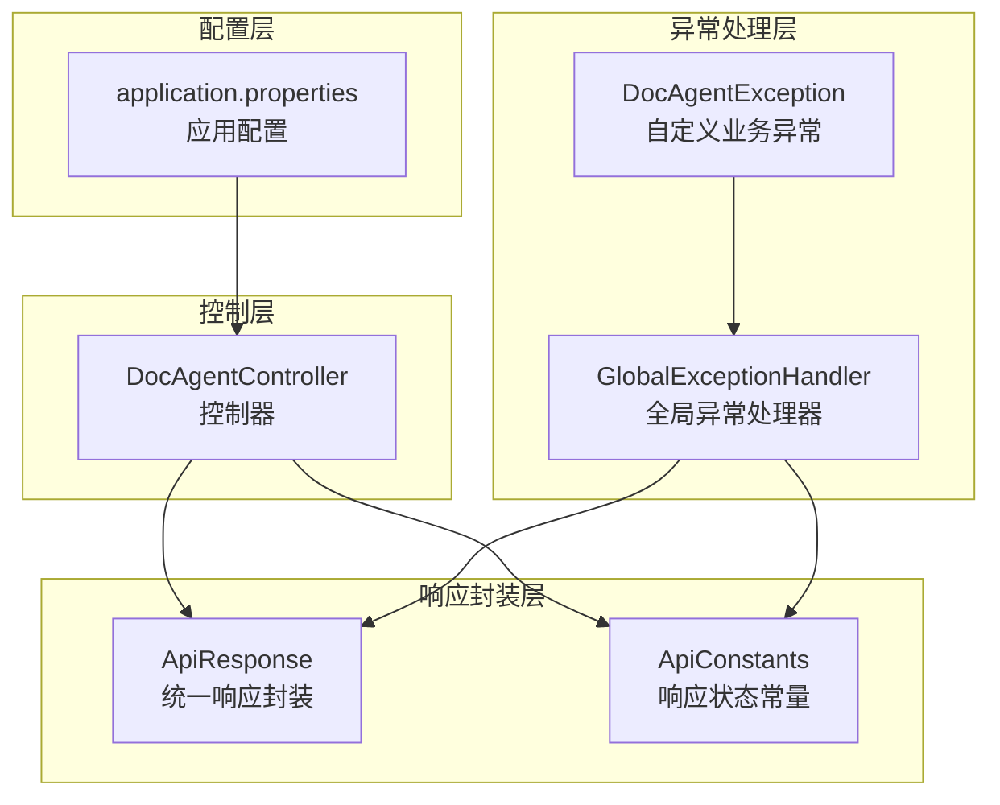
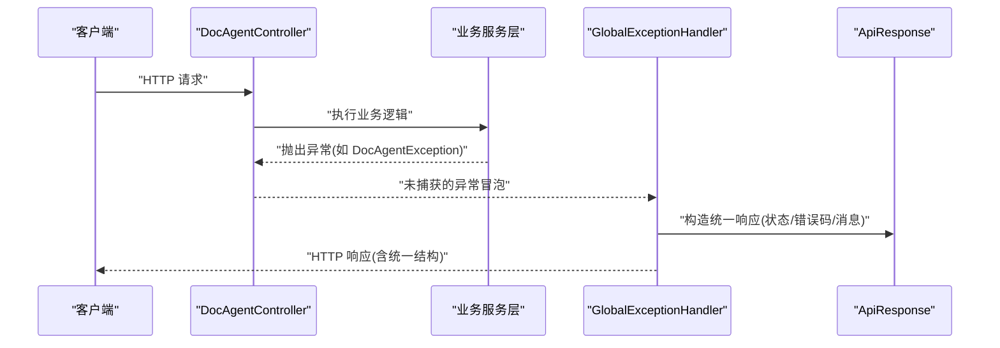
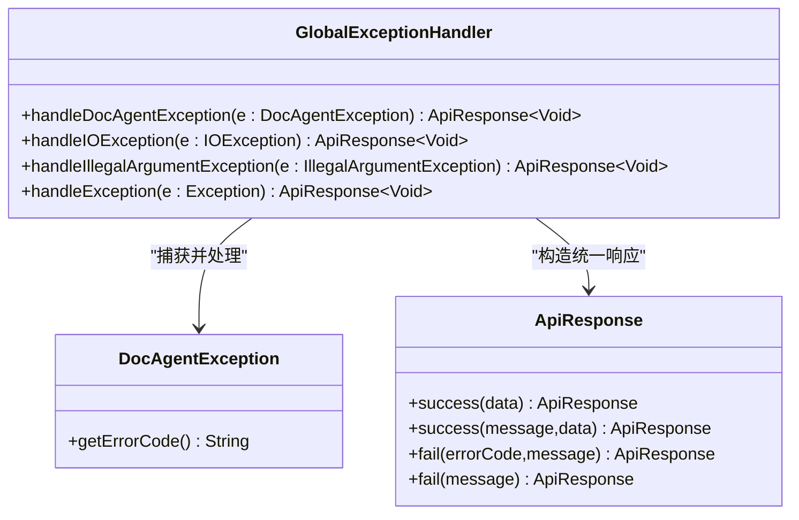
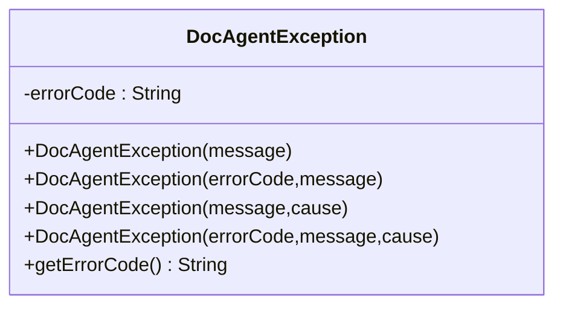
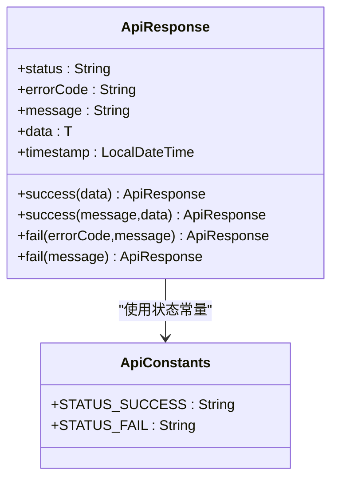
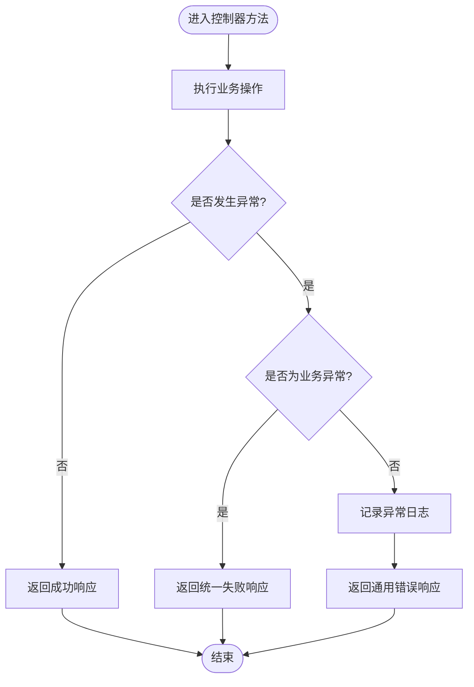
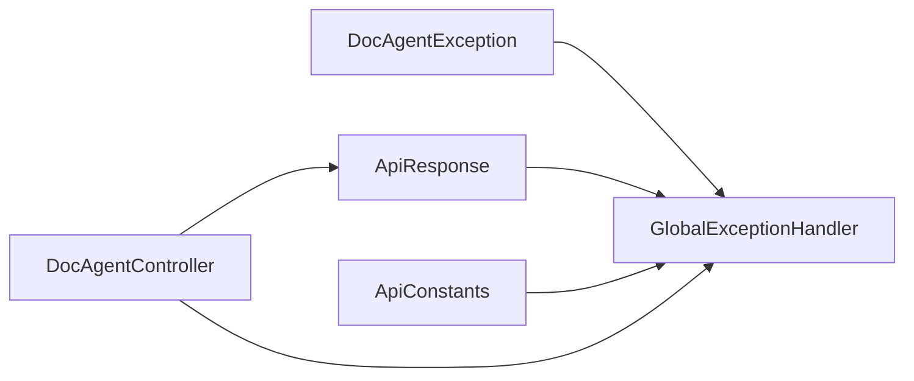

# 异常处理

<cite>
**本文引用的文件**
- [GlobalExceptionHandler.java](file://src/main/java/com/example/docs_agent/exception/GlobalExceptionHandler.java)
- [DocAgentException.java](file://src/main/java/com/example/docs_agent/exception/DocAgentException.java)
- [ApiResponse.java](file://src/main/java/com/example/docs_agent/dto/ApiResponse.java)
- [DocAgentController.java](file://src/main/java/com/example/docs_agent/controller/DocAgentController.java)
- [ApiConstants.java](file://src/main/java/com/example/docs_agent/constant/ApiConstants.java)
- [application.properties](file://src/main/resources/application.properties)
</cite>

## 目录
1. [简介](#简介)
2. [项目结构](#项目结构)
3. [核心组件](#核心组件)
4. [架构总览](#架构总览)
5. [详细组件分析](#详细组件分析)
6. [依赖分析](#依赖分析)
7. [性能考虑](#性能考虑)
8. [故障排查指南](#故障排查指南)
9. [结论](#结论)
10. [附录](#附录)

## 简介
本技术文档聚焦于项目的异常处理体系，系统性阐述全局异常处理器的捕获机制、错误码定义与统一响应格式，以及自定义业务异常 DocAgentException 的设计与使用。文档还总结了异常分类策略、错误日志记录最佳实践、用户友好错误消息设计原则，并提供实际使用示例与调试技巧，帮助开发者正确理解与高效使用异常处理机制。

## 项目结构
异常处理相关代码主要分布在以下模块：
- 异常定义与全局处理：exception 包
- 统一响应封装：dto 包
- 控制器层：controller 包
- 常量与配置：constant 与 resources

图表来源
- [GlobalExceptionHandler.java:1-60](file://src/main/java/com/example/docs_agent/exception/GlobalExceptionHandler.java#L1-L60)
- [DocAgentException.java:1-34](file://src/main/java/com/example/docs_agent/exception/DocAgentException.java#L1-L34)
- [ApiResponse.java:1-84](file://src/main/java/com/example/docs_agent/dto/ApiResponse.java#L1-L84)
- [DocAgentController.java:1-636](file://src/main/java/com/example/docs_agent/controller/DocAgentController.java#L1-L636)
- [ApiConstants.java:1-53](file://src/main/java/com/example/docs_agent/constant/ApiConstants.java#L1-L53)
- [application.properties:1-37](file://src/main/resources/application.properties#L1-L37)

章节来源
- [GlobalExceptionHandler.java:1-60](file://src/main/java/com/example/docs_agent/exception/GlobalExceptionHandler.java#L1-L60)
- [DocAgentException.java:1-34](file://src/main/java/com/example/docs_agent/exception/DocAgentException.java#L1-L34)
- [ApiResponse.java:1-84](file://src/main/java/com/example/docs_agent/dto/ApiResponse.java#L1-L84)
- [DocAgentController.java:1-636](file://src/main/java/com/example/docs_agent/controller/DocAgentController.java#L1-L636)
- [ApiConstants.java:1-53](file://src/main/java/com/example/docs_agent/constant/ApiConstants.java#L1-L53)
- [application.properties:1-37](file://src/main/resources/application.properties#L1-L37)

## 核心组件
- 全局异常处理器：集中捕获并转换各类异常为统一响应格式，保证对外输出一致、可控。
- 自定义业务异常：面向业务语义的异常类型，便于区分错误来源与含义。
- 统一响应封装：标准化响应结构，包含状态、错误码、消息与时间戳等字段。

章节来源
- [GlobalExceptionHandler.java:13-58](file://src/main/java/com/example/docs_agent/exception/GlobalExceptionHandler.java#L13-L58)
- [DocAgentException.java:3-33](file://src/main/java/com/example/docs_agent/exception/DocAgentException.java#L3-L33)
- [ApiResponse.java:8-83](file://src/main/java/com/example/docs_agent/dto/ApiResponse.java#L8-L83)

## 架构总览
异常处理在 Spring MVC 中通过@RestControllerAdvice实现全局拦截，结合控制器层的业务逻辑与统一响应封装，形成“异常捕获—错误码定义—统一响应”的闭环。

图表来源
- [GlobalExceptionHandler.java:23-28](file://src/main/java/com/example/docs_agent/exception/GlobalExceptionHandler.java#L23-L28)
- [DocAgentException.java:6-33](file://src/main/java/com/example/docs_agent/exception/DocAgentException.java#L6-L33)
- [ApiResponse.java:48-82](file://src/main/java/com/example/docs_agent/dto/ApiResponse.java#L48-L82)

## 详细组件分析

### 全局异常处理器（GlobalExceptionHandler）
- 职责与策略
  - 捕获并处理 DocAgentException：返回业务错误码与消息，状态码为客户端错误。
  - 捕获并处理 IOException：记录详细堆栈，返回统一 IO 错误码与用户可读消息。
  - 捕获并处理 IllegalArgumentException：记录参数异常，返回统一参数错误码。
  - 捕获并处理其他 Exception：记录系统异常，返回统一系统错误码。
- 日志与可观测性
  - 对每类异常均进行日志记录，包含错误码、消息与堆栈信息，便于问题定位。
- 统一响应
  - 通过 ApiResponse.fail 构造统一响应体，包含状态、错误码与消息字段。

图表来源
- [GlobalExceptionHandler.java:16-58](file://src/main/java/com/example/docs_agent/exception/GlobalExceptionHandler.java#L16-L58)
- [DocAgentException.java:6-33](file://src/main/java/com/example/docs_agent/exception/DocAgentException.java#L6-L33)
- [ApiResponse.java:48-82](file://src/main/java/com/example/docs_agent/dto/ApiResponse.java#L48-L82)

章节来源
- [GlobalExceptionHandler.java:13-58](file://src/main/java/com/example/docs_agent/exception/GlobalExceptionHandler.java#L13-L58)

### 自定义业务异常（DocAgentException）
- 设计要点
  - 继承 RuntimeException，支持携带错误码与原因异常。
  - 提供多种构造函数，满足不同场景下的错误信息与上下文传递需求。
  - 提供 getErrorCode 方法，便于全局处理器识别与分类。
- 使用建议
  - 在业务层明确抛出 DocAgentException，传递清晰的错误码与消息。
  - 若需要保留原始异常上下文，使用带 cause 的构造函数。

图表来源
- [DocAgentException.java:6-33](file://src/main/java/com/example/docs_agent/exception/DocAgentException.java#L6-L33)

章节来源
- [DocAgentException.java:3-33](file://src/main/java/com/example/docs_agent/exception/DocAgentException.java#L3-L33)

### 统一响应封装（ApiResponse）
- 结构与职责
  - 统一包含状态、错误码、消息、数据与时间戳字段，便于前端解析与展示。
  - 提供 success/fail 静态工厂方法，简化响应构造。
- 与常量配合
  - 通过 ApiConstants 定义统一的成功/失败状态常量，确保前后端一致性。

图表来源
- [ApiResponse.java:14-83](file://src/main/java/com/example/docs_agent/dto/ApiResponse.java#L14-L83)
- [ApiConstants.java:20-22](file://src/main/java/com/example/docs_agent/constant/ApiConstants.java#L20-L22)

章节来源
- [ApiResponse.java:8-83](file://src/main/java/com/example/docs_agent/dto/ApiResponse.java#L8-L83)
- [ApiConstants.java:18-22](file://src/main/java/com/example/docs_agent/constant/ApiConstants.java#L18-L22)

### 控制器层的异常处理实践
- 显式捕获与降级
  - 在控制器中对特定异常进行显式捕获，返回统一响应，避免异常继续冒泡。
  - 对于非业务异常，记录日志并返回用户可读的错误消息。
- 与全局处理器的协作
  - 控制器层可选择性地捕获异常；未捕获的异常由全局处理器兜底处理。
  - 全局处理器负责统一错误码与响应格式，确保一致性。

图表来源
- [DocAgentController.java:51-66](file://src/main/java/com/example/docs_agent/controller/DocAgentController.java#L51-L66)
- [GlobalExceptionHandler.java:23-58](file://src/main/java/com/example/docs_agent/exception/GlobalExceptionHandler.java#L23-L58)

章节来源
- [DocAgentController.java:51-66](file://src/main/java/com/example/docs_agent/controller/DocAgentController.java#L51-L66)
- [DocAgentController.java:332-342](file://src/main/java/com/example/docs_agent/controller/DocAgentController.java#L332-L342)
- [DocAgentController.java:626-633](file://src/main/java/com/example/docs_agent/controller/DocAgentController.java#L626-L633)

## 依赖分析
- 组件耦合
  - GlobalExceptionHandler 依赖 ApiResponse 与 ApiConstants，用于构造统一响应与状态常量。
  - DocAgentException 作为业务异常，被全局处理器捕获并转换为统一响应。
  - 控制器层在必要时直接构造 ApiResponse，减少异常冒泡。
- 外部依赖
  - Spring MVC 注解（@RestControllerAdvice、@ExceptionHandler、@ResponseStatus）实现全局异常拦截。
  - 日志框架（SLF4J）用于异常日志记录。

图表来源
- [GlobalExceptionHandler.java:3-9](file://src/main/java/com/example/docs_agent/exception/GlobalExceptionHandler.java#L3-L9)
- [ApiResponse.java:3-4](file://src/main/java/com/example/docs_agent/dto/ApiResponse.java#L3-L4)
- [ApiConstants.java:6-22](file://src/main/java/com/example/docs_agent/constant/ApiConstants.java#L6-L22)
- [DocAgentController.java:18-19](file://src/main/java/com/example/docs_agent/controller/DocAgentController.java#L18-L19)

章节来源
- [GlobalExceptionHandler.java:1-9](file://src/main/java/com/example/docs_agent/exception/GlobalExceptionHandler.java#L1-L9)
- [ApiResponse.java:1-7](file://src/main/java/com/example/docs_agent/dto/ApiResponse.java#L1-L7)
- [ApiConstants.java:1-22](file://src/main/java/com/example/docs_agent/constant/ApiConstants.java#L1-L22)
- [DocAgentController.java:1-27](file://src/main/java/com/example/docs_agent/controller/DocAgentController.java#L1-L27)

## 性能考虑
- 异常开销
  - 异常栈收集与日志记录会带来额外开销，建议仅在必要时记录完整堆栈。
  - 对高频异常（如参数校验）优先在控制器层快速返回，避免进入全局处理器。
- 响应构造
  - 统一响应封装减少了重复逻辑，有利于降低响应时间与提升一致性。
- 日志级别
  - 生产环境建议使用 INFO 或更高级别，避免过多 DEBUG 日志影响性能。

## 故障排查指南
- 常见问题定位
  - 查看全局处理器的日志输出，确认异常类型与错误码是否符合预期。
  - 检查控制器层是否对特定异常进行了显式捕获，导致未进入全局处理器。
- 日志与追踪
  - application.properties 中配置了日志级别与控制台编码，便于在本地快速定位问题。
- 建议流程
  - 先在控制器层打印关键参数与状态，再逐步缩小范围到服务层或外部依赖。
  - 对于 IO 异常，重点检查文件路径、权限与网络连接。

章节来源
- [application.properties:29-34](file://src/main/resources/application.properties#L29-L34)
- [GlobalExceptionHandler.java:25-57](file://src/main/java/com/example/docs_agent/exception/GlobalExceptionHandler.java#L25-L57)
- [DocAgentController.java:51-66](file://src/main/java/com/example/docs_agent/controller/DocAgentController.java#L51-L66)

## 结论
本项目的异常处理体系通过全局异常处理器与统一响应封装实现了“可预期、可追踪、可维护”的错误处理机制。自定义业务异常 DocAgentException 提供了清晰的错误语义与上下文承载能力，配合严格的日志记录与统一响应格式，显著提升了系统的稳定性与可运维性。建议在后续迭代中持续完善异常分类策略与错误码规范，进一步提升用户体验与开发效率。

## 附录
- 最佳实践清单
  - 明确异常分类：业务异常与系统异常分离，分别走不同处理路径。
  - 错误码设计：统一、可读、可扩展，便于前端与监控系统识别。
  - 用户友好消息：避免泄露敏感信息，提供可操作的修复建议。
  - 日志记录：分级、结构化、可检索，保留关键上下文。
  - 单元测试：针对异常分支补充测试用例，确保覆盖率。
- 常见异常场景与处理建议
  - 参数校验失败：在控制器层快速返回，使用统一参数错误码。
  - 文件操作失败：捕获 IO 异常，记录详细信息并返回用户可读消息。
  - 业务规则违反：抛出 DocAgentException，携带业务错误码与消息。
  - 未知系统错误：交由全局处理器兜底，记录完整堆栈以便排查。