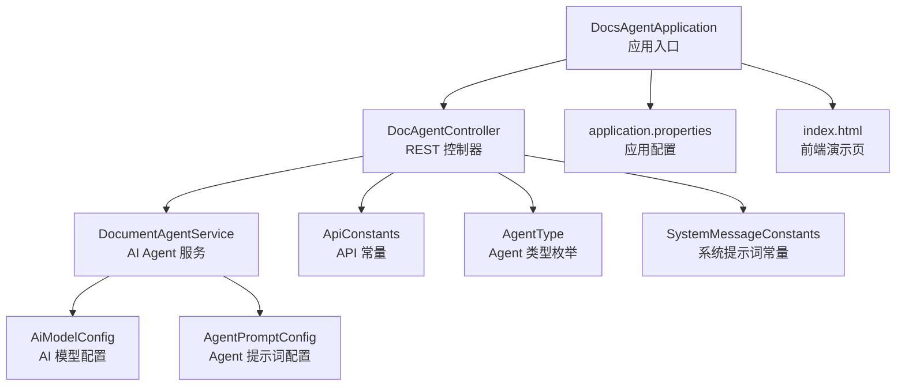
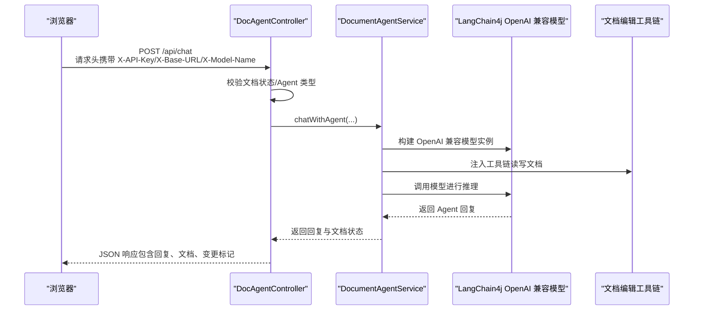
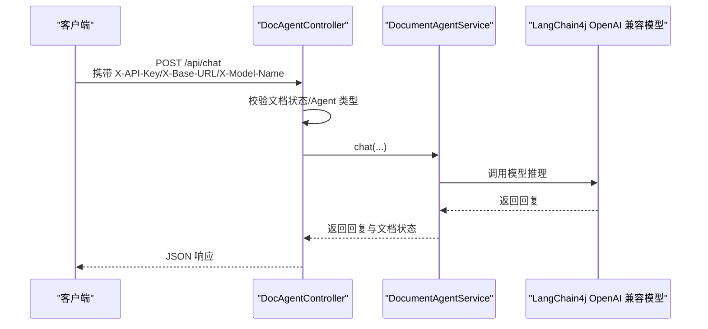
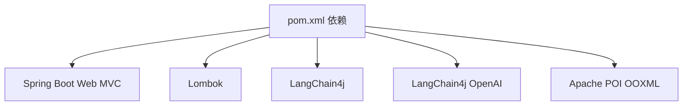

# 快速开始

<cite>
**本文引用的文件**
- [pom.xml](file://pom.xml)
- [application.properties](file://src/main/resources/application.properties)
- [DocsAgentApplication.java](file://src/main/java/com/example/docs_agent/DocsAgentApplication.java)
- [DocAgentController.java](file://src/main/java/com/example/docs_agent/controller/DocAgentController.java)
- [AiModelConfig.java](file://src/main/java/com/example/docs_agent/config/AiModelConfig.java)
- [AgentPromptConfig.java](file://src/main/java/com/example/docs_agent/config/AgentPromptConfig.java)
- [ApiConstants.java](file://src/main/java/com/example/docs_agent/constant/ApiConstants.java)
- [AgentType.java](file://src/main/java/com/example/docs_agent/constant/AgentType.java)
- [SystemMessageConstants.java](file://src/main/java/com/example/docs_agent/constant/SystemMessageConstants.java)
- [DocumentAgentService.java](file://src/main/java/com/example/docs_agent/service/DocumentAgentService.java)
- [index.html](file://src/main/resources/static/index.html)
- [.mvn/wrapper/maven-wrapper.properties](file://.mvn/wrapper/maven-wrapper.properties)
- [HELP.md](file://HELP.md)
</cite>

## 目录
1. [简介](#简介)
2. [项目结构](#项目结构)
3. [核心组件](#核心组件)
4. [架构总览](#架构总览)
5. [详细组件分析](#详细组件分析)
6. [依赖分析](#依赖分析)
7. [性能考虑](#性能考虑)
8. [故障排除指南](#故障排除指南)
9. [结论](#结论)
10. [附录](#附录)

## 简介
本指南面向新开发者，帮助你在约 15 分钟内完成环境准备、项目启动与首次 API 调用，体验与 AI Agent 的基本对话。项目基于 Spring Boot 4.0.3，使用 LangChain4j 集成 OpenAI 兼容模型，提供文档编辑、语法检查、智能摘要等能力，并内置前端页面用于交互演示。

## 项目结构
项目采用标准 Spring Boot 结构，主要模块如下：
- 应用入口与配置：DocsAgentApplication、application.properties
- 控制器层：DocAgentController，提供 REST API
- 配置层：AiModelConfig、AgentPromptConfig
- 常量层：ApiConstants、AgentType、SystemMessageConstants
- 服务层：DocumentAgentService 等
- 前端静态资源：index.html（浏览器端演示页面）

图表来源
- [DocsAgentApplication.java:1-11](file://src/main/java/com/example/docs_agent/DocsAgentApplication.java#L1-L11)
- [DocAgentController.java:1-636](file://src/main/java/com/example/docs_agent/controller/DocAgentController.java#L1-L636)
- [AiModelConfig.java:1-50](file://src/main/java/com/example/docs_agent/config/AiModelConfig.java#L1-L50)
- [AgentPromptConfig.java:1-88](file://src/main/java/com/example/docs_agent/config/AgentPromptConfig.java#L1-L88)
- [ApiConstants.java:1-53](file://src/main/java/com/example/docs_agent/constant/ApiConstants.java#L1-L53)
- [AgentType.java:1-87](file://src/main/java/com/example/docs_agent/constant/AgentType.java#L1-L87)
- [SystemMessageConstants.java:1-234](file://src/main/java/com/example/docs_agent/constant/SystemMessageConstants.java#L1-L234)
- [application.properties:1-37](file://src/main/resources/application.properties#L1-L37)
- [index.html:1-800](file://src/main/resources/static/index.html#L1-L800)

章节来源
- [pom.xml:1-111](file://pom.xml#L1-L111)
- [application.properties:1-37](file://src/main/resources/application.properties#L1-L37)
- [DocsAgentApplication.java:1-11](file://src/main/java/com/example/docs_agent/DocsAgentApplication.java#L1-L11)
- [DocAgentController.java:1-636](file://src/main/java/com/example/docs_agent/controller/DocAgentController.java#L1-L636)

## 核心组件
- 应用入口：启动 Spring Boot 应用
- 控制器：提供 /api 基础路径下的多个 API，包括对话、文档状态管理、语法检查、摘要生成等
- 配置：AI 模型参数、Agent 提示词策略、日志级别等
- 常量：API 基础路径、默认模型、Agent 类型、系统提示词模板
- 服务：封装 LangChain4j 的 OpenAI 兼容模型调用，支持多 Agent 类型与工具链

章节来源
- [DocsAgentApplication.java:1-11](file://src/main/java/com/example/docs_agent/DocsAgentApplication.java#L1-L11)
- [DocAgentController.java:1-636](file://src/main/java/com/example/docs_agent/controller/DocAgentController.java#L1-L636)
- [AiModelConfig.java:1-50](file://src/main/java/com/example/docs_agent/config/AiModelConfig.java#L1-L50)
- [AgentPromptConfig.java:1-88](file://src/main/java/com/example/docs_agent/config/AgentPromptConfig.java#L1-L88)
- [ApiConstants.java:1-53](file://src/main/java/com/example/docs_agent/constant/ApiConstants.java#L1-L53)
- [AgentType.java:1-87](file://src/main/java/com/example/docs_agent/constant/AgentType.java#L1-L87)
- [SystemMessageConstants.java:1-234](file://src/main/java/com/example/docs_agent/constant/SystemMessageConstants.java#L1-L234)

## 架构总览
下图展示了从浏览器到后端 API，再到 AI 模型的调用链路。浏览器通过 /api/chat 发起对话，控制器解析请求头中的模型参数，调用服务层与 AI 模型交互，并将结果返回给前端。

图表来源
- [DocAgentController.java:354-428](file://src/main/java/com/example/docs_agent/controller/DocAgentController.java#L354-L428)
- [DocumentAgentService.java:183-191](file://src/main/java/com/example/docs_agent/service/DocumentAgentService.java#L183-L191)
- [ApiConstants.java:27-29](file://src/main/java/com/example/docs_agent/constant/ApiConstants.java#L27-L29)

## 详细组件分析

### 环境与依赖准备
- JDK 17：项目属性中明确指定 Java 17
- Maven：使用 Maven Wrapper，无需手动安装 Maven
- IDE：推荐 IntelliJ IDEA 或 VS Code（Spring Boot 插件）
- 可选：Postman 或 curl 用于 API 调用

章节来源
- [pom.xml:29-36](file://pom.xml#L29-L36)
- [.mvn/wrapper/maven-wrapper.properties:1-4](file://.mvn/wrapper/maven-wrapper.properties#L1-L4)

### 克隆与构建
- 克隆仓库后，使用 Maven Wrapper 执行构建与启动
- 构建命令：使用项目根目录下的 mvnw.cmd（Windows）或 mvnw（Unix）
- 启动命令：mvnw spring-boot:run 或 IDE 直接运行 DocsAgentApplication.main()

章节来源
- [pom.xml:1-111](file://pom.xml#L1-L111)
- [DocsAgentApplication.java:1-11](file://src/main/java/com/example/docs_agent/DocsAgentApplication.java#L1-L11)

### 首次启动与访问
- 启动后访问 http://localhost:8080（默认端口）
- 页面加载后可直接进行对话；若提示“文档为空”，先初始化文档或扫描全文

章节来源
- [application.properties:8-12](file://src/main/resources/application.properties#L8-L12)
- [index.html:1-800](file://src/main/resources/static/index.html#L1-L800)

### 关键配置项说明
- 服务器端口与编码：server.port、server.servlet.encoding.*
- SSL 证书：server.ssl.key-store、server.ssl.key-store-password、server.ssl.key-store-type
- AI 模型参数：ai.model.api-key、ai.model.base-url、ai.model.model-name、ai.model.timeout-seconds、ai.model.chat-memory-size
- Agent 提示词策略：agent.prompt.default-type、agent.prompt.allow-client-override、agent.prompt.allow-custom-prompt
- 日志配置：logging.level.*、logging.charset.console、logging.pattern.console
- 忽略 favicon：spring.mvc.favicon.enabled=false

章节来源
- [application.properties:1-37](file://src/main/resources/application.properties#L1-L37)

### 第一个 API 调用：与 AI Agent 对话
- 端点：POST /api/chat
- 请求头：
  - X-API-Key：模型 API 密钥
  - X-Base-URL：模型服务地址（可覆盖默认值）
  - X-Model-Name：模型名称（可覆盖默认值）
- 请求体：包含 message、agentType（可选）、customSystemPrompt（可选）
- 响应体：包含 reply、document、changed、status 等字段

图表来源
- [DocAgentController.java:354-428](file://src/main/java/com/example/docs_agent/controller/DocAgentController.java#L354-L428)
- [DocumentAgentService.java:183-191](file://src/main/java/com/example/docs_agent/service/DocumentAgentService.java#L183-L191)
- [ApiConstants.java:27-29](file://src/main/java/com/example/docs_agent/constant/ApiConstants.java#L27-L29)

章节来源
- [DocAgentController.java:354-428](file://src/main/java/com/example/docs_agent/controller/DocAgentController.java#L354-L428)
- [ApiConstants.java:14-30](file://src/main/java/com/example/docs_agent/constant/ApiConstants.java#L14-L30)

### Agent 类型与系统提示词
- Agent 类型：general、academic、business、technical、legal、creative、custom
- 系统提示词：内置多类型提示词模板，支持自定义提示词
- 配置开关：是否允许前端覆盖 Agent 类型、是否允许使用自定义提示词

章节来源
- [AgentType.java:1-87](file://src/main/java/com/example/docs_agent/constant/AgentType.java#L1-L87)
- [SystemMessageConstants.java:1-234](file://src/main/java/com/example/docs_agent/constant/SystemMessageConstants.java#L1-L234)
- [AgentPromptConfig.java:1-88](file://src/main/java/com/example/docs_agent/config/AgentPromptConfig.java#L1-L88)

### AI 模型配置
- 配置类：AiModelConfig，绑定 ai.model.* 前缀
- 默认模型：SiliconFlow 的 OpenAI 兼容接口
- 超时与记忆窗口：timeoutSeconds、chatMemorySize

章节来源
- [AiModelConfig.java:1-50](file://src/main/java/com/example/docs_agent/config/AiModelConfig.java#L1-L50)
- [ApiConstants.java:48-51](file://src/main/java/com/example/docs_agent/constant/ApiConstants.java#L48-L51)

## 依赖分析
项目依赖包括：
- Spring Boot Web MVC：提供 Web 层能力
- Lombok：简化 Java 代码
- LangChain4j 与 LangChain4j OpenAI：AI 集成
- Apache POI OOXML：处理 Office 文档

图表来源
- [pom.xml:37-78](file://pom.xml#L37-L78)

章节来源
- [pom.xml:1-111](file://pom.xml#L1-L111)

## 性能考虑
- 聊天记忆窗口：ai.model.chat-memory-size 控制上下文长度，影响响应速度与成本
- 超时设置：ai.model.timeout-seconds 控制模型调用超时，避免长时间等待
- 文档长度限制：摘要生成会限制输入长度，避免超出模型上下文
- 日志级别：生产环境建议提高日志级别，减少 IO 开销

章节来源
- [AiModelConfig.java:35-41](file://src/main/java/com/example/docs_agent/config/AiModelConfig.java#L35-L41)
- [DocAgentController.java:590-595](file://src/main/java/com/example/docs_agent/controller/DocAgentController.java#L590-L595)
- [application.properties:29-34](file://src/main/resources/application.properties#L29-L34)

## 故障排除指南
- 端口占用
  - 现象：启动失败，端口冲突
  - 处理：修改 server.port 或释放占用端口
- SSL 证书问题
  - 现象：HTTPS 访问异常
  - 处理：确认 keystore 文件路径与密码正确，或关闭 SSL
- AI 模型连接失败
  - 现象：/api/chat 返回异常
  - 处理：检查 X-API-Key、X-Base-URL、X-Model-Name 是否正确；确认网络可达
- 文档为空
  - 现象：提示“文档为空，请先同步文档内容”
  - 处理：先调用 /api/init-document 或扫描全文后再发起对话
- 日志乱码（Windows）
  - 现象：控制台中文显示异常
  - 处理：application.properties 中已设置日志控制台编码为 GBK

章节来源
- [application.properties:8-12](file://src/main/resources/application.properties#L8-L12)
- [application.properties:32-34](file://src/main/resources/application.properties#L32-L34)
- [DocAgentController.java:280-290](file://src/main/java/com/example/docs_agent/controller/DocAgentController.java#L280-L290)
- [DocAgentController.java:377-387](file://src/main/java/com/example/docs_agent/controller/DocAgentController.java#L377-L387)

## 结论
按照本指南，你可以在 15 分钟内完成环境准备、项目启动与首次 API 调用。建议在本地开发阶段使用默认配置，上线前再根据实际需求调整 AI 模型参数、日志级别与安全配置。

## 附录

### 常用 API 列表（路径与方法）
- GET /api/agent-types：获取可用 Agent 类型
- GET /api/agent-prompt/{typeCode}：获取指定类型系统提示词
- POST /api/custom-prompt：设置自定义提示词
- GET /api/custom-prompt：获取当前自定义提示词
- DELETE /api/custom-prompt：清除自定义提示词
- GET /api/agent-config：获取 Agent 配置信息
- POST /api/chat：与 AI Agent 对话
- POST /api/save-to-word：增量保存到 Word
- GET /api/document：获取当前文档状态
- POST /api/init-document：初始化文档状态
- POST /api/lock-selection：锁定选区
- POST /api/accept：接受变更
- POST /api/reject：拒绝变更
- POST /api/batch-accept：批量接受变更
- POST /api/batch-reject：批量拒绝变更
- POST /api/accept-all：接受所有待处理变更
- POST /api/reject-all：拒绝所有待处理变更
- POST /api/grammar-check：全文语法检查
- POST /api/summarize：生成文档摘要

章节来源
- [DocAgentController.java:1-636](file://src/main/java/com/example/docs_agent/controller/DocAgentController.java#L1-L636)
- [ApiConstants.java:14-15](file://src/main/java/com/example/docs_agent/constant/ApiConstants.java#L14-L15)