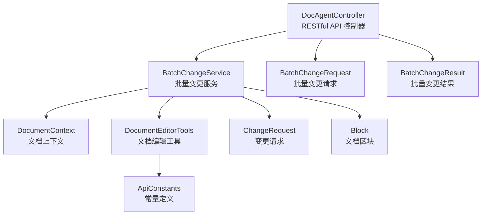
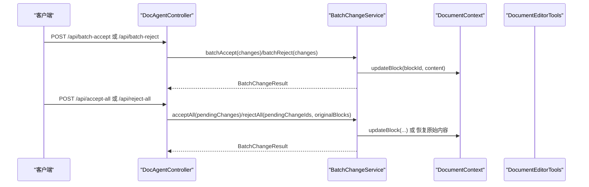
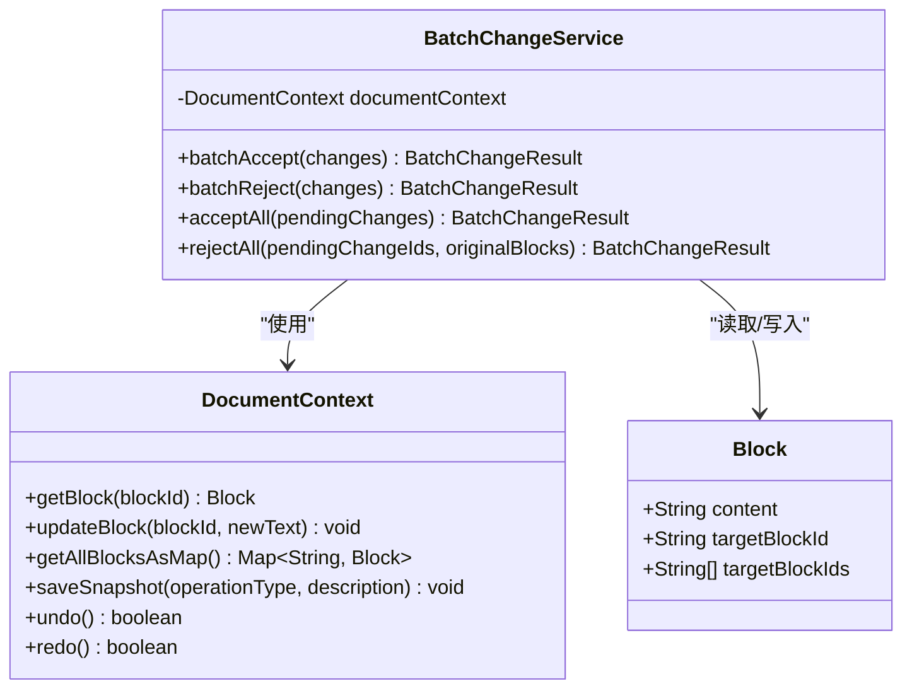
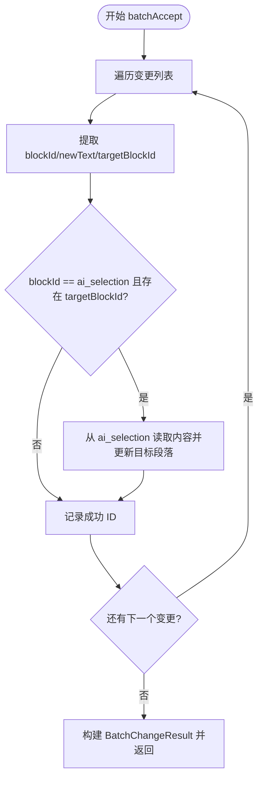
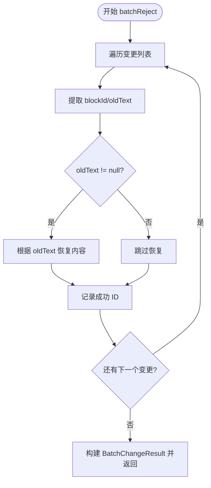
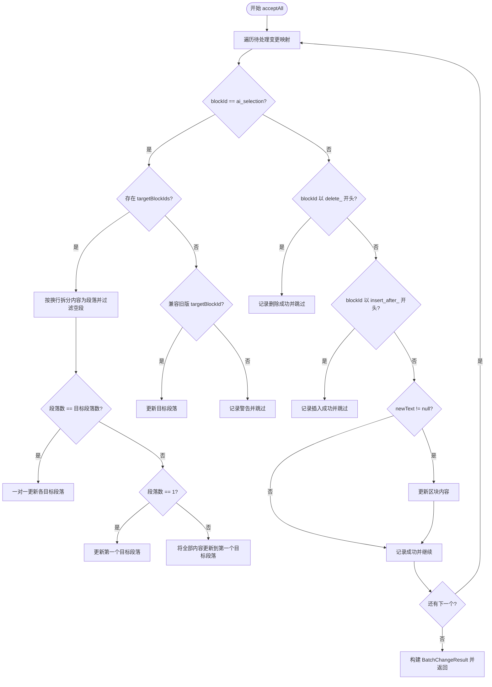
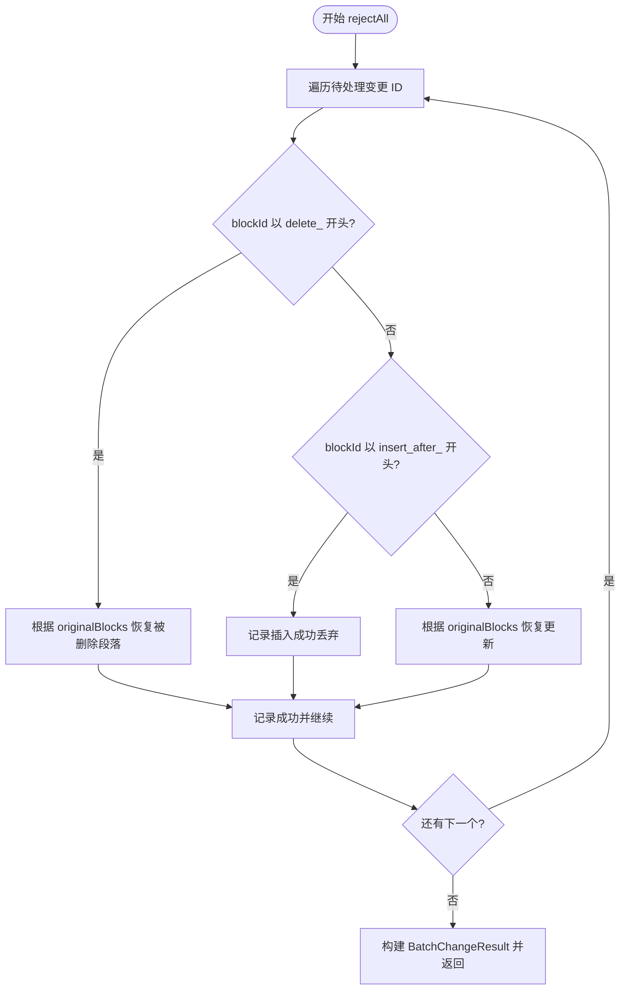
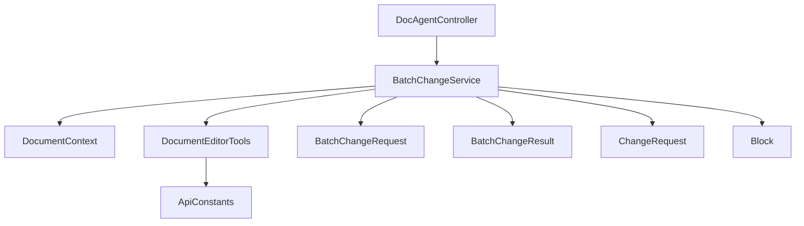

# 批量变更管理

<cite>
**本文引用的文件**
- [BatchChangeService.java](file://src/main/java/com/example/docs_agent/service/BatchChangeService.java)
- [BatchChangeRequest.java](file://src/main/java/com/example/docs_agent/dto/BatchChangeRequest.java)
- [BatchChangeResult.java](file://src/main/java/com/example/docs_agent/dto/BatchChangeResult.java)
- [ChangeRequest.java](file://src/main/java/com/example/docs_agent/dto/ChangeRequest.java)
- [DocumentContext.java](file://src/main/java/com/example/docs_agent/service/DocumentContext.java)
- [DocumentEditorTools.java](file://src/main/java/com/example/docs_agent/service/DocumentEditorTools.java)
- [Block.java](file://src/main/java/com/example/docs_agent/entity/Block.java)
- [ApiConstants.java](file://src/main/java/com/example/docs_agent/constant/ApiConstants.java)
- [DocAgentController.java](file://src/main/java/com/example/docs_agent/controller/DocAgentController.java)
</cite>

## 目录
1. [简介](#简介)
2. [项目结构](#项目结构)
3. [核心组件](#核心组件)
4. [架构总览](#架构总览)
5. [详细组件分析](#详细组件分析)
6. [依赖关系分析](#依赖关系分析)
7. [性能考量](#性能考量)
8. [故障排查指南](#故障排查指南)
9. [结论](#结论)
10. [附录](#附录)

## 简介
本技术文档围绕批量变更管理功能展开，重点解析 BatchChangeService 的核心实现，涵盖批量接受变更（batchAccept）与批量拒绝变更（batchReject）的处理逻辑；深入说明变更请求的处理流程，包括 ai_selection 特殊逻辑、删除操作（delete_ 前缀）、插入操作（insert_after_ 前缀）的处理机制；解释 acceptAll 与 rejectAll 方法的不同行为模式，尤其是对多段落内容的智能分配策略；并提供 BatchChangeRequest 与 BatchChangeResult 数据结构的完整说明，包括字段定义、使用场景与数据流转。最后给出实际的代码示例与使用场景，帮助开发者正确使用批量变更管理功能。

## 项目结构
该模块位于 Spring Boot 应用中，采用分层架构：
- 控制器层：DocAgentController 提供 RESTful API，负责接收请求并调用服务层
- 服务层：BatchChangeService 实现批量变更的核心业务逻辑；DocumentContext 管理文档状态；DocumentEditorTools 暴露给大模型的工具集
- 数据传输对象：BatchChangeRequest、BatchChangeResult、ChangeRequest
- 实体：Block 表示文档区块
- 常量：ApiConstants 定义区块 ID 前缀与特殊标记

图表来源
- [DocAgentController.java:182-260](file://src/main/java/com/example/docs_agent/controller/DocAgentController.java#L182-L260)
- [BatchChangeService.java:33-266](file://src/main/java/com/example/docs_agent/service/BatchChangeService.java#L33-L266)
- [DocumentContext.java:62-81](file://src/main/java/com/example/docs_agent/service/DocumentContext.java#L62-L81)
- [DocumentEditorTools.java:18-22](file://src/main/java/com/example/docs_agent/service/DocumentEditorTools.java#L18-L22)
- [BatchChangeRequest.java:13-28](file://src/main/java/com/example/docs_agent/dto/BatchChangeRequest.java#L13-L28)
- [BatchChangeResult.java:13-38](file://src/main/java/com/example/docs_agent/dto/BatchChangeResult.java#L13-L38)
- [ChangeRequest.java:9-29](file://src/main/java/com/example/docs_agent/dto/ChangeRequest.java#L9-L29)
- [Block.java:11-45](file://src/main/java/com/example/docs_agent/entity/Block.java#L11-L45)
- [ApiConstants.java:34-42](file://src/main/java/com/example/docs_agent/constant/ApiConstants.java#L34-L42)

章节来源
- [DocAgentController.java:182-260](file://src/main/java/com/example/docs_agent/controller/DocAgentController.java#L182-L260)
- [BatchChangeService.java:33-266](file://src/main/java/com/example/docs_agent/service/BatchChangeService.java#L33-L266)
- [DocumentContext.java:62-81](file://src/main/java/com/example/docs_agent/service/DocumentContext.java#L62-L81)
- [DocumentEditorTools.java:18-22](file://src/main/java/com/example/docs_agent/service/DocumentEditorTools.java#L18-L22)
- [BatchChangeRequest.java:13-28](file://src/main/java/com/example/docs_agent/dto/BatchChangeRequest.java#L13-L28)
- [BatchChangeResult.java:13-38](file://src/main/java/com/example/docs_agent/dto/BatchChangeResult.java#L13-L38)
- [ChangeRequest.java:9-29](file://src/main/java/com/example/docs_agent/dto/ChangeRequest.java#L9-L29)
- [Block.java:11-45](file://src/main/java/com/example/docs_agent/entity/Block.java#L11-L45)
- [ApiConstants.java:34-42](file://src/main/java/com/example/docs_agent/constant/ApiConstants.java#L34-L42)

## 核心组件
- BatchChangeService：实现批量变更的核心业务逻辑，包括批量接受、批量拒绝、接受所有、拒绝所有等方法
- DocAgentController：提供 RESTful API，负责接收请求并调用 BatchChangeService
- DocumentContext：维护文档状态，提供区块的增删改查与快照能力
- DocumentEditorTools：向大模型暴露文档编辑工具，如更新段落、插入段落、删除段落等
- DTO：BatchChangeRequest、BatchChangeResult、ChangeRequest
- Entity：Block
- Constants：ApiConstants

章节来源
- [BatchChangeService.java:33-266](file://src/main/java/com/example/docs_agent/service/BatchChangeService.java#L33-L266)
- [DocAgentController.java:182-260](file://src/main/java/com/example/docs_agent/controller/DocAgentController.java#L182-L260)
- [DocumentContext.java:62-81](file://src/main/java/com/example/docs_agent/service/DocumentContext.java#L62-L81)
- [DocumentEditorTools.java:18-22](file://src/main/java/com/example/docs_agent/service/DocumentEditorTools.java#L18-L22)
- [BatchChangeRequest.java:13-28](file://src/main/java/com/example/docs_agent/dto/BatchChangeRequest.java#L13-L28)
- [BatchChangeResult.java:13-38](file://src/main/java/com/example/docs_agent/dto/BatchChangeResult.java#L13-L38)
- [ChangeRequest.java:9-29](file://src/main/java/com/example/docs_agent/dto/ChangeRequest.java#L9-L29)
- [Block.java:11-45](file://src/main/java/com/example/docs_agent/entity/Block.java#L11-L45)
- [ApiConstants.java:34-42](file://src/main/java/com/example/docs_agent/constant/ApiConstants.java#L34-L42)

## 架构总览
批量变更管理通过控制器接收请求，调用服务层进行批量处理，并通过 DocumentContext 维护文档状态。DocumentEditorTools 为大模型提供工具接口，生成带前缀的区块 ID（如 delete_、insert_after_），便于 BatchChangeService 在 acceptAll/rejectAll 中识别操作类型。

图表来源
- [DocAgentController.java:182-260](file://src/main/java/com/example/docs_agent/controller/DocAgentController.java#L182-L260)
- [BatchChangeService.java:33-266](file://src/main/java/com/example/docs_agent/service/BatchChangeService.java#L33-L266)
- [DocumentContext.java:72-81](file://src/main/java/com/example/docs_agent/service/DocumentContext.java#L72-L81)
- [DocumentEditorTools.java:58-102](file://src/main/java/com/example/docs_agent/service/DocumentEditorTools.java#L58-L102)

## 详细组件分析

### BatchChangeService 核心实现
BatchChangeService 是批量变更管理的核心，包含以下关键方法：
- batchAccept：遍历变更列表，处理 ai_selection 特殊逻辑，更新目标段落，记录成功/失败 ID
- batchReject：根据 oldText 恢复原始内容，记录成功/失败 ID
- acceptAll：接受所有待处理变更，支持 ai_selection 多段落智能分配、删除与插入操作识别
- rejectAll：拒绝所有待处理变更，针对删除与插入操作采取不同恢复策略

图表来源
- [BatchChangeService.java:25-266](file://src/main/java/com/example/docs_agent/service/BatchChangeService.java#L25-L266)
- [DocumentContext.java:62-81](file://src/main/java/com/example/docs_agent/service/DocumentContext.java#L62-L81)
- [Block.java:11-45](file://src/main/java/com/example/docs_agent/entity/Block.java#L11-L45)

章节来源
- [BatchChangeService.java:33-266](file://src/main/java/com/example/docs_agent/service/BatchChangeService.java#L33-L266)
- [DocumentContext.java:62-81](file://src/main/java/com/example/docs_agent/service/DocumentContext.java#L62-L81)
- [Block.java:11-45](file://src/main/java/com/example/docs_agent/entity/Block.java#L11-L45)

#### 批量接受变更（batchAccept）
- 输入：变更列表（ChangeRequest）
- 处理逻辑：
  - 遍历每个变更，提取 blockId、newText、targetBlockId
  - 若 blockId 为 ai_selection 且存在 targetBlockId，则从 ai_selection 读取内容并更新目标段落
  - 记录成功/失败 ID，构建 BatchChangeResult
- 异常处理：捕获异常并记录失败 ID

图表来源
- [BatchChangeService.java:33-68](file://src/main/java/com/example/docs_agent/service/BatchChangeService.java#L33-L68)

章节来源
- [BatchChangeService.java:33-68](file://src/main/java/com/example/docs_agent/service/BatchChangeService.java#L33-L68)

#### 批量拒绝变更（batchReject）
- 输入：变更列表（ChangeRequest）
- 处理逻辑：
  - 遍历每个变更，根据 oldText 恢复原始内容
  - 记录成功/失败 ID，构建 BatchChangeResult
- 异常处理：捕获异常并记录失败 ID

图表来源
- [BatchChangeService.java:76-105](file://src/main/java/com/example/docs_agent/service/BatchChangeService.java#L76-L105)

章节来源
- [BatchChangeService.java:76-105](file://src/main/java/com/example/docs_agent/service/BatchChangeService.java#L76-L105)

#### 接受所有变更（acceptAll）
- 输入：待处理变更映射（blockId -> Block）
- 处理逻辑：
  - 遍历映射，逐项处理
  - ai_selection 特殊逻辑：支持多段落智能分配
    - 若存在 targetBlockIds 列表：
      - 将 ai_selection 内容按换行拆分为段落，过滤空段
      - 段落数与目标段落数相等：一对一更新
      - 段落数为 1：更新第一个目标段落
      - 其他情况：将全部内容更新到第一个目标段落
    - 若不存在 targetBlockIds：兼容旧版本，使用单个 targetBlockId
  - 删除操作（blockId 以 delete_ 开头）：记录成功，不执行实际删除（Word 中已完成）
  - 插入操作（blockId 以 insert_after_ 开头）：记录成功，不执行实际插入（Word 中已完成）
  - 普通更新：若 newText 存在则更新区块内容
- 异常处理：捕获异常并记录失败 ID

图表来源
- [BatchChangeService.java:113-210](file://src/main/java/com/example/docs_agent/service/BatchChangeService.java#L113-L210)

章节来源
- [BatchChangeService.java:113-210](file://src/main/java/com/example/docs_agent/service/BatchChangeService.java#L113-L210)

#### 拒绝所有变更（rejectAll）
- 输入：待处理变更 ID 列表与原始区块映射（key: blockId, value: 原始 Block）
- 处理逻辑：
  - 遍历待处理变更 ID
  - 删除操作（blockId 以 delete_ 开头）：根据原始区块内容恢复被删除的段落
  - 插入操作（blockId 以 insert_after_ 开头）：无需额外操作（Word 中尚未写入）
  - 普通更新：根据原始区块内容恢复
- 异常处理：捕获异常并记录失败 ID

图表来源
- [BatchChangeService.java:220-266](file://src/main/java/com/example/docs_agent/service/BatchChangeService.java#L220-L266)

章节来源
- [BatchChangeService.java:220-266](file://src/main/java/com/example/docs_agent/service/BatchChangeService.java#L220-L266)

### 变更请求处理流程
- ai_selection 特殊逻辑：当 blockId 为 ai_selection 且存在 targetBlockId 时，从 ai_selection 读取内容并更新目标段落
- 删除操作（delete_ 前缀）：在 acceptAll 中仅记录成功，实际删除已在 Word 中完成
- 插入操作（insert_after_ 前缀）：在 acceptAll 中仅记录成功，实际插入已在 Word 中完成

章节来源
- [BatchChangeService.java:44-51](file://src/main/java/com/example/docs_agent/service/BatchChangeService.java#L44-L51)
- [BatchChangeService.java:174-188](file://src/main/java/com/example/docs_agent/service/BatchChangeService.java#L174-L188)
- [BatchChangeService.java:227-243](file://src/main/java/com/example/docs_agent/service/BatchChangeService.java#L227-L243)

### 数据结构说明

#### BatchChangeRequest
- 字段定义
  - changes：变更操作列表（List<ChangeRequest>）
  - operationType：操作类型（accept/reject）
  - originalBlocks：拒绝操作时用于恢复原始状态的映射（Map<String, Block>）
- 使用场景
  - 批量接受/拒绝时携带变更列表
  - 接受所有/拒绝所有时携带待处理映射与原始状态

章节来源
- [BatchChangeRequest.java:13-28](file://src/main/java/com/example/docs_agent/dto/BatchChangeRequest.java#L13-L28)

#### BatchChangeResult
- 字段定义
  - successIds：操作成功的区块 ID 列表
  - failedIds：操作失败的区块 ID 列表
  - successCount：成功数量
  - failedCount：失败数量
  - message：操作结果消息
- 使用场景
  - 所有批量操作返回统一的结果结构，便于前端展示与统计

章节来源
- [BatchChangeResult.java:13-38](file://src/main/java/com/example/docs_agent/dto/BatchChangeResult.java#L13-L38)

#### ChangeRequest
- 字段定义
  - blockId：区块 ID
  - oldText：原始文本（用于拒绝操作时恢复）
  - newText：新文本内容（用于接受操作时同步更新）
  - targetBlockId：目标段落 ID（用于 ai_selection 同步更新原始段落）
- 使用场景
  - 单个变更的请求参数，支持批量操作

章节来源
- [ChangeRequest.java:9-29](file://src/main/java/com/example/docs_agent/dto/ChangeRequest.java#L9-L29)

#### Block
- 字段定义
  - content：区块内容
  - targetBlockId：目标区块 ID（用于 ai_selection 等临时区块）
  - targetBlockIds：目标区块 ID 列表（用于多段落选区）
- 使用场景
  - 接受所有变更时，ai_selection 可能包含多目标段落 ID

章节来源
- [Block.java:11-45](file://src/main/java/com/example/docs_agent/entity/Block.java#L11-L45)

### API 使用示例与场景

#### 批量接受变更
- 请求路径：POST /api/batch-accept
- 请求体：BatchChangeRequest（包含 changes 列表）
- 场景：用户在前端勾选多个变更，一次性接受
- 注意：ai_selection 会同步更新目标段落

章节来源
- [DocAgentController.java:182-187](file://src/main/java/com/example/docs_agent/controller/DocAgentController.java#L182-L187)
- [BatchChangeService.java:33-68](file://src/main/java/com/example/docs_agent/service/BatchChangeService.java#L33-L68)

#### 批量拒绝变更
- 请求路径：POST /api/batch-reject
- 请求体：BatchChangeRequest（包含 changes 列表）
- 场景：用户在前端勾选多个变更，一次性拒绝
- 注意：根据 oldText 恢复原始内容

章节来源
- [DocAgentController.java:195-200](file://src/main/java/com/example/docs_agent/controller/DocAgentController.java#L195-L200)
- [BatchChangeService.java:76-105](file://src/main/java/com/example/docs_agent/service/BatchChangeService.java#L76-L105)

#### 接受所有变更
- 请求路径：POST /api/accept-all
- 请求体：Map<String, Block>（待处理变更映射）
- 场景：用户确认接受所有草稿与操作
- 注意：ai_selection 多段落智能分配；delete_ 与 insert_after_ 仅记录成功

章节来源
- [DocAgentController.java:208-226](file://src/main/java/com/example/docs_agent/controller/DocAgentController.java#L208-L226)
- [BatchChangeService.java:113-210](file://src/main/java/com/example/docs_agent/service/BatchChangeService.java#L113-L210)

#### 拒绝所有变更
- 请求路径：POST /api/reject-all
- 请求体：BatchChangeRequest（包含 changes 列表与 originalBlocks）
- 场景：用户取消所有草稿与操作
- 注意：delete_ 恢复被删除段落；insert_after_ 丢弃；普通更新恢复原始内容

章节来源
- [DocAgentController.java:234-260](file://src/main/java/com/example/docs_agent/controller/DocAgentController.java#L234-L260)
- [BatchChangeService.java:220-266](file://src/main/java/com/example/docs_agent/service/BatchChangeService.java#L220-L266)

## 依赖关系分析
- BatchChangeService 依赖 DocumentContext 进行区块状态管理
- DocAgentController 作为入口，依赖 BatchChangeService 与 DocumentContext
- DocumentEditorTools 生成带前缀的区块 ID，影响 acceptAll/rejectAll 的分支逻辑
- ApiConstants 提供区块 ID 前缀与特殊标记，支撑删除/插入/ai_selection 的识别

图表来源
- [DocAgentController.java:38-43](file://src/main/java/com/example/docs_agent/controller/DocAgentController.java#L38-L43)
- [BatchChangeService.java:25-26](file://src/main/java/com/example/docs_agent/service/BatchChangeService.java#L25-L26)
- [DocumentContext.java:24-29](file://src/main/java/com/example/docs_agent/service/DocumentContext.java#L24-L29)
- [DocumentEditorTools.java:18-22](file://src/main/java/com/example/docs_agent/service/DocumentEditorTools.java#L18-L22)
- [ApiConstants.java:34-42](file://src/main/java/com/example/docs_agent/constant/ApiConstants.java#L34-L42)

章节来源
- [DocAgentController.java:38-43](file://src/main/java/com/example/docs_agent/controller/DocAgentController.java#L38-L43)
- [BatchChangeService.java:25-26](file://src/main/java/com/example/docs_agent/service/BatchChangeService.java#L25-L26)
- [DocumentContext.java:24-29](file://src/main/java/com/example/docs_agent/service/DocumentContext.java#L24-L29)
- [DocumentEditorTools.java:18-22](file://src/main/java/com/example/docs_agent/service/DocumentEditorTools.java#L18-L22)
- [ApiConstants.java:34-42](file://src/main/java/com/example/docs_agent/constant/ApiConstants.java#L34-L42)

## 性能考量
- 批量操作采用线性遍历，时间复杂度 O(n)，其中 n 为变更数量
- ai_selection 多段落智能分配涉及字符串拆分与过滤，整体仍为 O(n) 级别
- acceptAll/rejectAll 中对删除/插入操作的处理为常量时间，不影响总体复杂度
- 建议：在大规模变更场景下，前端应分批提交，避免单次请求过大导致超时

## 故障排查指南
- 批量接受/拒绝失败：检查日志中的错误信息，确认 blockId 是否有效、ai_selection 内容是否存在、oldText 是否提供
- ai_selection 未更新目标段落：确认 blockId 为 ai_selection 且 targetBlockId 非空
- 删除/插入操作无效：确认 blockId 是否以 delete_/insert_after_ 开头，acceptAll/rejectAll 会根据前缀识别操作类型
- 恢复失败：rejectAll 需要 originalBlocks 提供原始状态，确保请求体中包含正确的 oldText

章节来源
- [BatchChangeService.java:55-58](file://src/main/java/com/example/docs_agent/service/BatchChangeService.java#L55-L58)
- [BatchChangeService.java:92-95](file://src/main/java/com/example/docs_agent/service/BatchChangeService.java#L92-L95)
- [BatchChangeService.java:165-167](file://src/main/java/com/example/docs_agent/service/BatchChangeService.java#L165-L167)
- [BatchChangeService.java:230-233](file://src/main/java/com/example/docs_agent/service/BatchChangeService.java#L230-L233)

## 结论
批量变更管理通过 BatchChangeService 提供了灵活而强大的批量操作能力，支持 ai_selection 的多段落智能分配、删除与插入操作的识别与处理，并提供了统一的结果结构 BatchChangeResult。结合 DocAgentController 的 RESTful API 与 DocumentEditorTools 的工具集，开发者可以高效地实现文档的批量变更管理，满足复杂场景下的内容编辑需求。

## 附录
- 区块 ID 前缀与特殊标记
  - BLOCK_PREFIX_DELETE：delete_
  - BLOCK_PREFIX_INSERT：insert_after_
  - BLOCK_AI_SELECTION：ai_selection
  - DELETED_MARKER：[DELETED_MARKER]

章节来源
- [ApiConstants.java:34-42](file://src/main/java/com/example/docs_agent/constant/ApiConstants.java#L34-L42)