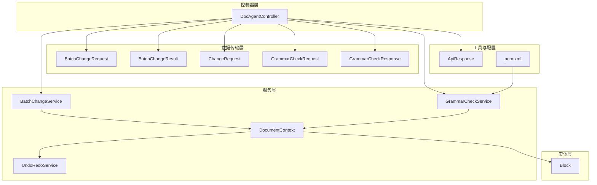
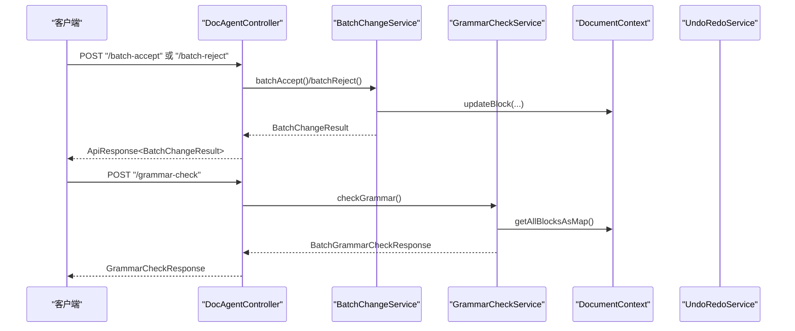
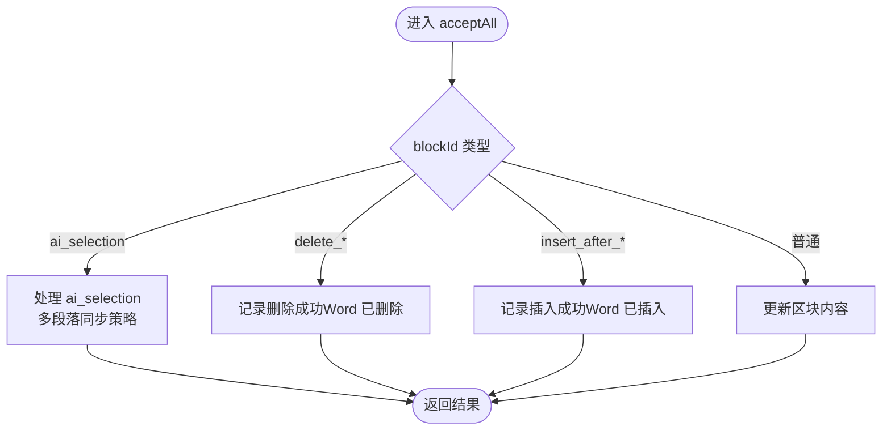
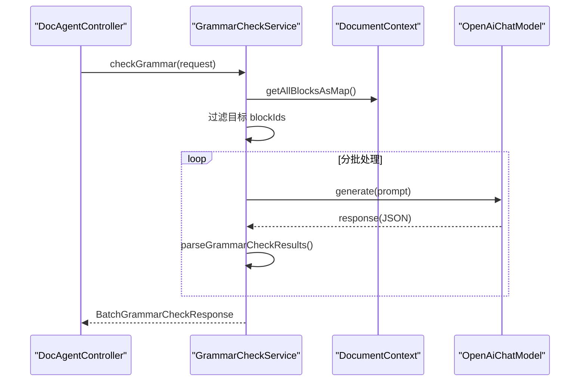
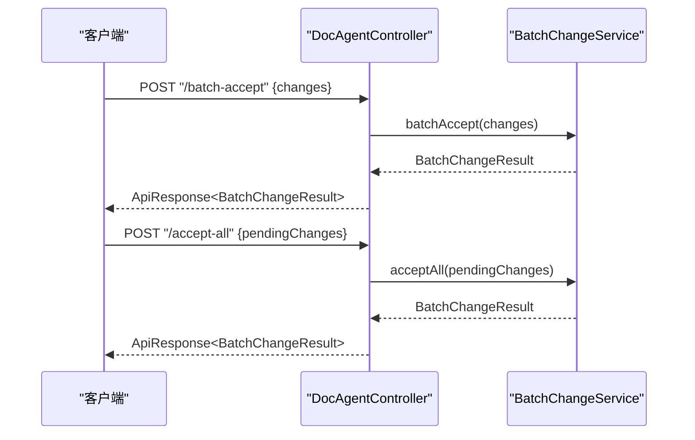
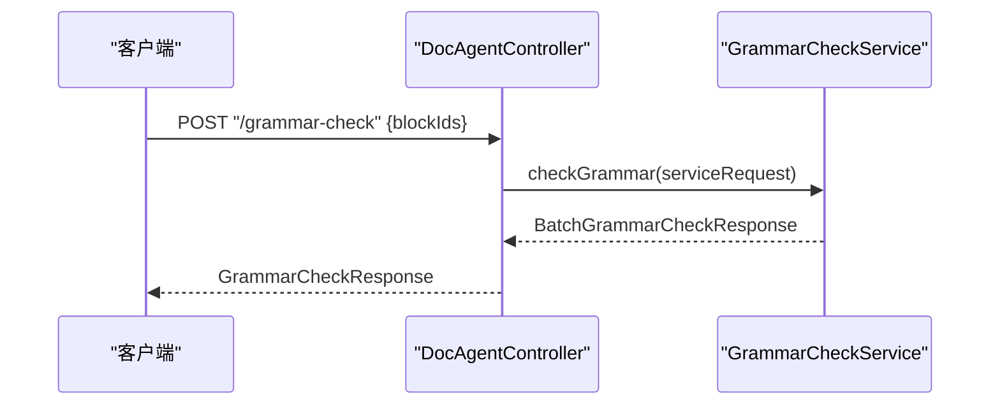
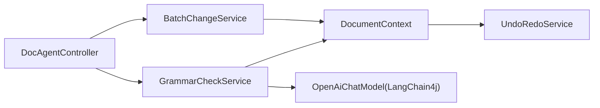

# 批量处理功能

<cite>
**本文引用的文件**
- [BatchChangeService.java](file://src/main/java/com/example/docs_agent/service/BatchChangeService.java)
- [GrammarCheckService.java](file://src/main/java/com/example/docs_agent/service/GrammarCheckService.java)
- [BatchChangeRequest.java](file://src/main/java/com/example/docs_agent/dto/BatchChangeRequest.java)
- [BatchChangeResult.java](file://src/main/java/com/example/docs_agent/dto/BatchChangeResult.java)
- [ChangeRequest.java](file://src/main/java/com/example/docs_agent/dto/ChangeRequest.java)
- [GrammarCheckRequest.java](file://src/main/java/com/example/docs_agent/dto/GrammarCheckRequest.java)
- [GrammarCheckResponse.java](file://src/main/java/com/example/docs_agent/dto/GrammarCheckResponse.java)
- [Block.java](file://src/main/java/com/example/docs_agent/entity/Block.java)
- [DocumentContext.java](file://src/main/java/com/example/docs_agent/service/DocumentContext.java)
- [UndoRedoService.java](file://src/main/java/com/example/docs_agent/service/UndoRedoService.java)
- [DocAgentController.java](file://src/main/java/com/example/docs_agent/controller/DocAgentController.java)
- [ApiResponse.java](file://src/main/java/com/example/docs_agent/dto/ApiResponse.java)
- [pom.xml](file://pom.xml)
</cite>

## 目录
1. [简介](#简介)
2. [项目结构](#项目结构)
3. [核心组件](#核心组件)
4. [架构总览](#架构总览)
5. [详细组件分析](#详细组件分析)
6. [依赖关系分析](#依赖关系分析)
7. [性能考虑](#性能考虑)
8. [故障排查指南](#故障排查指南)
9. [结论](#结论)
10. [附录](#附录)

## 简介
本技术文档围绕“批量处理功能”展开，重点覆盖以下方面：
- BatchChangeService 的实现：批量变更请求的处理流程、变更接受/拒绝机制、结果聚合逻辑。
- GrammarCheckService 的语法检查功能：全文语法检查、拼写检查与错误高亮显示的实现思路。
- 数据结构：BatchChangeRequest、BatchChangeResult、ChangeRequest、GrammarCheckRequest、GrammarCheckResponse 的结构与使用方式。
- 实际应用场景与工作流程示例：批量接受变更、批量拒绝变更的操作流程。
- 性能优化策略、并发处理与错误处理机制。
- 使用示例与最佳实践指南。

## 项目结构
该项目采用基于包的分层组织方式，核心模块如下：
- controller 层：对外暴露 REST API，负责请求路由与响应封装。
- service 层：业务逻辑实现，包括文档上下文管理、批量变更处理、语法检查、撤销/重做等。
- dto 层：传输对象，承载请求与响应数据结构。
- entity 层：领域模型，如 Block。
- config、constant、exception 等辅助模块。

图表来源
- [DocAgentController.java:36-636](file://src/main/java/com/example/docs_agent/controller/DocAgentController.java#L36-L636)
- [BatchChangeService.java:23-268](file://src/main/java/com/example/docs_agent/service/BatchChangeService.java#L23-L268)
- [GrammarCheckService.java:25-340](file://src/main/java/com/example/docs_agent/service/GrammarCheckService.java#L25-L340)
- [DocumentContext.java:19-205](file://src/main/java/com/example/docs_agent/service/DocumentContext.java#L19-L205)
- [UndoRedoService.java:15-192](file://src/main/java/com/example/docs_agent/service/UndoRedoService.java#L15-L192)
- [BatchChangeRequest.java:13-30](file://src/main/java/com/example/docs_agent/dto/BatchChangeRequest.java#L13-L30)
- [BatchChangeResult.java:13-40](file://src/main/java/com/example/docs_agent/dto/BatchChangeResult.java#L13-L40)
- [ChangeRequest.java:9-31](file://src/main/java/com/example/docs_agent/dto/ChangeRequest.java#L9-L31)
- [GrammarCheckRequest.java:11-23](file://src/main/java/com/example/docs_agent/dto/GrammarCheckRequest.java#L11-L23)
- [GrammarCheckResponse.java:13-60](file://src/main/java/com/example/docs_agent/dto/GrammarCheckResponse.java#L13-L60)
- [Block.java:11-47](file://src/main/java/com/example/docs_agent/entity/Block.java#L11-L47)
- [ApiResponse.java:14-84](file://src/main/java/com/example/docs_agent/dto/ApiResponse.java#L14-L84)
- [pom.xml:37-78](file://pom.xml#L37-L78)

章节来源
- [DocAgentController.java:36-636](file://src/main/java/com/example/docs_agent/controller/DocAgentController.java#L36-L636)
- [pom.xml:37-78](file://pom.xml#L37-L78)

## 核心组件
- 批量变更服务：BatchChangeService，负责批量接受/拒绝变更、接受/拒绝所有待处理变更，并聚合结果。
- 语法检查服务：GrammarCheckService，负责对文档进行批量语法检查，解析 AI 返回结果并生成汇总。
- 文档上下文：DocumentContext，维护内存中的文档区块集合，提供更新、查询、撤销/重做能力。
- 控制器：DocAgentController，提供 REST API，协调服务层与 DTO 层交互。
- 数据传输对象：BatchChangeRequest、BatchChangeResult、ChangeRequest、GrammarCheckRequest、GrammarCheckResponse。
- 实体：Block，表示文档中的段落或内容块。

章节来源
- [BatchChangeService.java:23-268](file://src/main/java/com/example/docs_agent/service/BatchChangeService.java#L23-L268)
- [GrammarCheckService.java:25-340](file://src/main/java/com/example/docs_agent/service/GrammarCheckService.java#L25-L340)
- [DocumentContext.java:19-205](file://src/main/java/com/example/docs_agent/service/DocumentContext.java#L19-L205)
- [DocAgentController.java:36-636](file://src/main/java/com/example/docs_agent/controller/DocAgentController.java#L36-L636)
- [BatchChangeRequest.java:13-30](file://src/main/java/com/example/docs_agent/dto/BatchChangeRequest.java#L13-L30)
- [BatchChangeResult.java:13-40](file://src/main/java/com/example/docs_agent/dto/BatchChangeResult.java#L13-L40)
- [ChangeRequest.java:9-31](file://src/main/java/com/example/docs_agent/dto/ChangeRequest.java#L9-L31)
- [GrammarCheckRequest.java:11-23](file://src/main/java/com/example/docs_agent/dto/GrammarCheckRequest.java#L11-L23)
- [GrammarCheckResponse.java:13-60](file://src/main/java/com/example/docs_agent/dto/GrammarCheckResponse.java#L13-L60)
- [Block.java:11-47](file://src/main/java/com/example/docs_agent/entity/Block.java#L11-L47)

## 架构总览
下图展示了控制器、服务与数据结构之间的交互关系，以及批量变更与语法检查的关键流程。

图表来源
- [DocAgentController.java:182-260](file://src/main/java/com/example/docs_agent/controller/DocAgentController.java#L182-L260)
- [DocAgentController.java:271-343](file://src/main/java/com/example/docs_agent/controller/DocAgentController.java#L271-L343)
- [BatchChangeService.java:33-105](file://src/main/java/com/example/docs_agent/service/BatchChangeService.java#L33-L105)
- [BatchChangeService.java:113-210](file://src/main/java/com/example/docs_agent/service/BatchChangeService.java#L113-L210)
- [BatchChangeService.java:220-266](file://src/main/java/com/example/docs_agent/service/BatchChangeService.java#L220-L266)
- [GrammarCheckService.java:73-179](file://src/main/java/com/example/docs_agent/service/GrammarCheckService.java#L73-L179)
- [DocumentContext.java:103-106](file://src/main/java/com/example/docs_agent/service/DocumentContext.java#L103-L106)

## 详细组件分析

### 批量变更服务（BatchChangeService）
- 批量接受变更（batchAccept）
  - 输入：变更列表（ChangeRequest）。
  - 处理：遍历变更，对 ai_selection 特殊处理（当存在目标段落时，将内容同步更新到目标段落），其余正常记录成功/失败。
  - 结果：返回 BatchChangeResult，包含成功/失败 ID 列表与计数。
- 批量拒绝变更（batchReject）
  - 输入：变更列表（ChangeRequest）。
  - 处理：根据 oldText 恢复到原始内容；记录成功/失败。
  - 结果：返回 BatchChangeResult。
- 接受所有待处理变更（acceptAll）
  - 输入：待处理变更映射（blockId -> Block）。
  - 处理：针对不同类型的 blockId（ai_selection、delete_*、insert_after_*）分别处理；ai_selection 支持多段落同步，按段落数匹配策略更新目标段落；普通更新直接更新内容。
  - 结果：返回 BatchChangeResult。
- 拒绝所有待处理变更（rejectAll）
  - 输入：待处理变更 ID 列表与原始区块映射。
  - 处理：对 delete_* 恢复原区块内容；insert_after_* 无需操作；普通更新恢复到原始内容。
  - 结果：返回 BatchChangeResult。

图表来源
- [BatchChangeService.java:113-210](file://src/main/java/com/example/docs_agent/service/BatchChangeService.java#L113-L210)

章节来源
- [BatchChangeService.java:33-105](file://src/main/java/com/example/docs_agent/service/BatchChangeService.java#L33-L105)
- [BatchChangeService.java:113-210](file://src/main/java/com/example/docs_agent/service/BatchChangeService.java#L113-L210)
- [BatchChangeService.java:220-266](file://src/main/java/com/example/docs_agent/service/BatchChangeService.java#L220-L266)

### 语法检查服务（GrammarCheckService）
- 功能概述
  - 对文档进行批量语法检查，支持选择性检查（指定 blockIds）或全量检查。
  - 通过 OpenAI 模型生成检查结果，解析 JSON 并统计错误数量与生成总结。
- 关键流程
  - 获取文档区块映射，过滤目标区块。
  - 构造批量检查提示，分批发送（批大小 5），避免请求过快。
  - 解析 AI 返回的 JSON，提取每段的错误信息与建议修正。
  - 统计错误总数并生成总结。
- 错误处理
  - 若解析失败或请求异常，为当前批次生成默认结果，保证整体流程继续执行。

图表来源
- [DocAgentController.java:271-343](file://src/main/java/com/example/docs_agent/controller/DocAgentController.java#L271-L343)
- [GrammarCheckService.java:73-179](file://src/main/java/com/example/docs_agent/service/GrammarCheckService.java#L73-L179)

章节来源
- [GrammarCheckService.java:73-179](file://src/main/java/com/example/docs_agent/service/GrammarCheckService.java#L73-L179)
- [GrammarCheckService.java:184-310](file://src/main/java/com/example/docs_agent/service/GrammarCheckService.java#L184-L310)
- [GrammarCheckService.java:315-338](file://src/main/java/com/example/docs_agent/service/GrammarCheckService.java#L315-L338)

### 数据结构与使用方式

#### BatchChangeRequest
- 字段
  - changes：变更列表（ChangeRequest）。
  - operationType：操作类型（accept/reject）。
  - originalBlocks：拒绝操作时用于恢复的原始区块映射。
- 使用场景
  - 批量接受/拒绝变更时，携带变更列表与可选的原始状态映射。

章节来源
- [BatchChangeRequest.java:13-30](file://src/main/java/com/example/docs_agent/dto/BatchChangeRequest.java#L13-L30)

#### BatchChangeResult
- 字段
  - successIds、failedIds：成功/失败的区块 ID 列表。
  - successCount、failedCount：计数。
  - message：操作结果消息。
- 使用场景
  - 批量变更服务返回统一的结果封装。

章节来源
- [BatchChangeResult.java:13-40](file://src/main/java/com/example/docs_agent/dto/BatchChangeResult.java#L13-L40)

#### ChangeRequest
- 字段
  - blockId：区块 ID。
  - oldText：原始文本（用于拒绝恢复）。
  - newText：新文本内容（用于接受同步）。
  - targetBlockId：目标段落 ID（ai_selection 同步时使用）。
- 使用场景
  - 单个变更的接受/拒绝请求。

章节来源
- [ChangeRequest.java:9-31](file://src/main/java/com/example/docs_agent/dto/ChangeRequest.java#L9-L31)

#### GrammarCheckRequest
- 字段
  - blockIds：要检查的区块 ID 列表（为空则全量检查）。
  - autoApply：是否自动应用建议修改（服务内部未使用，保留扩展）。
- 使用场景
  - 控制层接收前端请求，转换为服务层请求。

章节来源
- [GrammarCheckRequest.java:11-23](file://src/main/java/com/example/docs_agent/dto/GrammarCheckRequest.java#L11-L23)

#### GrammarCheckResponse
- 字段
  - status、message：状态与消息。
  - totalChecked、errorCount：检查总数与错误数。
  - results：检查结果列表（包含 blockId、originalText、hasError、errorDescription、suggestedCorrection、severity、severityLabel）。
  - summary：检查总结。
- 使用场景
  - 控制层将服务层结果转换为对外响应。

章节来源
- [GrammarCheckResponse.java:13-60](file://src/main/java/com/example/docs_agent/dto/GrammarCheckResponse.java#L13-L60)

#### Block
- 字段
  - content：内容。
  - targetBlockId：目标区块 ID（ai_selection 同步时使用）。
  - targetBlockIds：目标区块 ID 列表（多段落选区）。
- 使用场景
  - 承载文档段落信息，支持 ai_selection 的多段落同步。

章节来源
- [Block.java:11-47](file://src/main/java/com/example/docs_agent/entity/Block.java#L11-L47)

### 控制器接口与工作流

#### 批量变更接口
- POST /api/batch-accept
  - 请求体：BatchChangeRequest。
  - 响应：BatchChangeResult。
- POST /api/batch-reject
  - 请求体：BatchChangeRequest。
  - 响应：BatchChangeResult。
- POST /api/accept-all
  - 请求体：Map<String, Block>（待处理变更映射）。
  - 响应：BatchChangeResult。
- POST /api/reject-all
  - 请求体：BatchChangeRequest（包含变更 ID 列表与原始区块映射）。
  - 响应：BatchChangeResult。

图表来源
- [DocAgentController.java:182-260](file://src/main/java/com/example/docs_agent/controller/DocAgentController.java#L182-L260)
- [BatchChangeService.java:33-105](file://src/main/java/com/example/docs_agent/service/BatchChangeService.java#L33-L105)
- [BatchChangeService.java:113-210](file://src/main/java/com/example/docs_agent/service/BatchChangeService.java#L113-L210)

#### 语法检查接口
- POST /api/grammar-check
  - 请求头：apiKey、baseUrl、modelName。
  - 请求体：GrammarCheckRequest（blockIds、autoApply）。
  - 响应：GrammarCheckResponse。

图表来源
- [DocAgentController.java:271-343](file://src/main/java/com/example/docs_agent/controller/DocAgentController.java#L271-L343)
- [GrammarCheckService.java:73-179](file://src/main/java/com/example/docs_agent/service/GrammarCheckService.java#L73-L179)

章节来源
- [DocAgentController.java:182-260](file://src/main/java/com/example/docs_agent/controller/DocAgentController.java#L182-L260)
- [DocAgentController.java:271-343](file://src/main/java/com/example/docs_agent/controller/DocAgentController.java#L271-L343)

## 依赖关系分析
- 服务依赖
  - BatchChangeService 依赖 DocumentContext 进行区块更新。
  - GrammarCheckService 依赖 DocumentContext 获取文档区块，并依赖 OpenAI 模型进行检查。
  - DocumentContext 依赖 UndoRedoService 进行撤销/重做。
- 外部依赖
  - OpenAI 模型集成（LangChain4j OpenAI）。
  - Office 文档处理（Apache POI OOXML）。

图表来源
- [BatchChangeService.java:25](file://src/main/java/com/example/docs_agent/service/BatchChangeService.java#L25)
- [GrammarCheckService.java:27](file://src/main/java/com/example/docs_agent/service/GrammarCheckService.java#L27)
- [DocumentContext.java:34](file://src/main/java/com/example/docs_agent/service/DocumentContext.java#L34)
- [pom.xml:58-77](file://pom.xml#L58-L77)

章节来源
- [pom.xml:58-77](file://pom.xml#L58-L77)

## 性能考虑
- 批量检查分批处理
  - GrammarCheckService 将检查任务按固定批大小（例如 5）分批执行，并在每次批次间短暂休眠，避免请求过快导致限流或超时。
- 结果解析与错误兜底
  - 解析 AI 返回的 JSON 时，若解析失败或请求异常，会为当前批次生成默认结果，确保整体流程继续执行，提升鲁棒性。
- 文档状态管理
  - DocumentContext 使用 LinkedHashMap 保持插入顺序，便于按文档顺序处理；同时提供快照能力，支持撤销/重做，减少回滚成本。
- 并发与线程安全
  - 服务层未显式使用并发容器或异步处理；若需进一步提升吞吐，可在控制器层引入异步处理或限流策略，但需注意共享状态的一致性。

章节来源
- [GrammarCheckService.java:104-168](file://src/main/java/com/example/docs_agent/service/GrammarCheckService.java#L104-L168)
- [DocumentContext.java:24-29](file://src/main/java/com/example/docs_agent/service/DocumentContext.java#L24-L29)
- [DocumentContext.java:133-192](file://src/main/java/com/example/docs_agent/service/DocumentContext.java#L133-L192)

## 故障排查指南
- 批量变更失败
  - 现象：部分变更 ID 出现在 failedIds 中。
  - 排查：检查对应 blockId 是否存在于 DocumentContext；确认 ai_selection 的 targetBlockId/targetBlockIds 是否正确；查看日志中的错误信息。
- 语法检查异常
  - 现象：部分段落返回“检查失败”的默认结果。
  - 排查：确认 OpenAI 配置（apiKey、baseUrl、modelName）是否正确；检查网络连通性；查看服务层日志中的解析失败原因。
- 撤销/重做不可用
  - 现象：canUndo/canRedo 返回 false。
  - 排查：确认是否已执行 saveSnapshot；检查历史栈大小是否超过上限；查看 UndoRedoService 的日志输出。

章节来源
- [BatchChangeService.java:55-58](file://src/main/java/com/example/docs_agent/service/BatchChangeService.java#L55-L58)
- [BatchChangeService.java:92-95](file://src/main/java/com/example/docs_agent/service/BatchChangeService.java#L92-L95)
- [GrammarCheckService.java:151-167](file://src/main/java/com/example/docs_agent/service/GrammarCheckService.java#L151-L167)
- [UndoRedoService.java:97-108](file://src/main/java/com/example/docs_agent/service/UndoRedoService.java#L97-L108)

## 结论
本批量处理功能通过清晰的服务层划分与 DTO 封装，实现了：
- 批量变更的接受/拒绝与结果聚合；
- 全文语法检查的分批处理与错误兜底；
- 文档状态的统一管理与撤销/重做支持。
在实际应用中，建议结合业务场景对批大小、并发策略与错误处理进行进一步优化，以获得更好的性能与稳定性。

## 附录

### 实际应用场景与工作流程示例
- 批量接受变更
  - 场景：用户在前端勾选多个变更，点击“批量接受”。
  - 流程：客户端调用 /api/batch-accept，服务端逐条处理，ai_selection 类型按目标段落同步更新，最终返回 BatchChangeResult。
- 批量拒绝变更
  - 场景：用户取消多个变更。
  - 流程：客户端调用 /api/batch-reject，服务端根据 oldText 恢复到原始内容，返回 BatchChangeResult。
- 接受/拒绝所有待处理变更
  - 场景：用户一次性确认或放弃所有待处理变更。
  - 流程：客户端调用 /api/accept-all 或 /api/reject-all，服务端按类型分支处理（ai_selection、delete_*、insert_after_*、普通更新），返回 BatchChangeResult。
- 语法检查
  - 场景：用户触发“全文语法检查”，或仅检查选定段落。
  - 流程：客户端调用 /api/grammar-check，服务端分批请求 OpenAI，解析结果并生成汇总，返回 GrammarCheckResponse。

章节来源
- [DocAgentController.java:182-260](file://src/main/java/com/example/docs_agent/controller/DocAgentController.java#L182-L260)
- [DocAgentController.java:271-343](file://src/main/java/com/example/docs_agent/controller/DocAgentController.java#L271-L343)

### 最佳实践指南
- 批量变更
  - 在调用批量接口前，确保 DocumentContext 中已同步最新文档状态。
  - 对 ai_selection 的 targetBlockId/targetBlockIds 必须正确设置，避免同步失败。
  - 批量操作建议配合前端进度反馈与错误提示。
- 语法检查
  - 合理设置批大小与请求间隔，避免触发 OpenAI 速率限制。
  - 对于长文档，建议分段检查或限制检查范围，降低模型负载。
  - 检查结果中的 severity 字段可用于前端高亮显示，帮助用户快速定位问题。
- 错误处理
  - 批量操作中，即使个别项失败也应记录并返回整体结果，便于前端展示。
  - 服务层异常应捕获并记录，必要时返回默认兜底结果，保证流程连续性。
- 撤销/重做
  - 在执行重要变更前调用 saveSnapshot，以便后续撤销/重做。
  - 控制撤销/重做按钮的可用状态，避免越界操作。

章节来源
- [BatchChangeService.java:104-168](file://src/main/java/com/example/docs_agent/service/BatchChangeService.java#L104-L168)
- [GrammarCheckService.java:104-168](file://src/main/java/com/example/docs_agent/service/GrammarCheckService.java#L104-L168)
- [DocumentContext.java:133-192](file://src/main/java/com/example/docs_agent/service/DocumentContext.java#L133-L192)
- [UndoRedoService.java:76-90](file://src/main/java/com/example/docs_agent/service/UndoRedoService.java#L76-L90)