# 数据模型

<cite>
**本文引用的文件**
- [Block.java](file://src/main/java/com/example/docs_agent/entity/Block.java)
- [ChatRequest.java](file://src/main/java/com/example/docs_agent/dto/ChatRequest.java)
- [ChatResponse.java](file://src/main/java/com/example/docs_agent/dto/ChatResponse.java)
- [SaveToWordRequest.java](file://src/main/java/com/example/docs_agent/dto/SaveToWordRequest.java)
- [ApiResponse.java](file://src/main/java/com/example/docs_agent/dto/ApiResponse.java)
- [BatchChangeRequest.java](file://src/main/java/com/example/docs_agent/dto/BatchChangeRequest.java)
- [BatchChangeResult.java](file://src/main/java/com/example/docs_agent/dto/BatchChangeResult.java)
- [ChangeRequest.java](file://src/main/java/com/example/docs_agent/dto/ChangeRequest.java)
- [GrammarCheckRequest.java](file://src/main/java/com/example/docs_agent/dto/GrammarCheckRequest.java)
- [GrammarCheckResponse.java](file://src/main/java/com/example/docs_agent/dto/GrammarCheckResponse.java)
- [SummarizeRequest.java](file://src/main/java/com/example/docs_agent/dto/SummarizeRequest.java)
- [SummarizeResponse.java](file://src/main/java/com/example/docs_agent/dto/SummarizeResponse.java)
- [ApiConstants.java](file://src/main/java/com/example/docs_agent/constant/ApiConstants.java)
- [AgentType.java](file://src/main/java/com/example/docs_agent/constant/AgentType.java)
- [SystemMessageConstants.java](file://src/main/java/com/example/docs_agent/constant/SystemMessageConstants.java)
</cite>

## 目录
1. [简介](#简介)
2. [项目结构](#项目结构)
3. [核心组件](#核心组件)
4. [架构概览](#架构概览)
5. [详细组件分析](#详细组件分析)
6. [依赖分析](#依赖分析)
7. [性能考虑](#性能考虑)
8. [故障排查指南](#故障排查指南)
9. [结论](#结论)
10. [附录](#附录)

## 简介
本文件面向“数据模型”主题，系统梳理并解释以下内容：
- 实体类定义：重点说明 Block 实体的字段结构、数据类型与业务含义
- DTO 设计：涵盖 ChatRequest、ChatResponse、SaveToWordRequest 等数据传输对象的字段、验证规则与使用场景
- 统一响应包装：ApiResponse 的设计理念、静态工厂方法与使用方式
- 常量定义：ApiConstants 的 API 常量、AgentType 的 Agent 类型枚举、SystemMessageConstants 的系统消息常量
- 数据模型关系图与使用示例
- 数据验证、序列化与反序列化的最佳实践

## 项目结构
数据模型相关代码主要分布在以下包中：
- entity：领域实体，如 Block
- dto：数据传输对象，如 ChatRequest、ChatResponse、SaveToWordRequest、ApiResponse 及其他业务 DTO
- constant：常量定义，如 ApiConstants、AgentType、SystemMessageConstants

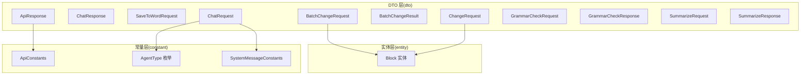

图表来源
- [Block.java:1-47](file://src/main/java/com/example/docs_agent/entity/Block.java#L1-L47)
- [ChatRequest.java:1-27](file://src/main/java/com/example/docs_agent/dto/ChatRequest.java#L1-L27)
- [ChatResponse.java:1-38](file://src/main/java/com/example/docs_agent/dto/ChatResponse.java#L1-L38)
- [SaveToWordRequest.java:1-16](file://src/main/java/com/example/docs_agent/dto/SaveToWordRequest.java#L1-L16)
- [ApiResponse.java:1-84](file://src/main/java/com/example/docs_agent/dto/ApiResponse.java#L1-L84)
- [BatchChangeRequest.java:1-30](file://src/main/java/com/example/docs_agent/dto/BatchChangeRequest.java#L1-L30)
- [BatchChangeResult.java:1-40](file://src/main/java/com/example/docs_agent/dto/BatchChangeResult.java#L1-L40)
- [ChangeRequest.java:1-31](file://src/main/java/com/example/docs_agent/dto/ChangeRequest.java#L1-L31)
- [GrammarCheckRequest.java:1-23](file://src/main/java/com/example/docs_agent/dto/GrammarCheckRequest.java#L1-L23)
- [GrammarCheckResponse.java:1-60](file://src/main/java/com/example/docs_agent/dto/GrammarCheckResponse.java#L1-L60)
- [SummarizeRequest.java:1-27](file://src/main/java/com/example/docs_agent/dto/SummarizeRequest.java#L1-L27)
- [SummarizeResponse.java:1-55](file://src/main/java/com/example/docs_agent/dto/SummarizeResponse.java#L1-L55)
- [ApiConstants.java:1-53](file://src/main/java/com/example/docs_agent/constant/ApiConstants.java#L1-L53)
- [AgentType.java:1-87](file://src/main/java/com/example/docs_agent/constant/AgentType.java#L1-L87)
- [SystemMessageConstants.java:1-234](file://src/main/java/com/example/docs_agent/constant/SystemMessageConstants.java#L1-L234)

章节来源
- [Block.java:1-47](file://src/main/java/com/example/docs_agent/entity/Block.java#L1-L47)
- [ApiResponse.java:1-84](file://src/main/java/com/example/docs_agent/dto/ApiResponse.java#L1-L84)
- [ApiConstants.java:1-53](file://src/main/java/com/example/docs_agent/constant/ApiConstants.java#L1-L53)
- [AgentType.java:1-87](file://src/main/java/com/example/docs_agent/constant/AgentType.java#L1-L87)
- [SystemMessageConstants.java:1-234](file://src/main/java/com/example/docs_agent/constant/SystemMessageConstants.java#L1-L234)

## 核心组件
本节聚焦于数据模型的关键组成：实体、DTO、统一响应与常量。

- 实体类：Block
  - 字段与含义
    - content：字符串，表示文档区块的内容
    - targetBlockId：字符串，表示该区块内容应应用到的目标段落 ID（用于临时选择区域 ai_selection 等）
    - targetBlockIds：字符串列表，表示多段落选区时的目标段落 ID 列表
  - 构造函数：提供无参、单参 content、双参 content+targetBlockId、双参 content+targetBlockIds 的多种构造方式，便于不同场景初始化
  - 业务意义：作为文档编辑过程中的最小可编辑单元，支持单段落与多段落的批量操作；同时支持“锁定选区”场景下的目标同步

- DTO 类
  - ChatRequest：聊天请求，包含用户消息、可选的 Agent 类型代码与自定义系统提示词
  - ChatResponse：聊天响应，包含回复内容、序列化后的文档状态、是否变更、状态描述与错误信息
  - SaveToWordRequest：保存到 Word 的请求，包含目标 docx 文件路径
  - 其他常用 DTO：BatchChangeRequest、BatchChangeResult、ChangeRequest、GrammarCheckRequest、GrammarCheckResponse、SummarizeRequest、SummarizeResponse

- 统一响应 ApiResponse<T>
  - 设计理念：为所有接口提供统一的响应结构，包含状态、错误码、消息、数据与时间戳
  - 静态工厂方法：success(data)、success(message,data)、fail(errorCode,message)、fail(message)
  - 使用方式：控制器层返回 ApiResponse.success(...) 或 ApiResponse.fail(...)，前端统一解析

- 常量
  - ApiConstants：API 基础路径、响应状态、请求头键、区块 ID 前缀、特殊标记与默认配置
  - AgentType：枚举类型，定义通用、学术、商业、技术、法律、创意、自定义等 Agent 角色，并提供 fromCode 与 isValid 辅助方法
  - SystemMessageConstants：内置各 Agent 类型的系统提示词模板，支持自定义提示词的设置与获取，并提供工具指令模板

章节来源
- [Block.java:10-46](file://src/main/java/com/example/docs_agent/entity/Block.java#L10-L46)
- [ChatRequest.java:8-26](file://src/main/java/com/example/docs_agent/dto/ChatRequest.java#L8-L26)
- [ChatResponse.java:9-37](file://src/main/java/com/example/docs_agent/dto/ChatResponse.java#L9-L37)
- [SaveToWordRequest.java:8-15](file://src/main/java/com/example/docs_agent/dto/SaveToWordRequest.java#L8-L15)
- [ApiResponse.java:13-83](file://src/main/java/com/example/docs_agent/dto/ApiResponse.java#L13-L83)
- [ApiConstants.java:6-52](file://src/main/java/com/example/docs_agent/constant/ApiConstants.java#L6-L52)
- [AgentType.java:9-86](file://src/main/java/com/example/docs_agent/constant/AgentType.java#L9-L86)
- [SystemMessageConstants.java:10-233](file://src/main/java/com/example/docs_agent/constant/SystemMessageConstants.java#L10-L233)

## 架构概览
下图展示数据模型在系统中的角色与交互关系：

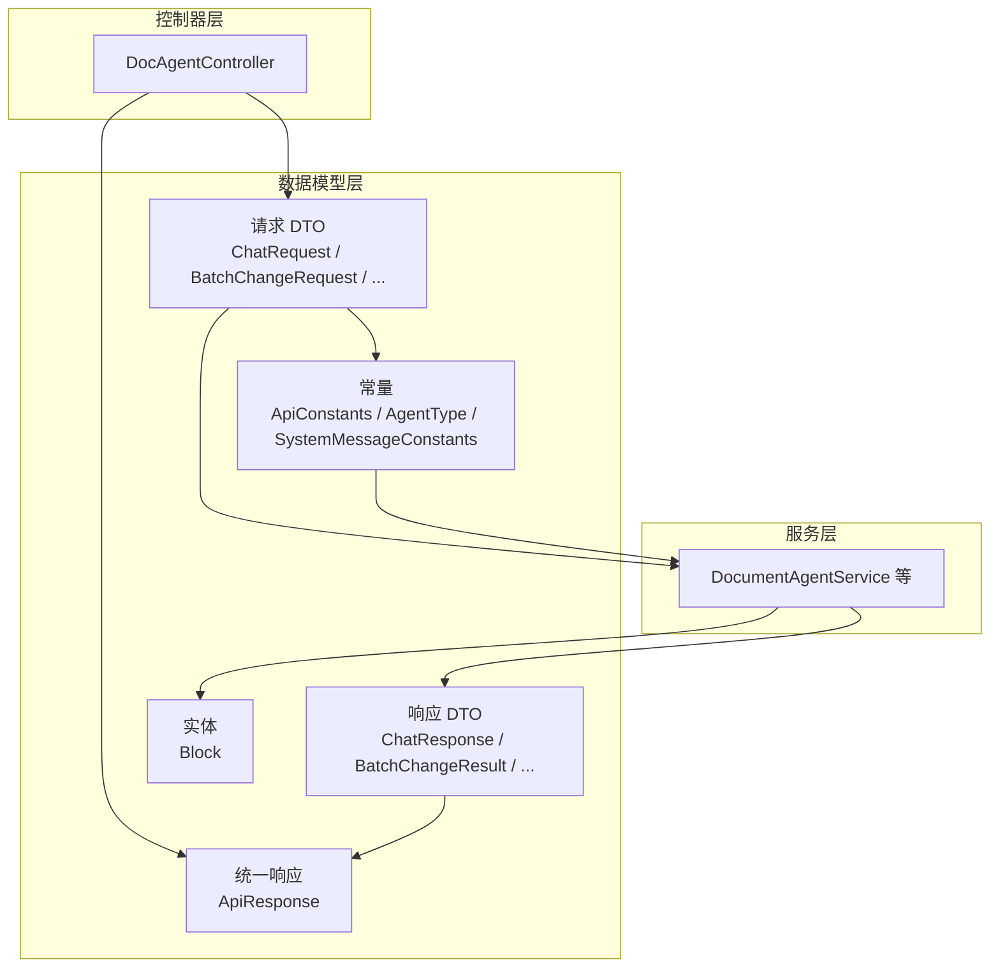

图表来源
- [ChatRequest.java:8-26](file://src/main/java/com/example/docs_agent/dto/ChatRequest.java#L8-L26)
- [BatchChangeRequest.java:12-29](file://src/main/java/com/example/docs_agent/dto/BatchChangeRequest.java#L12-L29)
- [ChatResponse.java:9-37](file://src/main/java/com/example/docs_agent/dto/ChatResponse.java#L9-L37)
- [BatchChangeResult.java:11-39](file://src/main/java/com/example/docs_agent/dto/BatchChangeResult.java#L11-L39)
- [Block.java:10-46](file://src/main/java/com/example/docs_agent/entity/Block.java#L10-L46)
- [ApiResponse.java:13-83](file://src/main/java/com/example/docs_agent/dto/ApiResponse.java#L13-L83)
- [ApiConstants.java:6-52](file://src/main/java/com/example/docs_agent/constant/ApiConstants.java#L6-L52)
- [AgentType.java:9-86](file://src/main/java/com/example/docs_agent/constant/AgentType.java#L9-L86)
- [SystemMessageConstants.java:10-233](file://src/main/java/com/example/docs_agent/constant/SystemMessageConstants.java#L10-L233)

## 详细组件分析

### 实体类：Block
- 字段说明
  - content：区块内容，字符串类型
  - targetBlockId：目标段落 ID，字符串类型，用于将当前区块内容应用到指定段落
  - targetBlockIds：目标段落 ID 列表，字符串列表类型，用于多段落选区的批量应用
- 构造函数
  - 无参构造：便于框架反射与序列化
  - 单参 content：快速初始化内容
  - 双参 content + targetBlockId：支持单段落目标同步
  - 双参 content + targetBlockIds：支持多段落目标同步
- 业务含义
  - 作为文档编辑的基本单元，支持“锁定选区”场景下的 ai_selection 同步更新
  - 支持批量变更操作中的原始状态记录与回滚

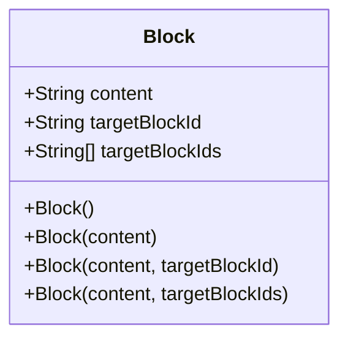

图表来源
- [Block.java:10-46](file://src/main/java/com/example/docs_agent/entity/Block.java#L10-L46)

章节来源
- [Block.java:10-46](file://src/main/java/com/example/docs_agent/entity/Block.java#L10-L46)

### DTO：ChatRequest
- 字段说明
  - message：用户输入的消息，字符串类型
  - agentType：可选的 Agent 类型代码，默认使用通用助手
  - customSystemPrompt：当 agentType 为 custom 时使用的自定义系统提示词
- 使用场景
  - 通用聊天交互、多 Agent 场景切换、自定义提示词注入
- 验证规则
  - message 非空校验（由上层控制器或 Bean Validation 实现）
  - agentType 有效性校验（结合 AgentType.isValid）

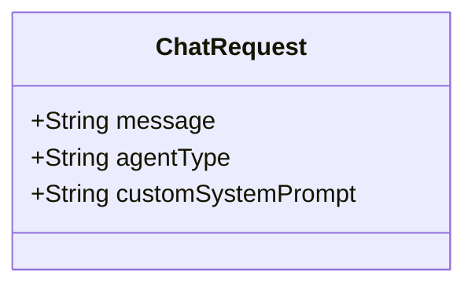

图表来源
- [ChatRequest.java:8-26](file://src/main/java/com/example/docs_agent/dto/ChatRequest.java#L8-L26)
- [AgentType.java:9-86](file://src/main/java/com/example/docs_agent/constant/AgentType.java#L9-L86)

章节来源
- [ChatRequest.java:8-26](file://src/main/java/com/example/docs_agent/dto/ChatRequest.java#L8-L26)
- [AgentType.java:9-86](file://src/main/java/com/example/docs_agent/constant/AgentType.java#L9-L86)

### DTO：ChatResponse
- 字段说明
  - reply：AI 回复内容
  - document：序列化后的文档状态（用于前端渲染）
  - changed：文档是否发生变更
  - status：状态描述
  - error：错误信息（如有）
- 使用场景
  - 聊天接口返回，携带最新文档状态与变更标记
- 验证规则
  - 字段均为可选或可空，由上层服务保证非空时的正确性

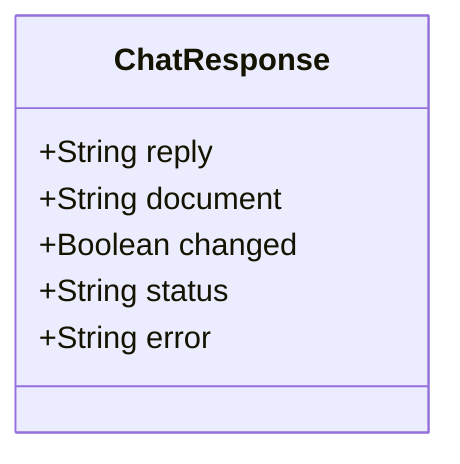

图表来源
- [ChatResponse.java:9-37](file://src/main/java/com/example/docs_agent/dto/ChatResponse.java#L9-L37)

章节来源
- [ChatResponse.java:9-37](file://src/main/java/com/example/docs_agent/dto/ChatResponse.java#L9-L37)

### DTO：SaveToWordRequest
- 字段说明
  - docxPath：目标 Word 文档路径
- 使用场景
  - 导出文档到本地 Word 文件
- 验证规则
  - docxPath 非空且合法文件路径（由上层校验）

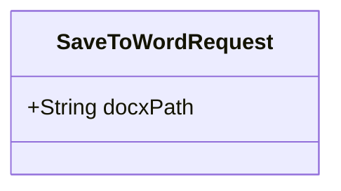

图表来源
- [SaveToWordRequest.java:8-15](file://src/main/java/com/example/docs_agent/dto/SaveToWordRequest.java#L8-L15)

章节来源
- [SaveToWordRequest.java:8-15](file://src/main/java/com/example/docs_agent/dto/SaveToWordRequest.java#L8-L15)

### DTO：批量变更相关
- BatchChangeRequest
  - changes：变更操作列表，元素为 ChangeRequest
  - operationType：操作类型 accept/reject
  - originalBlocks：用于拒绝时恢复原始状态的映射
- BatchChangeResult
  - successIds/failedIds：成功/失败的区块 ID 列表
  - successCount/failedCount：数量统计
  - message：操作结果消息
- ChangeRequest
  - blockId：区块 ID
  - oldText：原始文本（用于拒绝时恢复）
  - newText：新文本（用于接受时同步更新）
  - targetBlockId：ai_selection 同步更新时的目标段落 ID

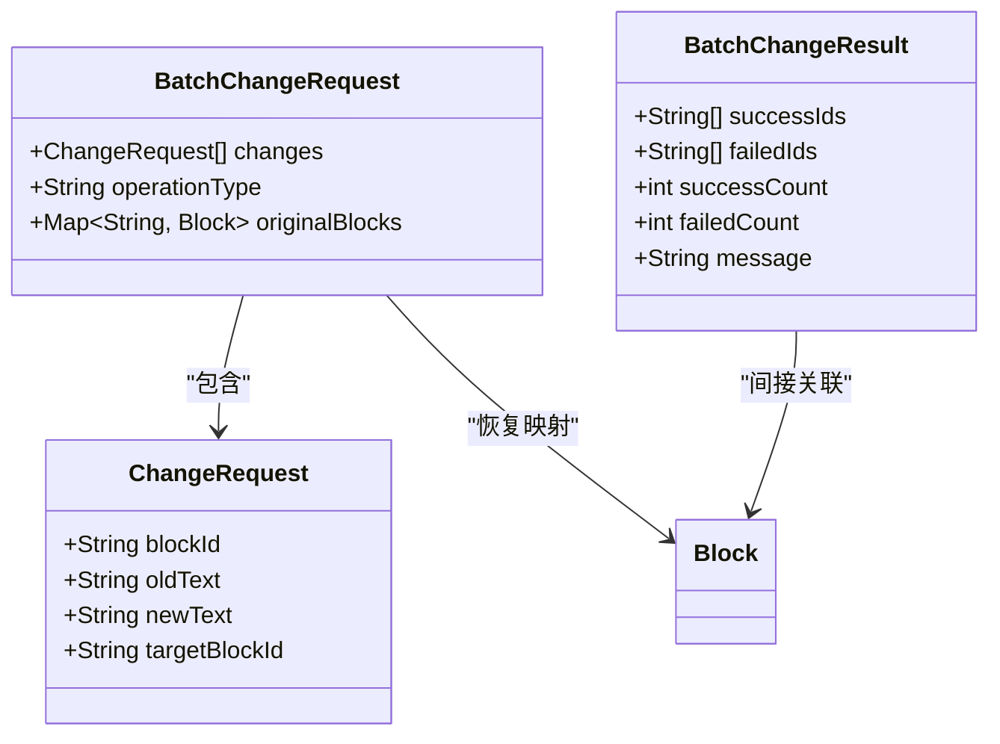

图表来源
- [BatchChangeRequest.java:12-29](file://src/main/java/com/example/docs_agent/dto/BatchChangeRequest.java#L12-L29)
- [BatchChangeResult.java:11-39](file://src/main/java/com/example/docs_agent/dto/BatchChangeResult.java#L11-L39)
- [ChangeRequest.java:8-30](file://src/main/java/com/example/docs_agent/dto/ChangeRequest.java#L8-L30)
- [Block.java:10-46](file://src/main/java/com/example/docs_agent/entity/Block.java#L10-L46)

章节来源
- [BatchChangeRequest.java:12-29](file://src/main/java/com/example/docs_agent/dto/BatchChangeRequest.java#L12-L29)
- [BatchChangeResult.java:11-39](file://src/main/java/com/example/docs_agent/dto/BatchChangeResult.java#L11-L39)
- [ChangeRequest.java:8-30](file://src/main/java/com/example/docs_agent/dto/ChangeRequest.java#L8-L30)
- [Block.java:10-46](file://src/main/java/com/example/docs_agent/entity/Block.java#L10-L46)

### DTO：语法检查相关
- GrammarCheckRequest
  - blockIds：要检查的区块 ID 列表（为空则检查全部）
  - autoApply：是否自动应用建议的修改
- GrammarCheckResponse
  - status/message：检查状态与消息
  - totalChecked/errorCount：检查总数与问题数
  - results：单项检查结果列表，包含 blockId、originalText、hasError、errorDescription、suggestedCorrection、severity/severityLabel
  - summary：检查总结

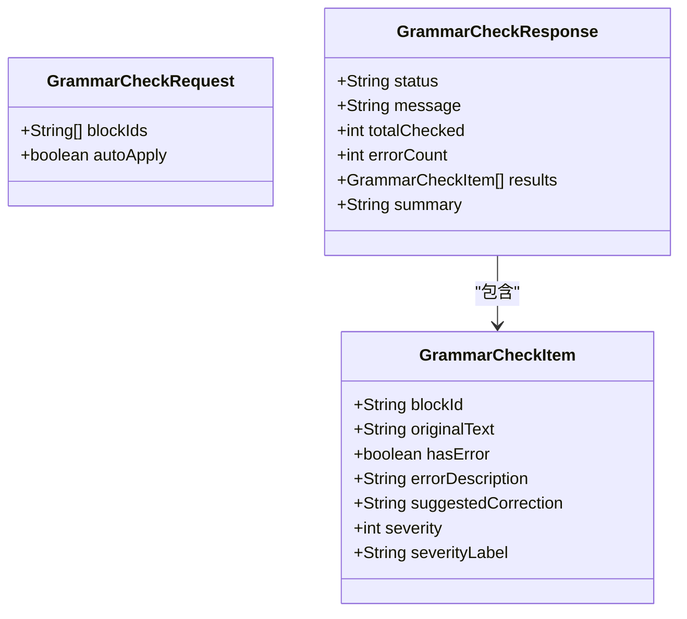

图表来源
- [GrammarCheckRequest.java:10-22](file://src/main/java/com/example/docs_agent/dto/GrammarCheckRequest.java#L10-L22)
- [GrammarCheckResponse.java:11-59](file://src/main/java/com/example/docs_agent/dto/GrammarCheckResponse.java#L11-L59)

章节来源
- [GrammarCheckRequest.java:10-22](file://src/main/java/com/example/docs_agent/dto/GrammarCheckRequest.java#L10-L22)
- [GrammarCheckResponse.java:11-59](file://src/main/java/com/example/docs_agent/dto/GrammarCheckResponse.java#L11-L59)

### DTO：摘要相关
- SummarizeRequest
  - summaryType：摘要类型（默认 outline）
  - maxLength：最大长度限制（字数）
  - language：目标语言（默认 zh）
- SummarizeResponse
  - status/message：状态与消息
  - summary：摘要内容
  - keyPoints：关键要点列表
  - originalWordCount/summaryWordCount：字数统计
  - summaryType：摘要类型
  - compressionRatio：压缩比率

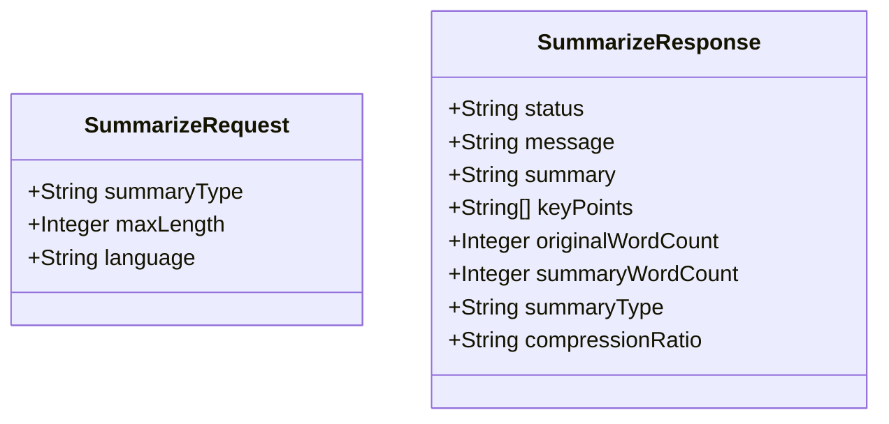

图表来源
- [SummarizeRequest.java:8-26](file://src/main/java/com/example/docs_agent/dto/SummarizeRequest.java#L8-L26)
- [SummarizeResponse.java:11-54](file://src/main/java/com/example/docs_agent/dto/SummarizeResponse.java#L11-L54)

章节来源
- [SummarizeRequest.java:8-26](file://src/main/java/com/example/docs_agent/dto/SummarizeRequest.java#L8-L26)
- [SummarizeResponse.java:11-54](file://src/main/java/com/example/docs_agent/dto/SummarizeResponse.java#L11-L54)

### 统一响应：ApiResponse<T>
- 字段说明
  - status：响应状态（success/fail/accepted）
  - errorCode：错误码
  - message：响应消息
  - data：泛型数据
  - timestamp：响应时间戳
- 静态工厂方法
  - success(data)、success(message,data)：成功响应
  - fail(errorCode,message)、fail(message)：失败响应
- 使用方式
  - 控制器层统一返回 ApiResponse.success(...) 或 ApiResponse.fail(...)
  - 前端统一解析 status/message/data

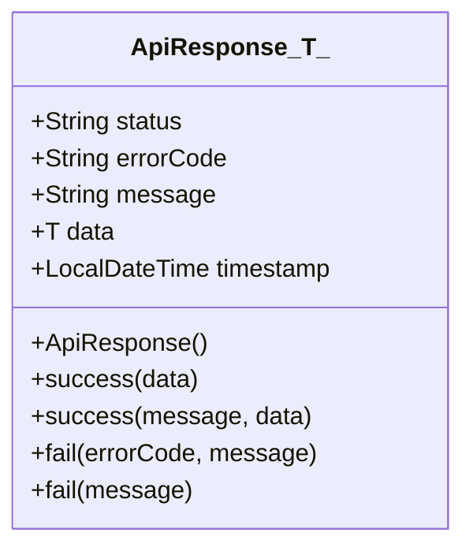

图表来源
- [ApiResponse.java:13-83](file://src/main/java/com/example/docs_agent/dto/ApiResponse.java#L13-L83)
- [ApiConstants.java:18-22](file://src/main/java/com/example/docs_agent/constant/ApiConstants.java#L18-L22)

章节来源
- [ApiResponse.java:13-83](file://src/main/java/com/example/docs_agent/dto/ApiResponse.java#L13-L83)
- [ApiConstants.java:18-22](file://src/main/java/com/example/docs_agent/constant/ApiConstants.java#L18-L22)

### 常量：ApiConstants
- API 基础路径、响应状态、请求头键、区块 ID 前缀、特殊标记与默认配置
- 作用：集中管理 API 相关常量，避免魔法字符串

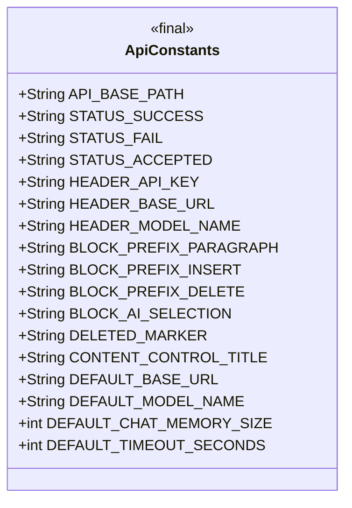

图表来源
- [ApiConstants.java:6-52](file://src/main/java/com/example/docs_agent/constant/ApiConstants.java#L6-L52)

章节来源
- [ApiConstants.java:6-52](file://src/main/java/com/example/docs_agent/constant/ApiConstants.java#L6-L52)

### 常量：AgentType
- 枚举值：GENERAL、ACADEMIC、BUSINESS、TECHNICAL、LEGAL、CREATIVE、CUSTOM
- 方法：fromCode(code)、isValid(code)
- 作用：统一 Agent 类型标识与校验

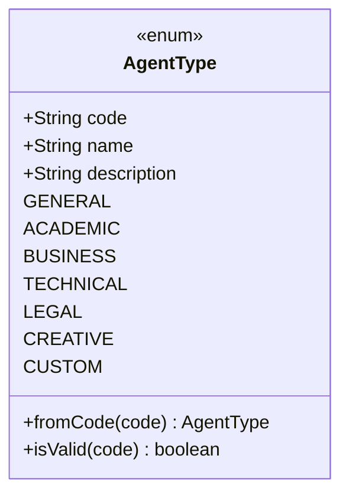

图表来源
- [AgentType.java:9-86](file://src/main/java/com/example/docs_agent/constant/AgentType.java#L9-L86)

章节来源
- [AgentType.java:9-86](file://src/main/java/com/example/docs_agent/constant/AgentType.java#L9-L86)

### 常量：SystemMessageConstants
- 内置各 Agent 类型的系统提示词模板
- 自定义提示词：setCustomPrompt/getCustomPrompt/clearCustomPrompt/hasCustomPrompt
- 工具指令模板：TOOL_USAGE_INSTRUCTIONS
- 作用：集中管理提示词，支持多 Agent 场景与自定义扩展

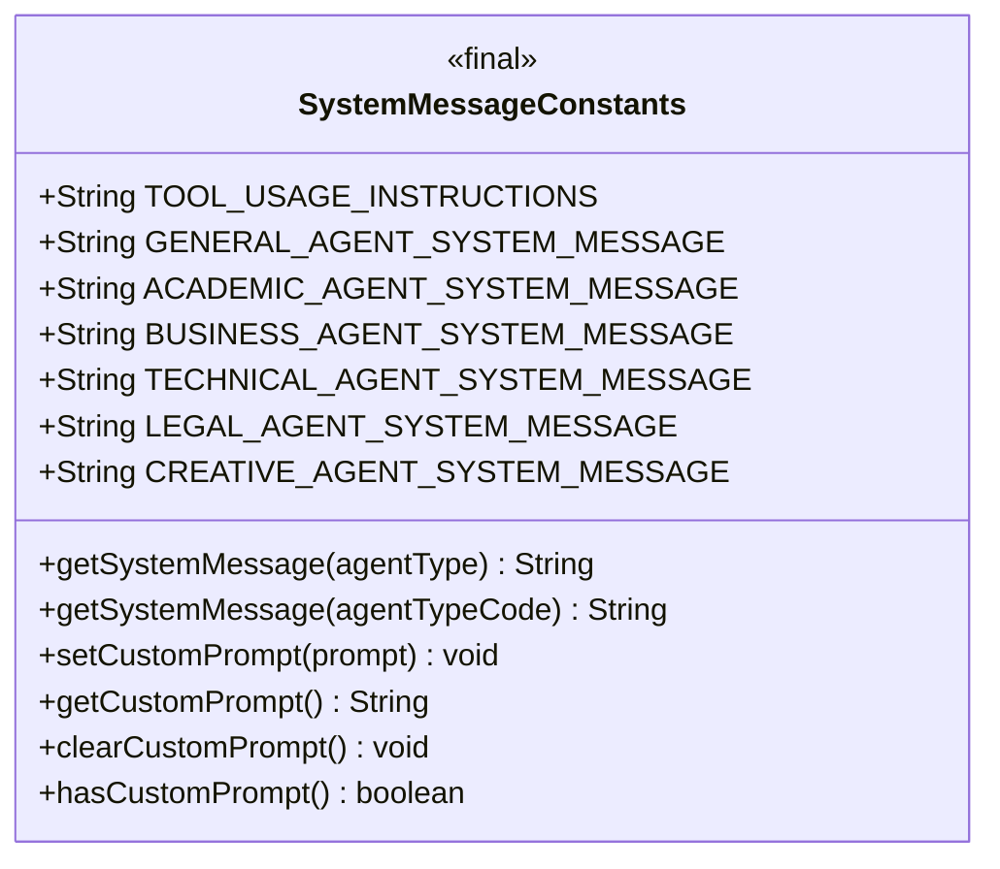

图表来源
- [SystemMessageConstants.java:10-233](file://src/main/java/com/example/docs_agent/constant/SystemMessageConstants.java#L10-L233)
- [AgentType.java:9-86](file://src/main/java/com/example/docs_agent/constant/AgentType.java#L9-L86)

章节来源
- [SystemMessageConstants.java:10-233](file://src/main/java/com/example/docs_agent/constant/SystemMessageConstants.java#L10-L233)
- [AgentType.java:9-86](file://src/main/java/com/example/docs_agent/constant/AgentType.java#L9-L86)

## 依赖分析
- Block 与批量变更相关 DTO 的耦合：BatchChangeRequest/ChangeRequest 依赖 Block 进行状态恢复与目标同步
- ChatRequest 依赖 AgentType 与 SystemMessageConstants，用于选择合适的系统提示词
- ApiResponse 依赖 ApiConstants 的状态常量
- 所有 DTO 之间保持低耦合，通过统一响应包装进行解耦

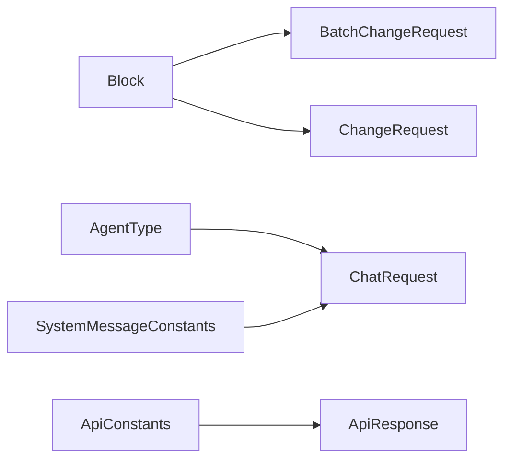

图表来源
- [Block.java:10-46](file://src/main/java/com/example/docs_agent/entity/Block.java#L10-L46)
- [BatchChangeRequest.java:12-29](file://src/main/java/com/example/docs_agent/dto/BatchChangeRequest.java#L12-L29)
- [ChangeRequest.java:8-30](file://src/main/java/com/example/docs_agent/dto/ChangeRequest.java#L8-L30)
- [AgentType.java:9-86](file://src/main/java/com/example/docs_agent/constant/AgentType.java#L9-L86)
- [SystemMessageConstants.java:169-189](file://src/main/java/com/example/docs_agent/constant/SystemMessageConstants.java#L169-L189)
- [ChatRequest.java:8-26](file://src/main/java/com/example/docs_agent/dto/ChatRequest.java#L8-L26)
- [ApiConstants.java:18-22](file://src/main/java/com/example/docs_agent/constant/ApiConstants.java#L18-L22)
- [ApiResponse.java:13-83](file://src/main/java/com/example/docs_agent/dto/ApiResponse.java#L13-L83)

章节来源
- [Block.java:10-46](file://src/main/java/com/example/docs_agent/entity/Block.java#L10-L46)
- [BatchChangeRequest.java:12-29](file://src/main/java/com/example/docs_agent/dto/BatchChangeRequest.java#L12-L29)
- [ChangeRequest.java:8-30](file://src/main/java/com/example/docs_agent/dto/ChangeRequest.java#L8-L30)
- [AgentType.java:9-86](file://src/main/java/com/example/docs_agent/constant/AgentType.java#L9-L86)
- [SystemMessageConstants.java:169-189](file://src/main/java/com/example/docs_agent/constant/SystemMessageConstants.java#L169-L189)
- [ChatRequest.java:8-26](file://src/main/java/com/example/docs_agent/dto/ChatRequest.java#L8-L26)
- [ApiConstants.java:18-22](file://src/main/java/com/example/docs_agent/constant/ApiConstants.java#L18-L22)
- [ApiResponse.java:13-83](file://src/main/java/com/example/docs_agent/dto/ApiResponse.java#L13-L83)

## 性能考虑
- DTO 序列化/反序列化
  - 使用 Lombok 注解减少样板代码，提高序列化效率
  - 对大字段（如 document）采用延迟加载或分页策略，避免一次性传输过多数据
- 批量操作
  - 批量变更时尽量合并请求，减少网络往返
  - 使用 Map<String, Block> 记录原始状态，避免重复查询
- 常量访问
  - 常量类为 final 且无实例化，常量字段为静态 final，JIT 可内联优化
- 时间戳
  - ApiResponse 的 timestamp 在构造时生成，避免重复计算

## 故障排查指南
- 统一响应
  - 若前端未收到标准响应，检查控制器是否使用 ApiResponse.success/fail 返回
  - 若状态异常，核对 ApiConstants 中的状态常量
- Agent 类型
  - 若 agentType 无效，系统会回退到 GENERAL；可通过 AgentType.isValid 校验
- 系统提示词
  - 自定义提示词未生效时，检查 SystemMessageConstants.setCustomPrompt 是否调用以及 hasCustomPrompt 的状态
- 区块 ID
  - 若 ai_selection 未更新，检查 targetBlockId 与 Block.targetBlockId 的一致性
- 语法检查
  - 若 results 为空，确认 blockIds 是否传入或 autoApply 是否启用

章节来源
- [ApiResponse.java:48-82](file://src/main/java/com/example/docs_agent/dto/ApiResponse.java#L48-L82)
- [ApiConstants.java:18-22](file://src/main/java/com/example/docs_agent/constant/ApiConstants.java#L18-L22)
- [AgentType.java:78-85](file://src/main/java/com/example/docs_agent/constant/AgentType.java#L78-L85)
- [SystemMessageConstants.java:196-223](file://src/main/java/com/example/docs_agent/constant/SystemMessageConstants.java#L196-L223)
- [Block.java:18-28](file://src/main/java/com/example/docs_agent/entity/Block.java#L18-L28)
- [GrammarCheckResponse.java:36-58](file://src/main/java/com/example/docs_agent/dto/GrammarCheckResponse.java#L36-L58)

## 结论
本数据模型体系以 Block 为核心实体，围绕 ChatRequest/ChatResponse、批量变更、语法检查与摘要等业务场景构建了完整的 DTO 生态；通过 ApiResponse 提供统一响应包装，借助 ApiConstants、AgentType、SystemMessageConstants 等常量实现配置与提示词的集中管理。整体设计具备高内聚、低耦合、易扩展的特点，适合在多 Agent 场景下进行文档智能编辑与处理。

## 附录
- 使用示例（路径指引）
  - 聊天请求与响应
    - [ChatRequest.java:8-26](file://src/main/java/com/example/docs_agent/dto/ChatRequest.java#L8-L26)
    - [ChatResponse.java:9-37](file://src/main/java/com/example/docs_agent/dto/ChatResponse.java#L9-L37)
  - 批量变更
    - [BatchChangeRequest.java:12-29](file://src/main/java/com/example/docs_agent/dto/BatchChangeRequest.java#L12-L29)
    - [BatchChangeResult.java:11-39](file://src/main/java/com/example/docs_agent/dto/BatchChangeResult.java#L11-L39)
    - [ChangeRequest.java:8-30](file://src/main/java/com/example/docs_agent/dto/ChangeRequest.java#L8-L30)
    - [Block.java:10-46](file://src/main/java/com/example/docs_agent/entity/Block.java#L10-L46)
  - 语法检查
    - [GrammarCheckRequest.java:10-22](file://src/main/java/com/example/docs_agent/dto/GrammarCheckRequest.java#L10-L22)
    - [GrammarCheckResponse.java:11-59](file://src/main/java/com/example/docs_agent/dto/GrammarCheckResponse.java#L11-L59)
  - 摘要
    - [SummarizeRequest.java:8-26](file://src/main/java/com/example/docs_agent/dto/SummarizeRequest.java#L8-L26)
    - [SummarizeResponse.java:11-54](file://src/main/java/com/example/docs_agent/dto/SummarizeResponse.java#L11-L54)
  - 统一响应
    - [ApiResponse.java:13-83](file://src/main/java/com/example/docs_agent/dto/ApiResponse.java#L13-L83)
    - [ApiConstants.java:18-22](file://src/main/java/com/example/docs_agent/constant/ApiConstants.java#L18-L22)
  - 常量
    - [AgentType.java:9-86](file://src/main/java/com/example/docs_agent/constant/AgentType.java#L9-L86)
    - [SystemMessageConstants.java:169-189](file://src/main/java/com/example/docs_agent/constant/SystemMessageConstants.java#L169-L189)