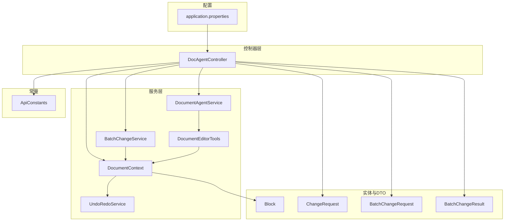
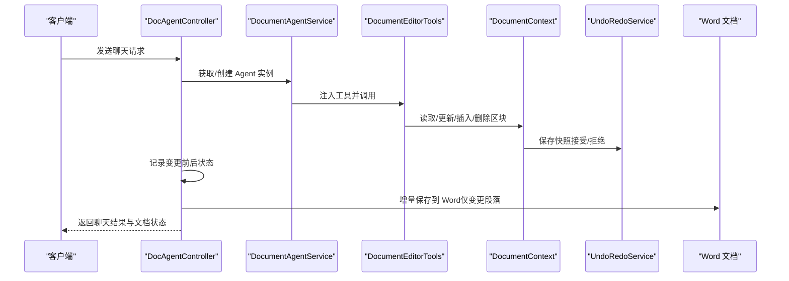
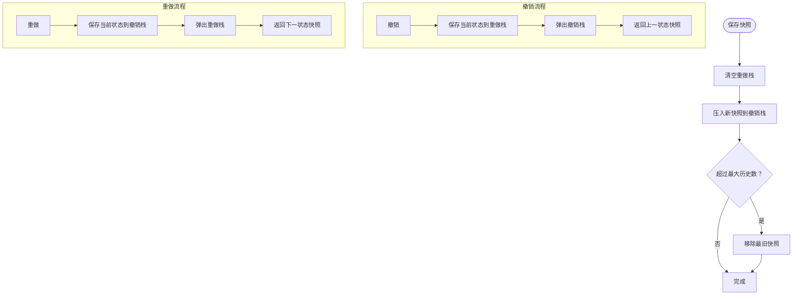
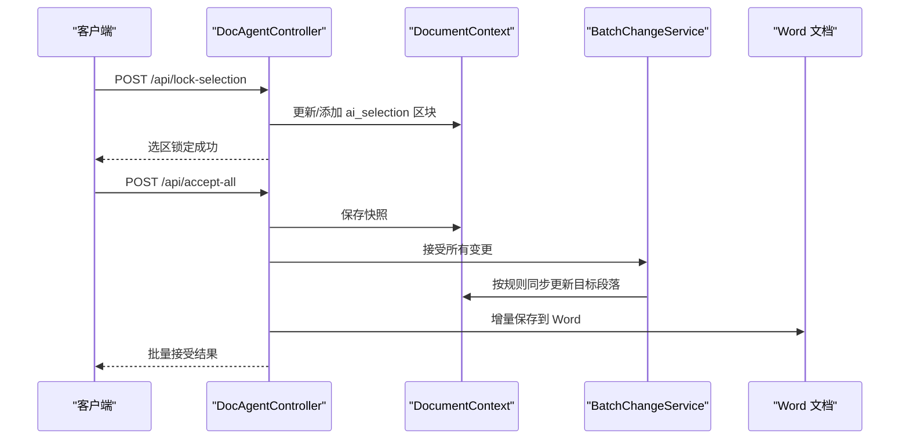
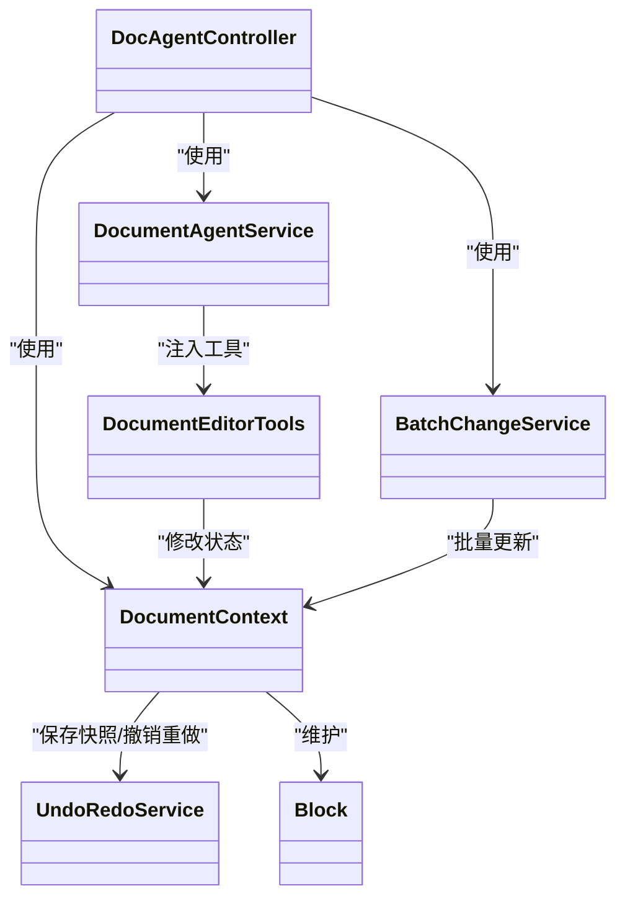

# 文档编辑功能

<cite>
**本文引用的文件**
- [DocumentEditorTools.java](file://src/main/java/com/example/docs_agent/service/DocumentEditorTools.java)
- [DocumentContext.java](file://src/main/java/com/example/docs_agent/service/DocumentContext.java)
- [UndoRedoService.java](file://src/main/java/com/example/docs_agent/service/UndoRedoService.java)
- [Block.java](file://src/main/java/com/example/docs_agent/entity/Block.java)
- [ApiConstants.java](file://src/main/java/com/example/docs_agent/constant/ApiConstants.java)
- [BatchChangeService.java](file://src/main/java/com/example/docs_agent/service/BatchChangeService.java)
- [DocAgentController.java](file://src/main/java/com/example/docs_agent/controller/DocAgentController.java)
- [application.properties](file://src/main/resources/application.properties)
- [ChangeRequest.java](file://src/main/java/com/example/docs_agent/dto/ChangeRequest.java)
- [BatchChangeRequest.java](file://src/main/java/com/example/docs_agent/dto/BatchChangeRequest.java)
- [BatchChangeResult.java](file://src/main/java/com/example/docs_agent/dto/BatchChangeResult.java)
- [DocumentAgentService.java](file://src/main/java/com/example/docs_agent/service/DocumentAgentService.java)
</cite>

## 目录
1. [简介](#简介)
2. [项目结构](#项目结构)
3. [核心组件](#核心组件)
4. [架构总览](#架构总览)
5. [详细组件分析](#详细组件分析)
6. [依赖关系分析](#依赖关系分析)
7. [性能考量](#性能考量)
8. [故障排查指南](#故障排查指南)
9. [结论](#结论)
10. [附录](#附录)

## 简介
本技术文档围绕文档编辑功能展开，重点说明以下方面：
- DocumentEditorTools 提供的编辑工具集：段落读取、更新、插入、删除等操作的具体实现与使用方式。
- DocumentContext 的文档状态管理机制：内存中的文档结构、Block 实体的数据模型与状态同步策略。
- 撤销重做服务的实现原理：操作历史记录、状态快照与回滚机制。
- 文档编辑工作流程示例：从选区锁定到变更接受的完整过程。
- 并发控制、数据一致性保证与性能优化措施。
- 实际使用场景与最佳实践指南。

## 项目结构
该项目采用 Spring Boot 结构，核心模块如下：
- controller：对外提供 RESTful API，负责接收请求、协调服务层与 Word 文档交互。
- service：业务服务层，包含文档上下文、编辑工具、批量变更、撤销重做、AI Agent 等。
- entity：领域模型，主要是 Block 实体。
- dto：请求/响应数据传输对象。
- constant：常量定义，如 API 基础路径、区块 ID 前缀、特殊标记等。
- resources：应用配置与静态资源。

图表来源
- [DocAgentController.java:32-636](file://src/main/java/com/example/docs_agent/controller/DocAgentController.java#L32-L636)
- [DocumentContext.java:16-205](file://src/main/java/com/example/docs_agent/service/DocumentContext.java#L16-L205)
- [DocumentEditorTools.java:14-105](file://src/main/java/com/example/docs_agent/service/DocumentEditorTools.java#L14-L105)
- [BatchChangeService.java:20-268](file://src/main/java/com/example/docs_agent/service/BatchChangeService.java#L20-L268)
- [UndoRedoService.java:13-192](file://src/main/java/com/example/docs_agent/service/UndoRedoService.java#L13-L192)
- [DocumentAgentService.java:23-389](file://src/main/java/com/example/docs_agent/service/DocumentAgentService.java#L23-L389)
- [Block.java:10-47](file://src/main/java/com/example/docs_agent/entity/Block.java#L10-L47)
- [ChangeRequest.java:8-31](file://src/main/java/com/example/docs_agent/dto/ChangeRequest.java#L8-L31)
- [BatchChangeRequest.java:12-30](file://src/main/java/com/example/docs_agent/dto/BatchChangeRequest.java#L12-L30)
- [BatchChangeResult.java:11-40](file://src/main/java/com/example/docs_agent/dto/BatchChangeResult.java#L11-L40)
- [ApiConstants.java:6-53](file://src/main/java/com/example/docs_agent/constant/ApiConstants.java#L6-L53)
- [application.properties:1-37](file://src/main/resources/application.properties#L1-L37)

章节来源
- [DocAgentController.java:32-636](file://src/main/java/com/example/docs_agent/controller/DocAgentController.java#L32-L636)
- [application.properties:1-37](file://src/main/resources/application.properties#L1-L37)

## 核心组件
- DocumentEditorTools：面向大模型的工具集，提供读取、更新、插入、删除段落的能力，并通过 DocumentContext 维护内存状态。
- DocumentContext：文档状态核心，维护区块映射与顺序、区块 ID 与 Word 段落索引映射、撤销重做快照入口。
- UndoRedoService：撤销/重做历史栈管理，提供快照保存、撤销、重做与历史清理能力。
- Block：文档最小单元，承载内容与目标段落标识（支持单个与多个目标）。
- BatchChangeService：批量变更处理，支持批量接受/拒绝与 ai_selection 的智能同步。
- DocAgentController：RESTful API 入口，协调 Word 文档增量保存、文档状态查询、变更接受/拒绝、AI 对话等。
- DocumentAgentService：AI Agent 管理与缓存，注入 DocumentEditorTools 供模型调用工具。

章节来源
- [DocumentEditorTools.java:14-105](file://src/main/java/com/example/docs_agent/service/DocumentEditorTools.java#L14-L105)
- [DocumentContext.java:16-205](file://src/main/java/com/example/docs_agent/service/DocumentContext.java#L16-L205)
- [UndoRedoService.java:13-192](file://src/main/java/com/example/docs_agent/service/UndoRedoService.java#L13-L192)
- [Block.java:10-47](file://src/main/java/com/example/docs_agent/entity/Block.java#L10-L47)
- [BatchChangeService.java:20-268](file://src/main/java/com/example/docs_agent/service/BatchChangeService.java#L20-L268)
- [DocAgentController.java:32-636](file://src/main/java/com/example/docs_agent/controller/DocAgentController.java#L32-L636)
- [DocumentAgentService.java:23-389](file://src/main/java/com/example/docs_agent/service/DocumentAgentService.java#L23-L389)

## 架构总览
整体架构围绕“内存文档状态 + AI 工具 + 批量变更 + Word 文档增量写入”展开。AI 通过 DocumentAgentService 注入 DocumentEditorTools，调用工具对内存中的 DocumentContext 进行修改；随后由 DocAgentController 触发增量保存到 Word 文档。

图表来源
- [DocAgentController.java:354-428](file://src/main/java/com/example/docs_agent/controller/DocAgentController.java#L354-L428)
- [DocumentAgentService.java:111-162](file://src/main/java/com/example/docs_agent/service/DocumentAgentService.java#L111-L162)
- [DocumentEditorTools.java:27-102](file://src/main/java/com/example/docs_agent/service/DocumentEditorTools.java#L27-L102)
- [DocumentContext.java:133-192](file://src/main/java/com/example/docs_agent/service/DocumentContext.java#L133-L192)
- [UndoRedoService.java:76-90](file://src/main/java/com/example/docs_agent/service/UndoRedoService.java#L76-L90)

## 详细组件分析

### DocumentEditorTools：编辑工具集
- 段落读取：readParagraph(blockId) 读取指定区块内容，用于在修改前了解上下文。
- 更新段落：updateParagraph(blockId, newText) 更新指定区块内容。
- 插入段落：insertParagraphAfter(targetBlockId, newText) 在目标区块后插入新段落，生成带特殊前缀的虚拟 ID，便于后续批量接受/拒绝。
- 删除段落：deleteParagraph(blockId) 标记删除，生成带特殊前缀的删除指令 ID，内容标记为特殊删除标记，便于后续处理。
- 读取文档全貌：readDocumentOutline() 返回格式化的文档内容字符串，便于 AI 了解上下文。

章节来源
- [DocumentEditorTools.java:27-102](file://src/main/java/com/example/docs_agent/service/DocumentEditorTools.java#L27-L102)
- [ApiConstants.java:32-44](file://src/main/java/com/example/docs_agent/constant/ApiConstants.java#L32-L44)

### DocumentContext：文档状态管理
- 数据结构：使用 LinkedHashMap 维护区块 ID 到 Block 的映射与插入顺序，确保文档阅读顺序一致。
- 区块 ID 与 Word 段落索引映射：setBlockToParaIndex()/getBlockToParaIndex() 支持 Word 文档增量写入时定位段落。
- 核心操作：
  - getBlock(blockId)/getAllBlocksAsMap()/getAllBlocksAsString() 提供查询与序列化能力。
  - updateBlock(blockId, newText) 更新或新增区块。
  - saveSnapshot()/undo()/redo()/canUndo()/canRedo()/clearUndoHistory() 与 UndoRedoService 协作实现撤销重做。
  - restoreBlocks(newBlocks) 用于撤销/重做时恢复状态。

章节来源
- [DocumentContext.java:16-205](file://src/main/java/com/example/docs_agent/service/DocumentContext.java#L16-L205)

### UndoRedoService：撤销重做服务
- 历史栈：使用两个双端队列 undoStack 与 redoStack 分别保存可撤销与可重做的快照。
- 快照类 DocumentSnapshot：包含区块映射、操作类型、描述与时间戳，并进行深拷贝以保证快照独立性。
- 关键方法：
  - saveSnapshot(blocks, operationType, description) 保存当前状态快照，清空 redo 栈并限制历史数量。
  - undo(currentBlocks)/redo(currentBlocks) 保存当前状态到另一栈，弹出并返回上一个/下一个快照。
  - canUndo()/canRedo() 查询可执行状态。
  - clearHistory() 清空历史。
- 性能与容量：最大历史记录数限制为固定值，避免内存膨胀。

图表来源
- [UndoRedoService.java:76-154](file://src/main/java/com/example/docs_agent/service/UndoRedoService.java#L76-L154)

章节来源
- [UndoRedoService.java:13-192](file://src/main/java/com/example/docs_agent/service/UndoRedoService.java#L13-L192)

### Block：数据模型与状态同步
- 字段：content、targetBlockId、targetBlockIds。
- 用途：
  - 普通区块：content 存放段落文本。
  - 选区锁定：ai_selection 区块存放选中文本，配合 targetBlockId 或 targetBlockIds 指向原始段落，实现批量接受时的智能同步。
- 批量接受逻辑：
  - ai_selection：根据目标段落数与内容段落数进行一对一、单段复制或全部合并更新。
  - 删除/插入：删除/插入操作通过特殊 ID 前缀识别，接受时仅记录，实际 Word 操作在服务层完成。
  - 普通更新：直接更新对应区块内容。

章节来源
- [Block.java:10-47](file://src/main/java/com/example/docs_agent/entity/Block.java#L10-L47)
- [BatchChangeService.java:113-210](file://src/main/java/com/example/docs_agent/service/BatchChangeService.java#L113-L210)

### 批量变更与工作流
- 批量接受：acceptAll(pendingChanges) 根据区块 ID 前缀与 ai_selection 的目标集合进行智能同步。
- 批量拒绝：rejectAll(pendingChangeIds, originalBlocks) 恢复到原始状态或丢弃草稿。
- 单个变更接受/拒绝：Controller 层在 acceptChange/rejectChange 中保存快照并执行更新。
- 选区锁定：lockSelection 将选区内容写入 ai_selection，并可建立与目标段落的映射关系，便于后续同步。

图表来源
- [DocAgentController.java:104-126](file://src/main/java/com/example/docs_agent/controller/DocAgentController.java#L104-L126)
- [DocAgentController.java:208-226](file://src/main/java/com/example/docs_agent/controller/DocAgentController.java#L208-L226)
- [BatchChangeService.java:113-210](file://src/main/java/com/example/docs_agent/service/BatchChangeService.java#L113-L210)

章节来源
- [DocAgentController.java:104-126](file://src/main/java/com/example/docs_agent/controller/DocAgentController.java#L104-L126)
- [DocAgentController.java:208-226](file://src/main/java/com/example/docs_agent/controller/DocAgentController.java#L208-L226)
- [BatchChangeService.java:113-210](file://src/main/java/com/example/docs_agent/service/BatchChangeService.java#L113-L210)

### 并发控制、数据一致性与性能优化
- 并发控制：
  - DocumentContext 与 UndoRedoService 未使用显式锁，但其内部结构（LinkedHashMap、Deque）在单线程控制器调用下可满足需求。
  - DocumentAgentService 使用并发安全的 ConcurrentHashMap 缓存不同配置的 Agent 实例，避免重复创建。
- 数据一致性：
  - 批量接受/拒绝通过快照与原始状态映射保障回滚能力。
  - Word 文档增量保存仅写入变更段落，减少 IO 开销。
- 性能优化：
  - UndoRedoService 限制历史栈大小，避免内存占用过大。
  - DocumentContext 使用 LinkedHashMap 保持顺序，避免排序开销。
  - Block 深拷贝快照，确保撤销/重做独立性。

章节来源
- [DocumentAgentService.java:27-34](file://src/main/java/com/example/docs_agent/service/DocumentAgentService.java#L27-L34)
- [UndoRedoService.java:30-31](file://src/main/java/com/example/docs_agent/service/UndoRedoService.java#L30-L31)
- [DocAgentController.java:51-66](file://src/main/java/com/example/docs_agent/controller/DocAgentController.java#L51-L66)

## 依赖关系分析
- DocAgentController 依赖 DocumentContext、BatchChangeService、DocumentAgentService、WordDocumentService（未在本文列出）。
- DocumentAgentService 依赖 DocumentEditorTools 与 AgentPromptConfig，向模型注入工具。
- DocumentEditorTools 依赖 DocumentContext。
- DocumentContext 依赖 UndoRedoService。
- BatchChangeService 依赖 DocumentContext。
- Block 为纯数据模型，被 DocumentContext 与 DTO 使用。

图表来源
- [DocAgentController.java:38-43](file://src/main/java/com/example/docs_agent/controller/DocAgentController.java#L38-L43)
- [DocumentAgentService.java:27-34](file://src/main/java/com/example/docs_agent/service/DocumentAgentService.java#L27-L34)
- [DocumentEditorTools.java:18-22](file://src/main/java/com/example/docs_agent/service/DocumentEditorTools.java#L18-L22)
- [DocumentContext.java:34-34](file://src/main/java/com/example/docs_agent/service/DocumentContext.java#L34-L34)
- [BatchChangeService.java:25-25](file://src/main/java/com/example/docs_agent/service/BatchChangeService.java#L25-L25)

章节来源
- [DocAgentController.java:38-43](file://src/main/java/com/example/docs_agent/controller/DocAgentController.java#L38-L43)
- [DocumentAgentService.java:27-34](file://src/main/java/com/example/docs_agent/service/DocumentAgentService.java#L27-L34)
- [DocumentEditorTools.java:18-22](file://src/main/java/com/example/docs_agent/service/DocumentEditorTools.java#L18-L22)
- [DocumentContext.java:34-34](file://src/main/java/com/example/docs_agent/service/DocumentContext.java#L34-L34)
- [BatchChangeService.java:25-25](file://src/main/java/com/example/docs_agent/service/BatchChangeService.java#L25-L25)

## 性能考量
- 历史记录上限：UndoRedoService 限制最大历史数，避免内存膨胀。
- 增量保存：仅对变更段落写入 Word，降低 IO 压力。
- 快照深拷贝：避免撤销/重做期间的共享状态问题。
- 缓存复用：DocumentAgentService 对不同配置的 Agent 实例进行缓存，减少初始化成本。
- 日志级别：生产环境建议调整日志级别，避免过多 DEBUG 输出影响性能。

章节来源
- [UndoRedoService.java:30-31](file://src/main/java/com/example/docs_agent/service/UndoRedoService.java#L30-L31)
- [DocAgentController.java:51-66](file://src/main/java/com/example/docs_agent/controller/DocAgentController.java#L51-L66)
- [DocumentAgentService.java:111-162](file://src/main/java/com/example/docs_agent/service/DocumentAgentService.java#L111-L162)
- [application.properties:29-34](file://src/main/resources/application.properties#L29-L34)

## 故障排查指南
- 文档为空导致操作失败：
  - 语法检查与摘要生成在文档为空时会返回错误提示，需先同步文档内容或调用初始化接口。
- 选区锁定无效：
  - 确认 lockSelection 请求中 selectedText 非空，且 targetBlockId（可选）正确。
- 变更接受/拒绝失败：
  - 检查 Block 的 oldText 是否存在，拒绝时需要原始内容进行恢复。
  - ai_selection 的目标段落数与内容段落数不匹配时，批量接受会采取“全部合并到首个目标段落”的策略。
- 撤销/重做不可用：
  - 确认历史栈非空，或在新的操作分支中已自动清空重做栈。
- 日志定位：
  - 调整 application.properties 中的日志级别，观察 DEBUG/INFO 级别的输出以定位问题。

章节来源
- [DocAgentController.java:280-290](file://src/main/java/com/example/docs_agent/controller/DocAgentController.java#L280-L290)
- [DocAgentController.java:390-414](file://src/main/java/com/example/docs_agent/controller/DocAgentController.java#L390-L414)
- [BatchChangeService.java:140-157](file://src/main/java/com/example/docs_agent/service/BatchChangeService.java#L140-L157)
- [UndoRedoService.java:97-108](file://src/main/java/com/example/docs_agent/service/UndoRedoService.java#L97-L108)
- [application.properties:29-34](file://src/main/resources/application.properties#L29-L34)

## 结论
本系统通过“内存文档状态 + AI 工具 + 批量变更 + Word 增量保存”的架构，实现了文档编辑的闭环：AI 可通过工具对内存中的 DocumentContext 进行读取与修改，系统通过快照与撤销重做保障安全性，最终以增量方式写回 Word 文档。该设计兼顾易用性、一致性与性能，适合在复杂文档协作场景中使用。

## 附录
- 常用 API 一览（节选）
  - GET /api/document：获取当前文档状态
  - POST /api/init-document：初始化文档状态
  - POST /api/lock-selection：锁定选区
  - POST /api/accept：接受单个变更
  - POST /api/reject：拒绝单个变更
  - POST /api/batch-accept：批量接受变更
  - POST /api/batch-reject：批量拒绝变更
  - POST /api/accept-all：接受所有待处理变更
  - POST /api/reject-all：拒绝所有待处理变更
  - POST /api/save-to-word：增量保存到 Word
  - POST /api/chat：与 AI Agent 对话
  - POST /api/grammar-check：全文语法检查
  - POST /api/summarize：生成文档摘要

章节来源
- [DocAgentController.java:73-636](file://src/main/java/com/example/docs_agent/controller/DocAgentController.java#L73-L636)
- [ApiConstants.java:15-15](file://src/main/java/com/example/docs_agent/constant/ApiConstants.java#L15-L15)