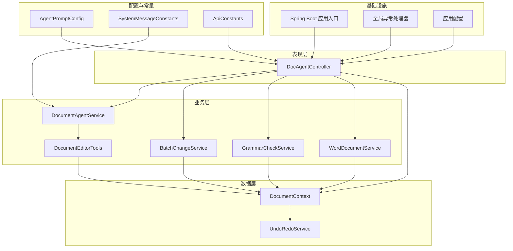
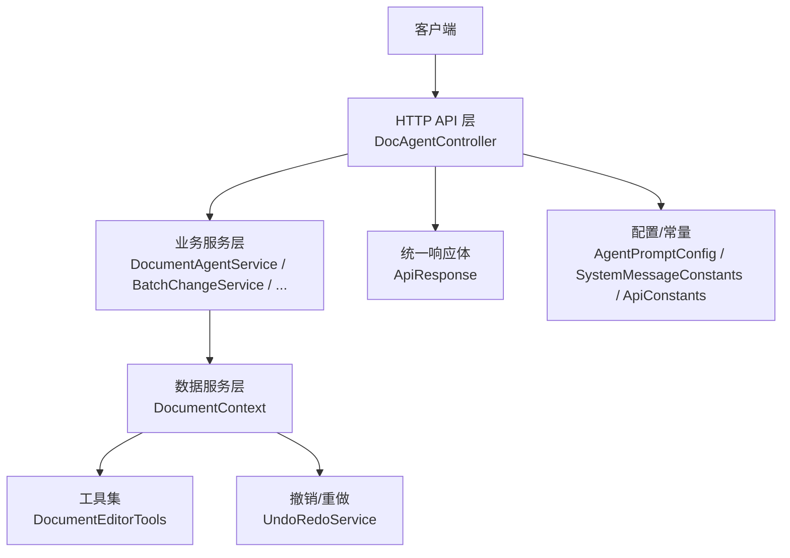
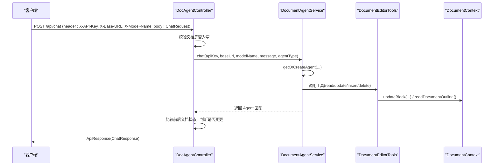
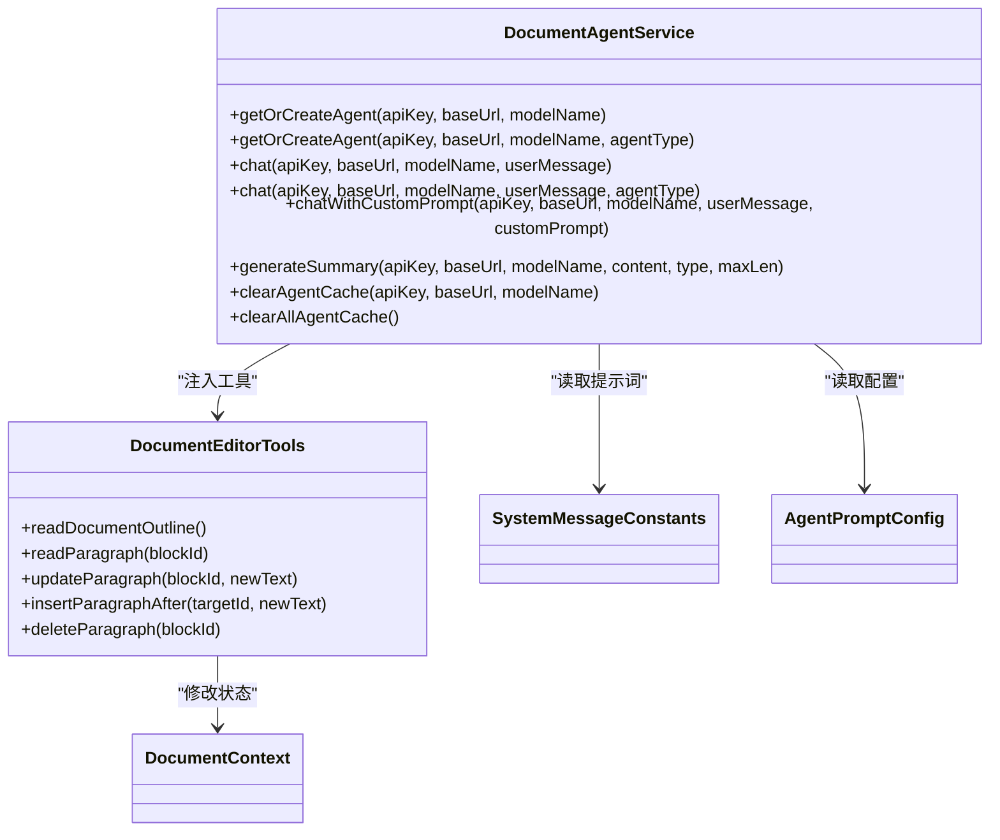
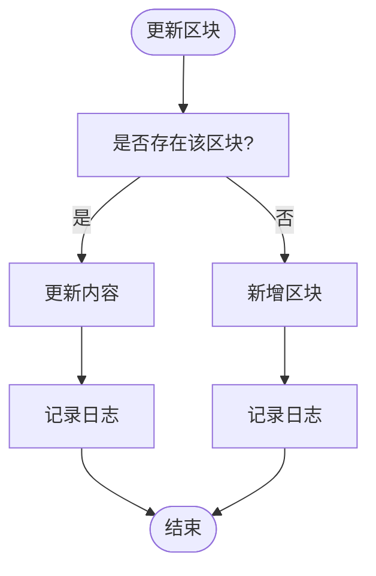
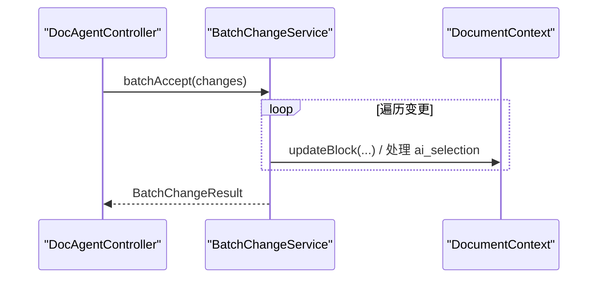
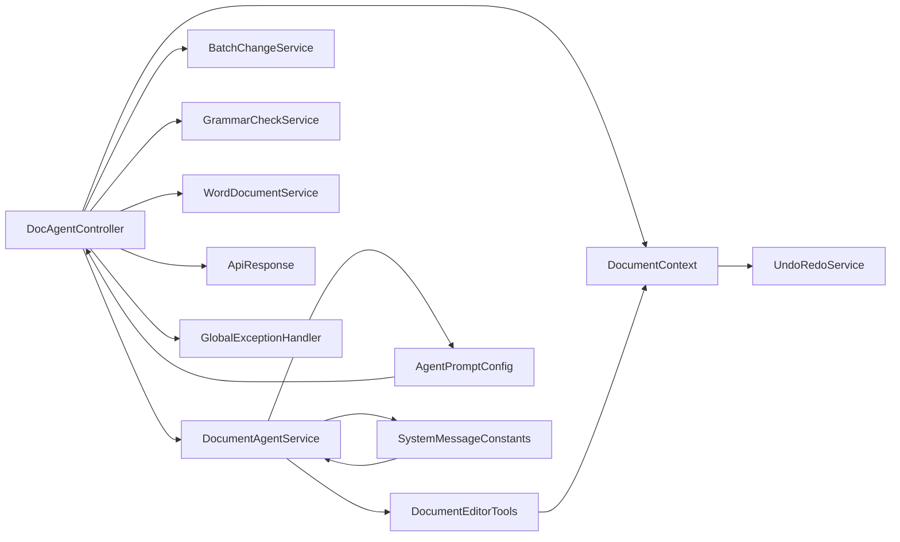
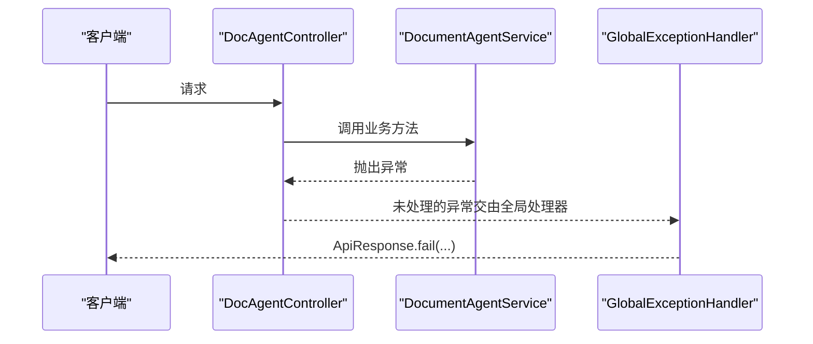

# 核心组件

<cite>
**本文引用的文件**
- [DocsAgentApplication.java](file://src/main/java/com/example/docs_agent/DocsAgentApplication.java)
- [DocAgentController.java](file://src/main/java/com/example/docs_agent/controller/DocAgentController.java)
- [DocumentAgentService.java](file://src/main/java/com/example/docs_agent/service/DocumentAgentService.java)
- [DocumentContext.java](file://src/main/java/com/example/docs_agent/service/DocumentContext.java)
- [DocumentEditorTools.java](file://src/main/java/com/example/docs_agent/service/DocumentEditorTools.java)
- [BatchChangeService.java](file://src/main/java/com/example/docs_agent/service/BatchChangeService.java)
- [UndoRedoService.java](file://src/main/java/com/example/docs_agent/service/UndoRedoService.java)
- [AgentPromptConfig.java](file://src/main/java/com/example/docs_agent/config/AgentPromptConfig.java)
- [SystemMessageConstants.java](file://src/main/java/com/example/docs_agent/constant/SystemMessageConstants.java)
- [ApiConstants.java](file://src/main/java/com/example/docs_agent/constant/ApiConstants.java)
- [ApiResponse.java](file://src/main/java/com/example/docs_agent/dto/ApiResponse.java)
- [Block.java](file://src/main/java/com/example/docs_agent/entity/Block.java)
- [GlobalExceptionHandler.java](file://src/main/java/com/example/docs_agent/exception/GlobalExceptionHandler.java)
- [application.properties](file://src/main/resources/application.properties)
- [pom.xml](file://pom.xml)
</cite>

## 目录
1. [简介](#简介)
2. [项目结构](#项目结构)
3. [核心组件](#核心组件)
4. [架构总览](#架构总览)
5. [组件详细分析](#组件详细分析)
6. [依赖关系分析](#依赖关系分析)
7. [性能考量](#性能考量)
8. [故障排查指南](#故障排查指南)
9. [结论](#结论)

## 简介
本文件面向 Docs-Agent 的核心组件，系统性阐述其基于 MVC 架构的实现方式，重点解析：
- 表现层（Controller）：DocAgentController 如何接收与处理 HTTP 请求，协调业务与数据层。
- 业务层（Service）：DocumentAgentService 如何管理 AI Agent 生命周期、提示词策略与工具调用；BatchChangeService、GrammarCheckService、WordDocumentService 等如何协同工作。
- 数据层（Service）：DocumentContext 如何维护内存中的文档状态，支持撤销/重做与持久化桥接。

同时，文档覆盖依赖注入机制、方法调用链路、数据传递方式、错误处理与异常传播、组件生命周期管理以及性能优化建议。

## 项目结构
项目采用 Spring Boot 标准目录结构，按关注点分包组织：
- controller：REST 控制器，暴露 API
- service：业务服务与工具服务
- config：配置类（提示词、AI 模型）
- constant：常量定义
- dto：请求/响应数据传输对象
- entity：领域模型
- exception：全局异常处理
- resources：配置与静态资源

图表来源
- [DocAgentController.java:32-636](file://src/main/java/com/example/docs_agent/controller/DocAgentController.java#L32-L636)
- [DocumentAgentService.java:23-389](file://src/main/java/com/example/docs_agent/service/DocumentAgentService.java#L23-L389)
- [DocumentContext.java:16-205](file://src/main/java/com/example/docs_agent/service/DocumentContext.java#L16-L205)
- [DocumentEditorTools.java:14-105](file://src/main/java/com/example/docs_agent/service/DocumentEditorTools.java#L14-L105)
- [BatchChangeService.java:20-268](file://src/main/java/com/example/docs_agent/service/BatchChangeService.java#L20-L268)
- [AgentPromptConfig.java:15-88](file://src/main/java/com/example/docs_agent/config/AgentPromptConfig.java#L15-L88)
- [SystemMessageConstants.java:10-234](file://src/main/java/com/example/docs_agent/constant/SystemMessageConstants.java#L10-L234)
- [ApiConstants.java:6-53](file://src/main/java/com/example/docs_agent/constant/ApiConstants.java#L6-L53)
- [DocsAgentApplication.java:6-11](file://src/main/java/com/example/docs_agent/DocsAgentApplication.java#L6-L11)
- [GlobalExceptionHandler.java:16-60](file://src/main/java/com/example/docs_agent/exception/GlobalExceptionHandler.java#L16-L60)
- [application.properties:1-37](file://src/main/resources/application.properties#L1-L37)

章节来源
- [DocsAgentApplication.java:6-11](file://src/main/java/com/example/docs_agent/DocsAgentApplication.java#L6-L11)
- [application.properties:1-37](file://src/main/resources/application.properties#L1-L37)
- [pom.xml:37-78](file://pom.xml#L37-L78)

## 核心组件
- DocAgentController：MVC 的表现层，负责接收 HTTP 请求、参数校验、调用业务层、组装统一响应体，并通过 ApiResponse 统一对外输出。
- DocumentAgentService：MVC 的业务层核心，负责 AI Agent 的创建/缓存、提示词策略、工具装配、摘要生成等。
- DocumentContext：MVC 的数据层核心，维护内存中的文档区块集合，提供读写、快照、撤销/重做等能力。
- DocumentEditorTools：LangChain4j 工具集，向 Agent 暴露“读取/更新/插入/删除”等文档操作，驱动 DocumentContext 的状态变更。
- BatchChangeService：批量变更处理，支持批量接受/拒绝、多段落 ai_selection 同步、删除/插入草稿的处理。
- UndoRedoService：撤销/重做历史管理，提供快照保存、回滚与前进能力。
- AgentPromptConfig、SystemMessageConstants、ApiConstants：配置与常量，支撑 Agent 类型、提示词与 API 规范。

章节来源
- [DocAgentController.java:32-636](file://src/main/java/com/example/docs_agent/controller/DocAgentController.java#L32-L636)
- [DocumentAgentService.java:23-389](file://src/main/java/com/example/docs_agent/service/DocumentAgentService.java#L23-L389)
- [DocumentContext.java:16-205](file://src/main/java/com/example/docs_agent/service/DocumentContext.java#L16-L205)
- [DocumentEditorTools.java:14-105](file://src/main/java/com/example/docs_agent/service/DocumentEditorTools.java#L14-L105)
- [BatchChangeService.java:20-268](file://src/main/java/com/example/docs_agent/service/BatchChangeService.java#L20-L268)
- [UndoRedoService.java:13-192](file://src/main/java/com/example/docs_agent/service/UndoRedoService.java#L13-L192)
- [AgentPromptConfig.java:15-88](file://src/main/java/com/example/docs_agent/config/AgentPromptConfig.java#L15-L88)
- [SystemMessageConstants.java:10-234](file://src/main/java/com/example/docs_agent/constant/SystemMessageConstants.java#L10-L234)
- [ApiConstants.java:6-53](file://src/main/java/com/example/docs_agent/constant/ApiConstants.java#L6-L53)

## 架构总览
Docs-Agent 采用典型的三层架构（MVC）：
- 表现层：DocAgentController 通过 Spring MVC 接收请求，进行参数校验与安全头解析，调用业务层服务。
- 业务层：DocumentAgentService 管理 AI Agent 生命周期与提示词策略；BatchChangeService、GrammarCheckService、WordDocumentService 等处理具体业务。
- 数据层：DocumentContext 作为内存态的文档载体，配合 UndoRedoService 提供快照与回滚能力；DocumentEditorTools 作为工具集注入 Agent，驱动 DocumentContext 的状态变化。

图表来源
- [DocAgentController.java:32-636](file://src/main/java/com/example/docs_agent/controller/DocAgentController.java#L32-L636)
- [DocumentAgentService.java:23-389](file://src/main/java/com/example/docs_agent/service/DocumentAgentService.java#L23-L389)
- [DocumentContext.java:16-205](file://src/main/java/com/example/docs_agent/service/DocumentContext.java#L16-L205)
- [DocumentEditorTools.java:14-105](file://src/main/java/com/example/docs_agent/service/DocumentEditorTools.java#L14-L105)
- [BatchChangeService.java:20-268](file://src/main/java/com/example/docs_agent/service/BatchChangeService.java#L20-L268)
- [AgentPromptConfig.java:15-88](file://src/main/java/com/example/docs_agent/config/AgentPromptConfig.java#L15-L88)
- [SystemMessageConstants.java:10-234](file://src/main/java/com/example/docs_agent/constant/SystemMessageConstants.java#L10-L234)
- [ApiConstants.java:6-53](file://src/main/java/com/example/docs_agent/constant/ApiConstants.java#L6-L53)
- [ApiResponse.java:13-84](file://src/main/java/com/example/docs_agent/dto/ApiResponse.java#L13-L84)

## 组件详细分析

### 表现层：DocAgentController（MVC 视图）
职责与特性
- 接收并解析 HTTP 请求，读取请求头（API Key、Base URL、Model Name），解析请求体。
- 对关键业务（如聊天、摘要、语法检查）进行前置校验（如文档是否为空）。
- 调用业务层服务执行具体逻辑，组装 ApiResponse 统一响应。
- 对外暴露多种 API：文档状态查询、初始化、锁定选区、接受/拒绝变更、批量变更、语法检查、聊天、Agent 类型与提示词管理、摘要生成等。

依赖注入与协作
- 通过构造器注入 DocumentContext、WordDocumentService、DocumentAgentService、BatchChangeService、GrammarCheckService、AgentPromptConfig。
- 与业务层的交互以方法调用为主，数据通过 DTO 与实体在边界处传递。

典型流程示例（聊天 API）

图表来源
- [DocAgentController.java:354-428](file://src/main/java/com/example/docs_agent/controller/DocAgentController.java#L354-L428)
- [DocumentAgentService.java:183-240](file://src/main/java/com/example/docs_agent/service/DocumentAgentService.java#L183-L240)
- [DocumentEditorTools.java:27-102](file://src/main/java/com/example/docs_agent/service/DocumentEditorTools.java#L27-L102)
- [DocumentContext.java:62-81](file://src/main/java/com/example/docs_agent/service/DocumentContext.java#L62-L81)

章节来源
- [DocAgentController.java:32-636](file://src/main/java/com/example/docs_agent/controller/DocAgentController.java#L32-L636)
- [ApiResponse.java:13-84](file://src/main/java/com/example/docs_agent/dto/ApiResponse.java#L13-L84)

### 业务层：DocumentAgentService（MVC 业务逻辑）
职责与特性
- 管理多类型 Agent 的创建与缓存，键由 API Key、Base URL、Model Name 与 Agent 类型组合。
- 通过 LangChain4j 的 AiServices 构建 Agent，注入 DocumentEditorTools 作为工具集。
- 支持默认类型、指定类型与自定义提示词三种聊天模式；提供摘要生成能力。
- 提供缓存清理接口，便于配置变更后重建 Agent。

Agent 类型与提示词
- 通过 SystemMessageConstants 提供多类型提示词模板；AgentPromptConfig 控制默认类型、是否允许客户端覆盖、是否允许自定义提示词。
- 自定义提示词通过临时设置到 SystemMessageConstants 并使用特定接口实现。

图表来源
- [DocumentAgentService.java:23-389](file://src/main/java/com/example/docs_agent/service/DocumentAgentService.java#L23-L389)
- [DocumentEditorTools.java:14-105](file://src/main/java/com/example/docs_agent/service/DocumentEditorTools.java#L14-L105)
- [SystemMessageConstants.java:10-234](file://src/main/java/com/example/docs_agent/constant/SystemMessageConstants.java#L10-L234)
- [AgentPromptConfig.java:15-88](file://src/main/java/com/example/docs_agent/config/AgentPromptConfig.java#L15-L88)
- [DocumentContext.java:16-205](file://src/main/java/com/example/docs_agent/service/DocumentContext.java#L16-L205)

章节来源
- [DocumentAgentService.java:23-389](file://src/main/java/com/example/docs_agent/service/DocumentAgentService.java#L23-L389)
- [SystemMessageConstants.java:10-234](file://src/main/java/com/example/docs_agent/constant/SystemMessageConstants.java#L10-L234)
- [AgentPromptConfig.java:15-88](file://src/main/java/com/example/docs_agent/config/AgentPromptConfig.java#L15-L88)

### 数据层：DocumentContext（内存态文档状态）
职责与特性
- 维护区块 ID 到 Word 段落索引的映射，以及区块 ID 到 Block 的有序映射。
- 提供区块读写、文档全貌拼接、清空、统计、快照保存、撤销/重做等能力。
- 通过 UndoRedoService 与快照机制实现状态回滚与前进。

图表来源
- [DocumentContext.java:62-81](file://src/main/java/com/example/docs_agent/service/DocumentContext.java#L62-L81)

章节来源
- [DocumentContext.java:16-205](file://src/main/java/com/example/docs_agent/service/DocumentContext.java#L16-L205)
- [Block.java:10-47](file://src/main/java/com/example/docs_agent/entity/Block.java#L10-L47)

### 工具层：DocumentEditorTools（Agent 工具集）
职责与特性
- 暴露 readDocumentOutline、readParagraph、updateParagraph、insertParagraphAfter、deleteParagraph 等工具方法。
- 通过 @Tool 注解与 LangChain4j 集成，Agent 可直接调用这些工具以修改 DocumentContext 的状态。
- 为插入/删除操作生成特殊 ID 前缀，便于后端识别与处理。

章节来源
- [DocumentEditorTools.java:14-105](file://src/main/java/com/example/docs_agent/service/DocumentEditorTools.java#L14-L105)

### 批量变更与撤销/重做
- BatchChangeService：批量接受/拒绝变更，支持 ai_selection 多段落同步、删除/插入草稿处理、失败项收集与结果汇总。
- UndoRedoService：提供撤销/重做栈、最大历史条目限制、快照深拷贝、历史列表导出与清空。

图表来源
- [DocAgentController.java:182-200](file://src/main/java/com/example/docs_agent/controller/DocAgentController.java#L182-L200)
- [BatchChangeService.java:33-68](file://src/main/java/com/example/docs_agent/service/BatchChangeService.java#L33-L68)
- [DocumentContext.java:62-81](file://src/main/java/com/example/docs_agent/service/DocumentContext.java#L62-L81)

章节来源
- [BatchChangeService.java:20-268](file://src/main/java/com/example/docs_agent/service/BatchChangeService.java#L20-L268)
- [UndoRedoService.java:13-192](file://src/main/java/com/example/docs_agent/service/UndoRedoService.java#L13-L192)

## 依赖关系分析
- 控制器依赖业务与数据服务：DocAgentController 依赖 DocumentAgentService、BatchChangeService、GrammarCheckService、WordDocumentService、DocumentContext、AgentPromptConfig。
- 业务层依赖工具与配置：DocumentAgentService 依赖 DocumentEditorTools、SystemMessageConstants、AgentPromptConfig。
- 工具依赖数据层：DocumentEditorTools 依赖 DocumentContext。
- 数据层依赖撤销服务：DocumentContext 依赖 UndoRedoService。
- 统一响应与异常：控制器返回 ApiResponse，全局异常处理器捕获异常并统一包装。

图表来源
- [DocAgentController.java:32-636](file://src/main/java/com/example/docs_agent/controller/DocAgentController.java#L32-L636)
- [DocumentAgentService.java:23-389](file://src/main/java/com/example/docs_agent/service/DocumentAgentService.java#L23-L389)
- [DocumentContext.java:16-205](file://src/main/java/com/example/docs_agent/service/DocumentContext.java#L16-L205)
- [DocumentEditorTools.java:14-105](file://src/main/java/com/example/docs_agent/service/DocumentEditorTools.java#L14-L105)
- [BatchChangeService.java:20-268](file://src/main/java/com/example/docs_agent/service/BatchChangeService.java#L20-L268)
- [AgentPromptConfig.java:15-88](file://src/main/java/com/example/docs_agent/config/AgentPromptConfig.java#L15-L88)
- [SystemMessageConstants.java:10-234](file://src/main/java/com/example/docs_agent/constant/SystemMessageConstants.java#L10-L234)
- [ApiResponse.java:13-84](file://src/main/java/com/example/docs_agent/dto/ApiResponse.java#L13-L84)
- [GlobalExceptionHandler.java:16-60](file://src/main/java/com/example/docs_agent/exception/GlobalExceptionHandler.java#L16-L60)

章节来源
- [DocAgentController.java:32-636](file://src/main/java/com/example/docs_agent/controller/DocAgentController.java#L32-L636)
- [DocumentAgentService.java:23-389](file://src/main/java/com/example/docs_agent/service/DocumentAgentService.java#L23-L389)
- [DocumentContext.java:16-205](file://src/main/java/com/example/docs_agent/service/DocumentContext.java#L16-L205)
- [DocumentEditorTools.java:14-105](file://src/main/java/com/example/docs_agent/service/DocumentEditorTools.java#L14-L105)
- [BatchChangeService.java:20-268](file://src/main/java/com/example/docs_agent/service/BatchChangeService.java#L20-L268)
- [AgentPromptConfig.java:15-88](file://src/main/java/com/example/docs_agent/config/AgentPromptConfig.java#L15-L88)
- [SystemMessageConstants.java:10-234](file://src/main/java/com/example/docs_agent/constant/SystemMessageConstants.java#L10-L234)
- [ApiResponse.java:13-84](file://src/main/java/com/example/docs_agent/dto/ApiResponse.java#L13-L84)
- [GlobalExceptionHandler.java:16-60](file://src/main/java/com/example/docs_agent/exception/GlobalExceptionHandler.java#L16-L60)

## 性能考量
- Agent 缓存：DocumentAgentService 使用并发 Map 缓存不同配置与类型下的 Agent 实例，避免重复初始化，降低延迟与资源消耗。
- 工具调用开销：DocumentEditorTools 的工具方法直接操作内存中的 DocumentContext，避免频繁 IO；插入/删除采用“草稿 ID”策略，减少对 Word 的即时写入压力。
- 撤销/重做栈：UndoRedoService 限制最大历史条目，防止内存膨胀；快照深拷贝保证状态一致性。
- 文档摘要：对超长文档进行截断，避免超出模型上下文限制，提高成功率与稳定性。
- 日志级别：生产环境建议适度降低日志级别，避免高频 DEBUG 影响吞吐。

## 故障排查指南
常见问题与定位
- 文档为空导致聊天/摘要失败：控制器在进入业务层前会进行空文档校验，若为空，返回明确提示。
- Agent 执行异常：业务层捕获异常并抛出运行时异常，控制器捕获后统一包装为失败响应。
- 文件写入失败：保存到 Word 时捕获 IOException，返回 SAVE_ERROR 错误码。
- 参数非法：全局异常处理器捕获 IllegalArgumentException，返回 INVALID_PARAM 错误码。

异常传播路径

图表来源
- [DocAgentController.java:51-66](file://src/main/java/com/example/docs_agent/controller/DocAgentController.java#L51-L66)
- [DocumentAgentService.java:183-191](file://src/main/java/com/example/docs_agent/service/DocumentAgentService.java#L183-L191)
- [GlobalExceptionHandler.java:23-58](file://src/main/java/com/example/docs_agent/exception/GlobalExceptionHandler.java#L23-L58)

章节来源
- [DocAgentController.java:51-66](file://src/main/java/com/example/docs_agent/controller/DocAgentController.java#L51-L66)
- [DocumentAgentService.java:183-191](file://src/main/java/com/example/docs_agent/service/DocumentAgentService.java#L183-L191)
- [GlobalExceptionHandler.java:16-60](file://src/main/java/com/example/docs_agent/exception/GlobalExceptionHandler.java#L16-L60)

## 结论
Docs-Agent 的核心组件围绕 MVC 架构清晰分工：控制器负责请求接入与响应封装，业务层负责 AI Agent 生命周期与提示词策略，数据层负责内存态文档状态与快照管理。通过依赖注入与工具集集成，组件间耦合度低、内聚性强，具备良好的扩展性与可维护性。结合缓存、快照与统一异常处理机制，系统在性能与可靠性方面具备良好基础。