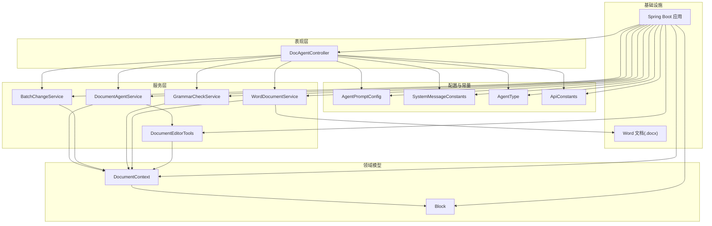
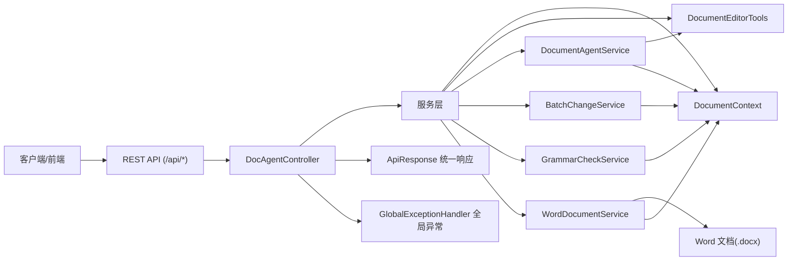
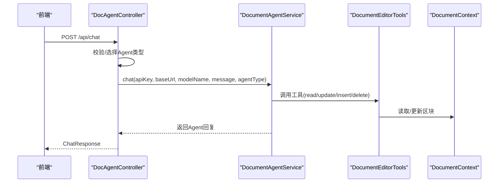
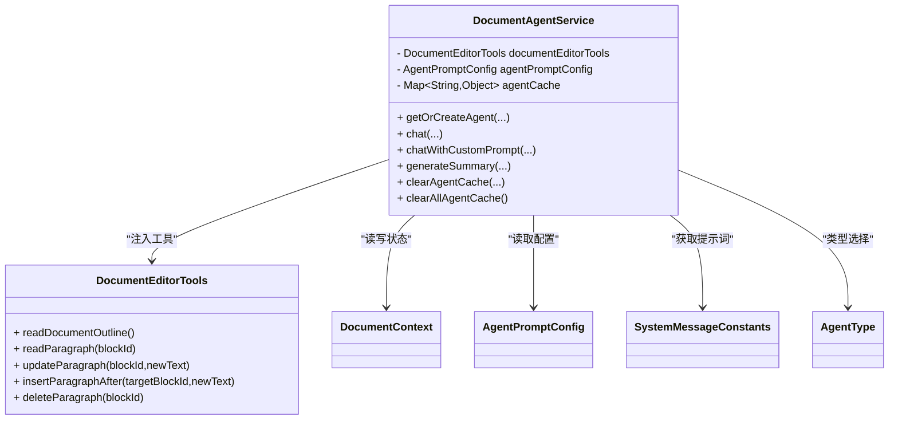
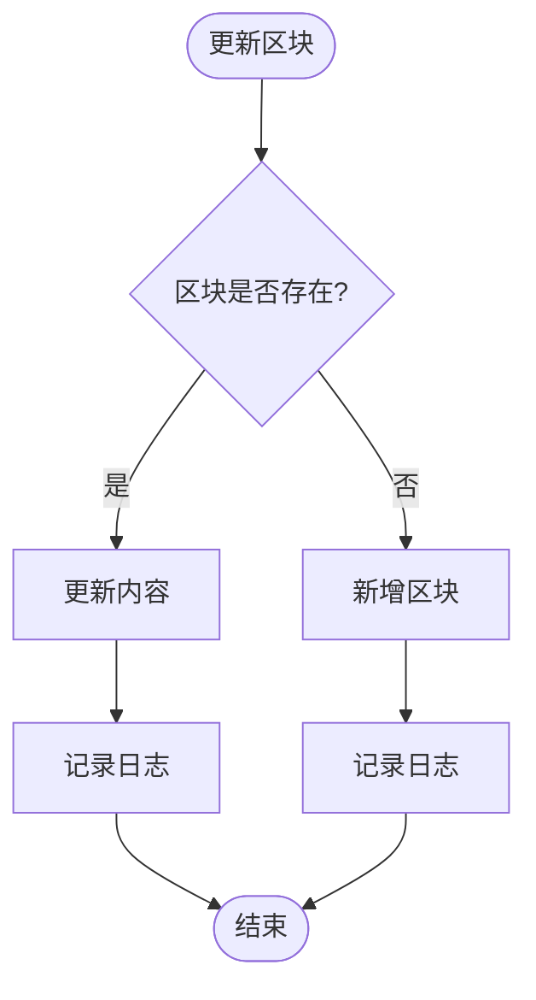
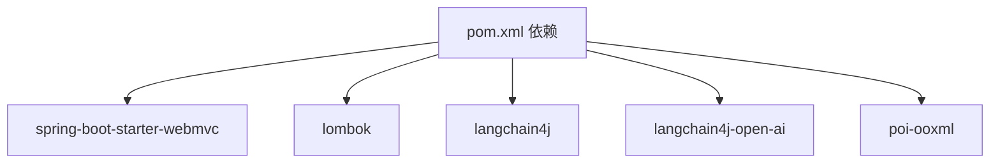

# 系统架构

<cite>
**本文引用的文件**
- [DocsAgentApplication.java](file://src/main/java/com/example/docs_agent/DocsAgentApplication.java)
- [DocAgentController.java](file://src/main/java/com/example/docs_agent/controller/DocAgentController.java)
- [DocumentAgentService.java](file://src/main/java/com/example/docs_agent/service/DocumentAgentService.java)
- [DocumentContext.java](file://src/main/java/com/example/docs_agent/service/DocumentContext.java)
- [AgentPromptConfig.java](file://src/main/java/com/example/docs_agent/config/AgentPromptConfig.java)
- [BatchChangeService.java](file://src/main/java/com/example/docs_agent/service/BatchChangeService.java)
- [GrammarCheckService.java](file://src/main/java/com/example/docs_agent/service/GrammarCheckService.java)
- [WordDocumentService.java](file://src/main/java/com/example/docs_agent/service/WordDocumentService.java)
- [DocumentEditorTools.java](file://src/main/java/com/example/docs_agent/service/DocumentEditorTools.java)
- [Block.java](file://src/main/java/com/example/docs_agent/entity/Block.java)
- [AgentType.java](file://src/main/java/com/example/docs_agent/constant/AgentType.java)
- [SystemMessageConstants.java](file://src/main/java/com/example/docs_agent/constant/SystemMessageConstants.java)
- [ApiConstants.java](file://src/main/java/com/example/docs_agent/constant/ApiConstants.java)
- [ApiResponse.java](file://src/main/java/com/example/docs_agent/dto/ApiResponse.java)
- [GlobalExceptionHandler.java](file://src/main/java/com/example/docs_agent/exception/GlobalExceptionHandler.java)
- [application.properties](file://src/main/resources/application.properties)
- [pom.xml](file://pom.xml)
</cite>

## 目录
1. [简介](#简介)
2. [项目结构](#项目结构)
3. [核心组件](#核心组件)
4. [架构总览](#架构总览)
5. [详细组件分析](#详细组件分析)
6. [依赖分析](#依赖分析)
7. [性能考量](#性能考量)
8. [故障排查指南](#故障排查指南)
9. [结论](#结论)
10. [附录](#附录)

## 简介
本项目为 Docs-Agent，旨在通过 AI Agent 协助用户对 Word 文档进行智能编辑、语法检查、摘要生成与批量变更处理。系统采用基于 Spring Boot 的分层架构，遵循 MVC 思想：Controller 负责接收请求与编排业务；Service 层负责领域逻辑与工具调用；Repository 层由内存态的 DocumentContext 与工具类替代；Entity 与 DTO 作为数据传输与持久化载体；Config 与 Constants 提供配置与常量。

系统边界清晰：对外通过 REST API 暴露能力，对内通过 Agent 提示词与工具集驱动文档状态变更，并最终增量写回 Word 文档。系统具备可扩展的 Agent 类型体系、可配置的提示词策略、以及完善的批量变更与撤销/重做机制。

## 项目结构
项目采用按职责分层的目录组织方式：
- config：配置类（Agent 提示词配置）
- constant：常量定义（Agent 类型、API 常量、系统提示词）
- controller：控制器（REST API）
- service：服务层（业务逻辑与工具集成）
- dto：数据传输对象（统一响应与请求体）
- entity：实体（文档区块）
- exception：全局异常处理
- util：工具类（本项目未提供）
- resources：静态资源与配置文件

图表来源
- [DocAgentController.java](file://src/main/java/com/example/docs_agent/controller/DocAgentController.java)
- [DocumentAgentService.java](file://src/main/java/com/example/docs_agent/service/DocumentAgentService.java)
- [DocumentContext.java](file://src/main/java/com/example/docs_agent/service/DocumentContext.java)
- [AgentPromptConfig.java](file://src/main/java/com/example/docs_agent/config/AgentPromptConfig.java)
- [BatchChangeService.java](file://src/main/java/com/example/docs_agent/service/BatchChangeService.java)
- [GrammarCheckService.java](file://src/main/java/com/example/docs_agent/service/GrammarCheckService.java)
- [WordDocumentService.java](file://src/main/java/com/example/docs_agent/service/WordDocumentService.java)
- [DocumentEditorTools.java](file://src/main/java/com/example/docs_agent/service/DocumentEditorTools.java)
- [Block.java](file://src/main/java/com/example/docs_agent/entity/Block.java)
- [AgentType.java](file://src/main/java/com/example/docs_agent/constant/AgentType.java)
- [SystemMessageConstants.java](file://src/main/java/com/example/docs_agent/constant/SystemMessageConstants.java)
- [ApiConstants.java](file://src/main/java/com/example/docs_agent/constant/ApiConstants.java)
- [DocsAgentApplication.java](file://src/main/java/com/example/docs_agent/DocsAgentApplication.java)

章节来源
- [DocsAgentApplication.java](file://src/main/java/com/example/docs_agent/DocsAgentApplication.java)
- [application.properties](file://src/main/resources/application.properties)
- [pom.xml](file://pom.xml)

## 核心组件
- 控制器层：DocAgentController 负责接收 REST 请求、校验参数、编排服务调用、组装统一响应。
- 服务层：
  - DocumentAgentService：管理 AI Agent 实例（缓存、类型切换、自定义提示词）、调用工具集、生成摘要。
  - DocumentContext：文档内存态容器，维护区块映射与 Word 段落索引、提供撤销/重做。
  - DocumentEditorTools：向 Agent 暴露读取/更新/插入/删除等工具。
  - BatchChangeService：批量变更接受/拒绝、多段落同步更新、删除/插入草稿处理。
  - GrammarCheckService：全文语法检查，分批调用模型并解析结果。
  - WordDocumentService：增量写回 Word 文档，仅更新有变更的段落。
- 配置与常量：AgentPromptConfig、SystemMessageConstants、AgentType、ApiConstants。
- 数据模型：Block。
- 统一响应：ApiResponse；全局异常：GlobalExceptionHandler。

章节来源
- [DocAgentController.java](file://src/main/java/com/example/docs_agent/controller/DocAgentController.java)
- [DocumentAgentService.java](file://src/main/java/com/example/docs_agent/service/DocumentAgentService.java)
- [DocumentContext.java](file://src/main/java/com/example/docs_agent/service/DocumentContext.java)
- [DocumentEditorTools.java](file://src/main/java/com/example/docs_agent/service/DocumentEditorTools.java)
- [BatchChangeService.java](file://src/main/java/com/example/docs_agent/service/BatchChangeService.java)
- [GrammarCheckService.java](file://src/main/java/com/example/docs_agent/service/GrammarCheckService.java)
- [WordDocumentService.java](file://src/main/java/com/example/docs_agent/service/WordDocumentService.java)
- [AgentPromptConfig.java](file://src/main/java/com/example/docs_agent/config/AgentPromptConfig.java)
- [SystemMessageConstants.java](file://src/main/java/com/example/docs_agent/constant/SystemMessageConstants.java)
- [AgentType.java](file://src/main/java/com/example/docs_agent/constant/AgentType.java)
- [ApiConstants.java](file://src/main/java/com/example/docs_agent/constant/ApiConstants.java)
- [Block.java](file://src/main/java/com/example/docs_agent/entity/Block.java)
- [ApiResponse.java](file://src/main/java/com/example/docs_agent/dto/ApiResponse.java)
- [GlobalExceptionHandler.java](file://src/main/java/com/example/docs_agent/exception/GlobalExceptionHandler.java)

## 架构总览
系统采用“控制器 → 服务 → 工具/上下文”的分层结构，结合内存态文档状态与增量写回策略，实现低耦合、高内聚的文档编辑闭环。

图表来源
- [DocAgentController.java](file://src/main/java/com/example/docs_agent/controller/DocAgentController.java)
- [DocumentAgentService.java](file://src/main/java/com/example/docs_agent/service/DocumentAgentService.java)
- [DocumentContext.java](file://src/main/java/com/example/docs_agent/service/DocumentContext.java)
- [DocumentEditorTools.java](file://src/main/java/com/example/docs_agent/service/DocumentEditorTools.java)
- [BatchChangeService.java](file://src/main/java/com/example/docs_agent/service/BatchChangeService.java)
- [GrammarCheckService.java](file://src/main/java/com/example/docs_agent/service/GrammarCheckService.java)
- [WordDocumentService.java](file://src/main/java/com/example/docs_agent/service/WordDocumentService.java)
- [ApiResponse.java](file://src/main/java/com/example/docs_agent/dto/ApiResponse.java)
- [GlobalExceptionHandler.java](file://src/main/java/com/example/docs_agent/exception/GlobalExceptionHandler.java)

## 详细组件分析

### 控制器层：DocAgentController
- 职责：接收并校验请求、编排服务层调用、返回统一响应。
- 关键流程：
  - 文档状态管理：初始化、获取、锁定选区、增量保存到 Word。
  - 变更处理：单条/批量接受/拒绝、全部接受/拒绝、撤销/重做。
  - 语法检查：分批调用模型，解析 JSON 结果，汇总统计。
  - 对话与摘要：选择 Agent 类型、注入提示词、调用工具集、生成摘要。
  - 提示词配置：查询/设置/清除自定义提示词，读取配置开关。
- 统一响应：ApiResponse；异常：GlobalExceptionHandler。

图表来源
- [DocAgentController.java](file://src/main/java/com/example/docs_agent/controller/DocAgentController.java)
- [DocumentAgentService.java](file://src/main/java/com/example/docs_agent/service/DocumentAgentService.java)
- [DocumentEditorTools.java](file://src/main/java/com/example/docs_agent/service/DocumentEditorTools.java)
- [DocumentContext.java](file://src/main/java/com/example/docs_agent/service/DocumentContext.java)

章节来源
- [DocAgentController.java](file://src/main/java/com/example/docs_agent/controller/DocAgentController.java)
- [ApiResponse.java](file://src/main/java/com/example/docs_agent/dto/ApiResponse.java)
- [GlobalExceptionHandler.java](file://src/main/java/com/example/docs_agent/exception/GlobalExceptionHandler.java)

### 服务层：DocumentAgentService
- 职责：管理 AI Agent 实例（缓存键含 API Key、Base URL、模型名、Agent 类型），按类型注入系统提示词，暴露工具集，生成摘要。
- 关键点：
  - 多类型接口：通用、学术、商业、技术、法律、创意、自定义。
  - 缓存策略：ConcurrentHashMap，按配置+类型组合键缓存。
  - 自定义提示词：通过配置与常量类动态注入，必要时创建专用 Agent 实例。
  - 工具集：DocumentEditorTools 注入到 Agent，实现文档状态变更。

图表来源
- [DocumentAgentService.java](file://src/main/java/com/example/docs_agent/service/DocumentAgentService.java)
- [DocumentEditorTools.java](file://src/main/java/com/example/docs_agent/service/DocumentEditorTools.java)
- [DocumentContext.java](file://src/main/java/com/example/docs_agent/service/DocumentContext.java)
- [AgentPromptConfig.java](file://src/main/java/com/example/docs_agent/config/AgentPromptConfig.java)
- [SystemMessageConstants.java](file://src/main/java/com/example/docs_agent/constant/SystemMessageConstants.java)
- [AgentType.java](file://src/main/java/com/example/docs_agent/constant/AgentType.java)

章节来源
- [DocumentAgentService.java](file://src/main/java/com/example/docs_agent/service/DocumentAgentService.java)

### 服务层：DocumentContext
- 职责：内存态文档状态容器，维护区块映射与 Word 段落索引，提供撤销/重做、快照保存、状态查询。
- 关键点：
  - LinkedHashMap 保证插入顺序即文档阅读顺序。
  - 与 UndoRedoService 协作实现快照管理。
  - 对外提供不可变视图，防止外部直接修改。

图表来源
- [DocumentContext.java](file://src/main/java/com/example/docs_agent/service/DocumentContext.java)

章节来源
- [DocumentContext.java](file://src/main/java/com/example/docs_agent/service/DocumentContext.java)

### 服务层：DocumentEditorTools
- 职责：向 Agent 暴露工具集，实现“读取文档/段落、更新段落、插入段落后、删除段落”等原子操作。
- 关键点：
  - 工具方法标注为 @Tool，配合 LangChain4j 的工具调用机制。
  - 插入/删除采用虚拟 ID 标记，便于前端与服务端识别草稿状态。

章节来源
- [DocumentEditorTools.java](file://src/main/java/com/example/docs_agent/service/DocumentEditorTools.java)

### 服务层：BatchChangeService
- 职责：批量接受/拒绝变更，支持 ai_selection 的多段落同步更新、删除/插入草稿处理。
- 关键点：
  - 对 ai_selection 的特殊处理：按段落数匹配或兜底策略同步到目标段落。
  - 删除/插入草稿在 Word 中完成，服务端仅记录状态。

章节来源
- [BatchChangeService.java](file://src/main/java/com/example/docs_agent/service/BatchChangeService.java)

### 服务层：GrammarCheckService
- 职责：全文语法检查，分批调用模型，解析 JSON 结果，汇总统计。
- 关键点：
  - 批次大小控制与短暂延迟，避免请求过快。
  - 结果解析采用简易正则提取，兼容不同返回格式。

章节来源
- [GrammarCheckService.java](file://src/main/java/com/example/docs_agent/service/GrammarCheckService.java)

### 服务层：WordDocumentService
- 职责：增量写回 Word 文档，仅更新有变更的段落，避免全量覆盖。
- 关键点：
  - 依据 blockToParaIndex 将内存区块映射到 Word 段落索引。
  - 定点替换段落正文，保存回原文件。

章节来源
- [WordDocumentService.java](file://src/main/java/com/example/docs_agent/service/WordDocumentService.java)

### 配置与常量
- AgentPromptConfig：默认 Agent 类型、是否允许前端覆盖、是否允许自定义提示词、自定义提示词存储。
- SystemMessageConstants：内置各类型 Agent 的系统提示词，支持自定义提示词设置与读取。
- AgentType：Agent 类型枚举及校验。
- ApiConstants：API 基础路径、响应状态、请求头、区块 ID 前缀、默认配置等。

章节来源
- [AgentPromptConfig.java](file://src/main/java/com/example/docs_agent/config/AgentPromptConfig.java)
- [SystemMessageConstants.java](file://src/main/java/com/example/docs_agent/constant/SystemMessageConstants.java)
- [AgentType.java](file://src/main/java/com/example/docs_agent/constant/AgentType.java)
- [ApiConstants.java](file://src/main/java/com/example/docs_agent/constant/ApiConstants.java)

### 数据模型
- Block：文档区块实体，包含内容、目标区块 ID（单/多）等。

章节来源
- [Block.java](file://src/main/java/com/example/docs_agent/entity/Block.java)

## 依赖分析
- 外部依赖：
  - Spring Boot Web MVC：提供 Web 容器与 MVC 能力。
  - Lombok：简化 Java 代码。
  - LangChain4j 与 LangChain4j OpenAI：AI 集成与模型调用。
  - Apache POI OOXML：处理 Word 文档读写。
- 内部模块耦合：
  - 控制器依赖服务层与配置常量。
  - 服务层依赖上下文与工具集，形成清晰的领域边界。
  - WordDocumentService 与外部 Word 文档耦合，属于基础设施层。

图表来源
- [pom.xml](file://pom.xml)

章节来源
- [pom.xml](file://pom.xml)

## 性能考量
- Agent 实例缓存：DocumentAgentService 使用并发 Map 缓存实例，减少重复初始化开销。
- 语法检查批处理：GrammarCheckService 分批处理并短暂延迟，降低模型调用频率与失败概率。
- 增量写回：WordDocumentService 仅更新有变更的段落，避免全量写盘。
- 内存态文档：DocumentContext 使用 LinkedHashMap 保持顺序与高效访问。
- 建议：
  - 对于大规模文档，可引入分页/分片策略与异步写回。
  - 为 Agent 缓存增加 TTL 与容量上限，避免内存膨胀。
  - 为模型调用增加熔断与重试策略，提升稳定性。

## 故障排查指南
- 统一异常处理：GlobalExceptionHandler 将业务异常、IO 异常、参数异常与系统异常分别映射为统一响应。
- 常见问题定位：
  - 文档为空：控制器在语法检查与对话前会检查 DocumentContext 是否为空，需先初始化或扫描文档。
  - 提示词配置：若不允许自定义提示词或前端覆盖，控制器会回退到默认类型。
  - 语法检查失败：GrammarCheckService 解析 JSON 失败时会记录告警并返回兜底结果。
  - Word 写回失败：WordDocumentService 抛出 IO 异常会被全局异常处理器捕获并返回统一错误。

章节来源
- [GlobalExceptionHandler.java](file://src/main/java/com/example/docs_agent/exception/GlobalExceptionHandler.java)
- [DocAgentController.java](file://src/main/java/com/example/docs_agent/controller/DocAgentController.java)
- [GrammarCheckService.java](file://src/main/java/com/example/docs_agent/service/GrammarCheckService.java)
- [WordDocumentService.java](file://src/main/java/com/example/docs_agent/service/WordDocumentService.java)

## 结论
Docs-Agent 通过清晰的分层架构与可插拔的 Agent 类型体系，实现了对 Word 文档的智能编辑闭环。控制器负责编排与编排，服务层承载业务逻辑与工具集成，内存态上下文与增量写回策略保证了性能与一致性。配置与常量提供了灵活的提示词与类型管理。整体设计具备良好的可扩展性与可维护性，适合在企业文档协作与知识管理场景中落地。

## 附录
- 基础设施与部署拓扑建议：
  - 单机部署：Spring Boot 应用 + 本地磁盘 Word 文档。
  - 容器化：打包为 Docker 镜像，挂载文档存储卷。
  - 横切关注点：
    - 安全：启用 HTTPS、鉴权头校验、敏感参数脱敏。
    - 监控：接入日志与指标（如 Micrometer），记录关键链路耗时。
    - 灾难恢复：定期备份 Word 文档与快照，支持回滚与恢复。
- 可扩展方向：
  - 引入数据库持久化 DocumentContext，支持跨会话恢复。
  - 支持多模型厂商与模型池管理。
  - 增加队列与异步处理，缓解长耗时操作阻塞。