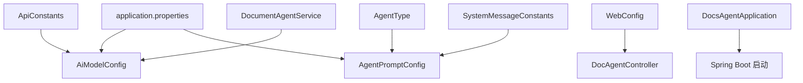
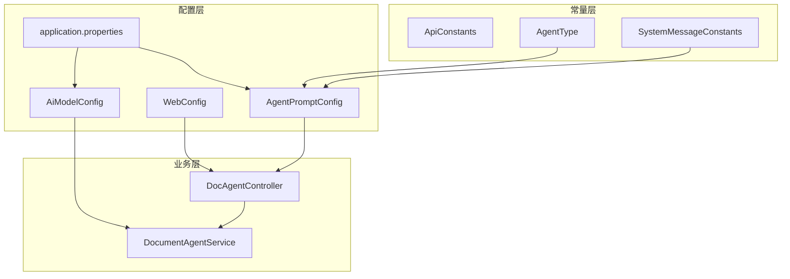
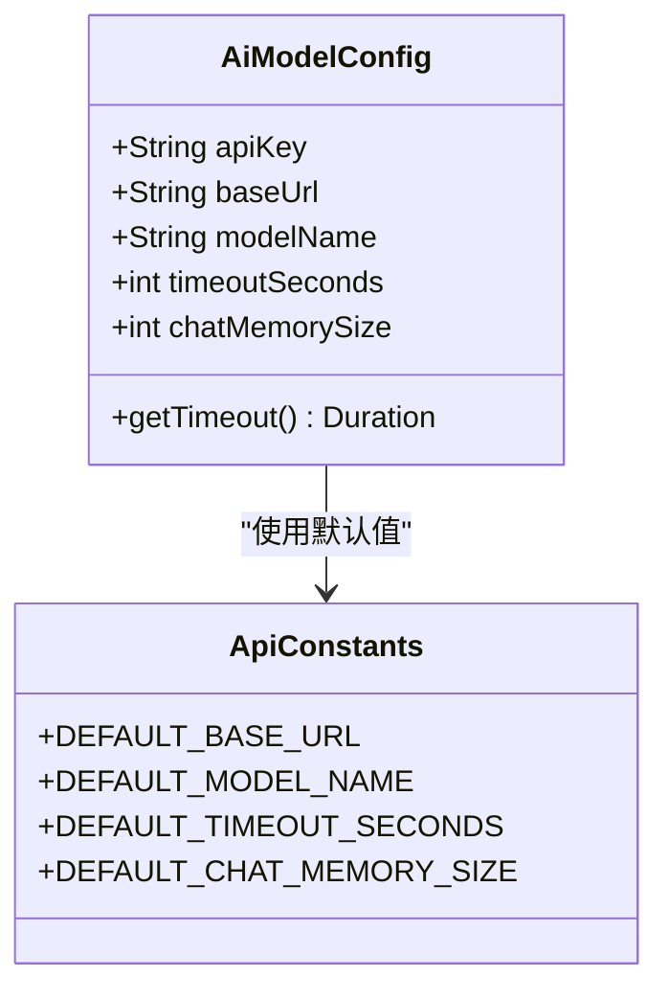
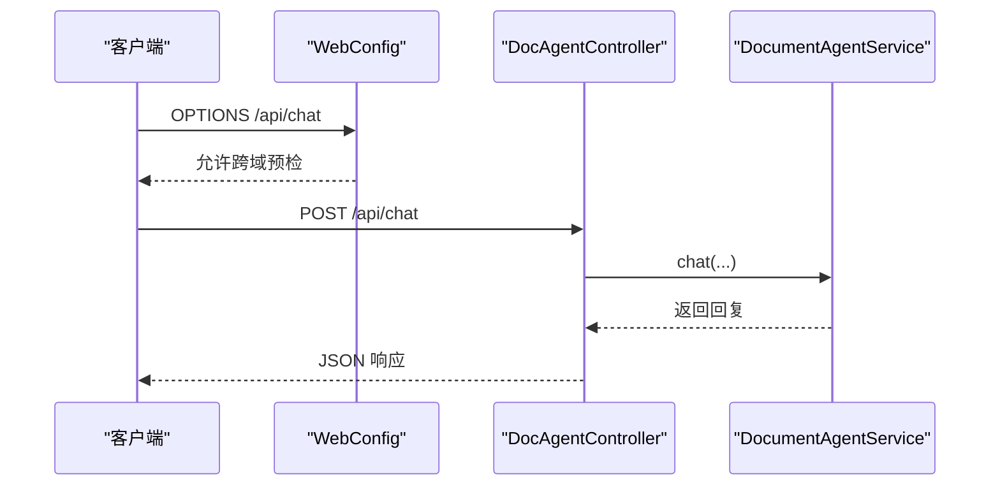
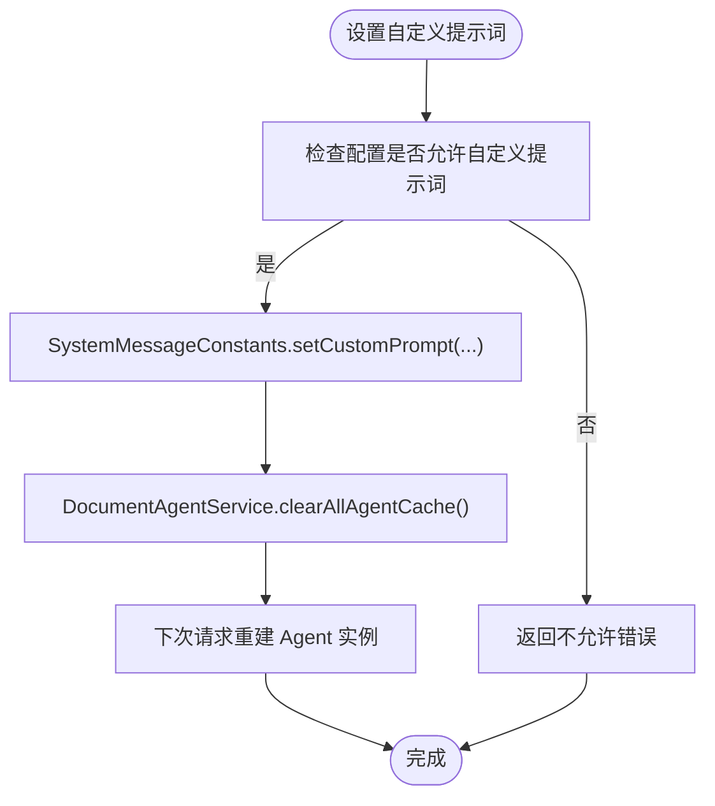
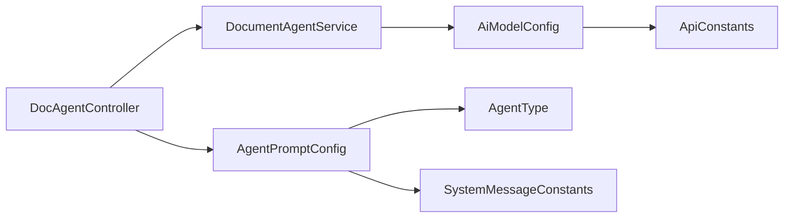

# 配置管理

<cite>
**本文引用的文件**
- [application.properties](file://src/main/resources/application.properties)
- [AiModelConfig.java](file://src/main/java/com/example/docs_agent/config/AiModelConfig.java)
- [WebConfig.java](file://src/main/java/com/example/docs_agent/config/WebConfig.java)
- [AgentPromptConfig.java](file://src/main/java/com/example/docs_agent/config/AgentPromptConfig.java)
- [ApiConstants.java](file://src/main/java/com/example/docs_agent/constant/ApiConstants.java)
- [AgentType.java](file://src/main/java/com/example/docs_agent/constant/AgentType.java)
- [SystemMessageConstants.java](file://src/main/java/com/example/docs_agent/constant/SystemMessageConstants.java)
- [DocAgentController.java](file://src/main/java/com/example/docs_agent/controller/DocAgentController.java)
- [DocumentAgentService.java](file://src/main/java/com/example/docs_agent/service/DocumentAgentService.java)
- [DocsAgentApplication.java](file://src/main/java/com/example/docs_agent/DocsAgentApplication.java)
</cite>

## 目录
1. [简介](#简介)
2. [项目结构](#项目结构)
3. [核心组件](#核心组件)
4. [架构总览](#架构总览)
5. [详细组件分析](#详细组件分析)
6. [依赖分析](#依赖分析)
7. [性能考虑](#性能考虑)
8. [故障排除指南](#故障排除指南)
9. [结论](#结论)
10. [附录](#附录)

## 简介
本文件面向配置管理，系统性阐述 application.properties 中的各项配置项，包括 AI 模型参数、服务器端口与 SSL、日志级别、以及数据库连接（本项目未启用数据库）。同时深入解析 AiModelConfig 的 AI 模型配置机制、WebConfig 的 Web 应用配置（CORS、静态资源、安全）、AgentPromptConfig 的提示词配置管理（系统提示词、用户自定义提示词、热更新），并提供最佳实践、环境变量管理指南、配置验证与故障排除方法。

## 项目结构
该项目采用 Spring Boot 标准目录结构，配置相关文件集中在：
- application.properties：应用级配置
- config 包：配置类（AiModelConfig、WebConfig、AgentPromptConfig）
- constant 包：常量定义（ApiConstants、AgentType、SystemMessageConstants）
- controller/service：业务层与控制器，体现配置的实际使用

图表来源
- [application.properties:1-37](file://src/main/resources/application.properties#L1-L37)
- [AiModelConfig.java:1-50](file://src/main/java/com/example/docs_agent/config/AiModelConfig.java#L1-L50)
- [AgentPromptConfig.java:1-88](file://src/main/java/com/example/docs_agent/config/AgentPromptConfig.java#L1-L88)
- [WebConfig.java:1-25](file://src/main/java/com/example/docs_agent/config/WebConfig.java#L1-L25)
- [ApiConstants.java:1-53](file://src/main/java/com/example/docs_agent/constant/ApiConstants.java#L1-L53)
- [AgentType.java:1-87](file://src/main/java/com/example/docs_agent/constant/AgentType.java#L1-L87)
- [SystemMessageConstants.java:1-234](file://src/main/java/com/example/docs_agent/constant/SystemMessageConstants.java#L1-L234)
- [DocumentAgentService.java:1-389](file://src/main/java/com/example/docs_agent/service/DocumentAgentService.java#L1-L389)
- [DocsAgentApplication.java:1-11](file://src/main/java/com/example/docs_agent/DocsAgentApplication.java#L1-L11)

章节来源
- [application.properties:1-37](file://src/main/resources/application.properties#L1-L37)
- [DocsAgentApplication.java:1-11](file://src/main/java/com/example/docs_agent/DocsAgentApplication.java#L1-L11)

## 核心组件
- application.properties：集中定义编码、服务器端口与 SSL、AI 模型参数、Agent 提示词策略、日志级别与控制台字符集、favicon 行为等。
- AiModelConfig：基于 @ConfigurationProperties(ai.model.*) 的模型配置类，提供 API Key、基础 URL、模型名、超时、聊天记忆窗口等属性及转换为 Duration 的便捷方法。
- AgentPromptConfig：基于 @ConfigurationProperties(agent.prompt.*) 的提示词配置类，支持默认类型、客户端覆盖开关、自定义提示词开关、以及运行时增删查自定义提示词。
- WebConfig：实现 WebMvcConfigurer，统一配置 CORS 映射与头部、方法、最大年龄等。
- ApiConstants：集中定义 API 基础路径、响应状态、请求头键名、默认模型与超时等常量。
- AgentType：定义 Agent 类型枚举及从代码解析的方法。
- SystemMessageConstants：内置各类型 Agent 的系统提示词模板，并提供自定义提示词的并发安全存储与获取。

章节来源
- [application.properties:14-27](file://src/main/resources/application.properties#L14-L27)
- [AiModelConfig.java:13-48](file://src/main/java/com/example/docs_agent/config/AiModelConfig.java#L13-L48)
- [AgentPromptConfig.java:15-86](file://src/main/java/com/example/docs_agent/config/AgentPromptConfig.java#L15-L86)
- [WebConfig.java:10-23](file://src/main/java/com/example/docs_agent/config/WebConfig.java#L10-L23)
- [ApiConstants.java:15-51](file://src/main/java/com/example/docs_agent/constant/ApiConstants.java#L15-L51)
- [AgentType.java:10-85](file://src/main/java/com/example/docs_agent/constant/AgentType.java#L10-L85)
- [SystemMessageConstants.java:10-234](file://src/main/java/com/example/docs_agent/constant/SystemMessageConstants.java#L10-L234)

## 架构总览
下图展示了配置在系统中的作用与交互关系，包括配置加载、控制器使用、服务层构建模型与提示词注入、以及热更新流程。

图表来源
- [application.properties:1-37](file://src/main/resources/application.properties#L1-L37)
- [AiModelConfig.java:13-48](file://src/main/java/com/example/docs_agent/config/AiModelConfig.java#L13-L48)
- [AgentPromptConfig.java:15-86](file://src/main/java/com/example/docs_agent/config/AgentPromptConfig.java#L15-L86)
- [WebConfig.java:10-23](file://src/main/java/com/example/docs_agent/config/WebConfig.java#L10-L23)
- [ApiConstants.java:15-51](file://src/main/java/com/example/docs_agent/constant/ApiConstants.java#L15-L51)
- [AgentType.java:10-85](file://src/main/java/com/example/docs_agent/constant/AgentType.java#L10-L85)
- [SystemMessageConstants.java:10-234](file://src/main/java/com/example/docs_agent/constant/SystemMessageConstants.java#L10-L234)
- [DocAgentController.java:34-43](file://src/main/java/com/example/docs_agent/controller/DocAgentController.java#L34-L43)
- [DocumentAgentService.java:25-34](file://src/main/java/com/example/docs_agent/service/DocumentAgentService.java#L25-L34)

## 详细组件分析

### application.properties 配置详解
- 编码配置
  - server.servlet.encoding.charset、enabled、force：统一字符集与强制编码，确保中文显示正常。
- 服务器配置
  - server.port：监听端口，默认 8080。
  - server.ssl.*：启用 HTTPS，使用 PKCS12 密钥库与密码。
- AI 模型配置（可被前端请求头覆盖）
  - ai.model.api-key：默认从环境变量读取，支持空值占位。
  - ai.model.base-url：默认 SiliconFlow 基础地址，可被前端 X-Base-URL 覆盖。
  - ai.model.model-name：默认大模型名称，可被前端 X-Model-Name 覆盖。
  - ai.model.timeout-seconds：默认 60 秒超时。
  - ai.model.chat-memory-size：默认聊天记忆窗口大小。
- Agent 提示词配置
  - agent.prompt.default-type：默认 Agent 类型代码。
  - agent.prompt.allow-client-override：是否允许前端覆盖类型。
  - agent.prompt.allow-custom-prompt：是否允许使用自定义提示词。
- 日志配置
  - logging.level.*：包级与子包级日志级别。
  - logging.charset.console：Windows 控制台字符集（GBK）。
  - logging.pattern.console：控制台日志格式。
- favicon 行为
  - spring.mvc.favicon.enabled=false：忽略 favicon.ico 请求，减少噪音日志。

章节来源
- [application.properties:3-37](file://src/main/resources/application.properties#L3-L37)

### AiModelConfig：AI 模型配置机制
- 配置绑定
  - @ConfigurationProperties(prefix="ai.model") 将 application.properties 中 ai.model.* 绑定到字段。
- 关键属性
  - apiKey、baseUrl、modelName：模型访问凭据与地址、模型标识。
  - timeoutSeconds：超时秒数，提供 getTimeout() 返回 java.time.Duration。
  - chatMemorySize：聊天记忆窗口大小。
- 默认值来源
  - ApiConstants.DEFAULT_*：提供默认值（基础 URL、模型名、超时、记忆窗口）。
- 使用场景
  - 控制器与服务层均可通过 AiModelConfig 获取配置，或直接使用请求头覆盖（优先级更高）。
- 性能与优化
  - 超时合理设置避免长时间阻塞。
  - 聊天记忆窗口适配文档上下文长度，避免过长导致性能下降。

图表来源
- [AiModelConfig.java:13-48](file://src/main/java/com/example/docs_agent/config/AiModelConfig.java#L13-L48)
- [ApiConstants.java:48-51](file://src/main/java/com/example/docs_agent/constant/ApiConstants.java#L48-L51)

章节来源
- [AiModelConfig.java:13-48](file://src/main/java/com/example/docs_agent/config/AiModelConfig.java#L13-L48)
- [ApiConstants.java:48-51](file://src/main/java/com/example/docs_agent/constant/ApiConstants.java#L48-L51)

### WebConfig：Web 应用配置
- CORS 配置
  - 映射 /api/**，允许任意来源、方法、头部，预检缓存 3600 秒。
- 静态资源
  - 项目包含静态页面（index.html），但未在 WebConfig 中显式配置静态资源映射；默认由 Spring Boot 自动配置处理。
- 安全配置
  - 当前未启用 Spring Security，CORS 为通配策略；生产环境建议限制来源与方法。
- 与控制器的关系
  - 控制器使用 @RequestMapping(ApiConstants.API_BASE_PATH) 绑定 /api 前缀，与 CORS 配置匹配。

图表来源
- [WebConfig.java:17-22](file://src/main/java/com/example/docs_agent/config/WebConfig.java#L17-L22)
- [DocAgentController.java:354-428](file://src/main/java/com/example/docs_agent/controller/DocAgentController.java#L354-L428)
- [DocumentAgentService.java:183-240](file://src/main/java/com/example/docs_agent/service/DocumentAgentService.java#L183-L240)

章节来源
- [WebConfig.java:10-23](file://src/main/java/com/example/docs_agent/config/WebConfig.java#L10-L23)
- [DocAgentController.java:34-43](file://src/main/java/com/example/docs_agent/controller/DocAgentController.java#L34-L43)

### AgentPromptConfig：提示词配置管理
- 配置绑定
  - @ConfigurationProperties(prefix="agent.prompt") 绑定默认类型、客户端覆盖、自定义提示词开关。
- 运行时管理
  - addCustomPrompt/getCustomPrompt/hasCustomPrompt/removeCustomPrompt：并发安全的 HashMap 存储。
- 与系统提示词集成
  - getDefaultAgentType：从配置解析默认 Agent 类型。
  - SystemMessageConstants：内置各类型提示词模板，支持自定义提示词覆盖。
- 热更新机制
  - 控制器提供 /api/custom-prompt 接口设置自定义提示词，并调用服务层 clearAllAgentCache 清理缓存，实现即时生效。
  - 服务层通过 ConcurrentMap 缓存 Agent 实例，清理后新请求会重新构建实例，从而应用最新提示词。

图表来源
- [AgentPromptConfig.java:55-86](file://src/main/java/com/example/docs_agent/config/AgentPromptConfig.java#L55-L86)
- [SystemMessageConstants.java:196-214](file://src/main/java/com/example/docs_agent/constant/SystemMessageConstants.java#L196-L214)
- [DocAgentController.java:475-495](file://src/main/java/com/example/docs_agent/controller/DocAgentController.java#L475-L495)
- [DocumentAgentService.java:307-310](file://src/main/java/com/example/docs_agent/service/DocumentAgentService.java#L307-L310)

章节来源
- [AgentPromptConfig.java:15-86](file://src/main/java/com/example/docs_agent/config/AgentPromptConfig.java#L15-L86)
- [SystemMessageConstants.java:169-223](file://src/main/java/com/example/docs_agent/constant/SystemMessageConstants.java#L169-L223)
- [DocAgentController.java:475-530](file://src/main/java/com/example/docs_agent/controller/DocAgentController.java#L475-L530)
- [DocumentAgentService.java:295-310](file://src/main/java/com/example/docs_agent/service/DocumentAgentService.java#L295-L310)

### 配置在控制器与服务中的使用
- 控制器
  - 通过 @RequestHeader 读取 X-API-Key、X-Base-URL、X-Model-Name，优先于配置文件。
  - 通过 AgentPromptConfig 决定 Agent 类型与是否允许自定义提示词。
  - 通过 SystemMessageConstants 获取系统提示词模板。
- 服务层
  - 通过 AiModelConfig 或请求头参数构建 OpenAiChatModel。
  - 使用 MessageWindowChatMemory 与工具集构建 AiServices。
  - 提供 clearAllAgentCache 以支持提示词热更新。

章节来源
- [DocAgentController.java:262-428](file://src/main/java/com/example/docs_agent/controller/DocAgentController.java#L262-L428)
- [DocumentAgentService.java:111-162](file://src/main/java/com/example/docs_agent/service/DocumentAgentService.java#L111-L162)
- [DocumentAgentService.java:253-278](file://src/main/java/com/example/docs_agent/service/DocumentAgentService.java#L253-L278)

## 依赖分析
- 配置类之间的耦合
  - AiModelConfig 依赖 ApiConstants 的默认值。
  - AgentPromptConfig 依赖 AgentType 与 SystemMessageConstants。
  - WebConfig 与 DocAgentController 通过 API 前缀关联。
- 外部依赖
  - Spring Boot 自动装配加载 application.properties。
  - LangChain4j 用于构建 AI Agent 与聊天记忆。
- 潜在循环依赖
  - 无直接循环依赖；配置类之间为单向使用关系。

图表来源
- [AiModelConfig.java:26,31,36,41](file://src/main/java/com/example/docs_agent/config/AiModelConfig.java#L26,L31,L36,L41)
- [AgentPromptConfig.java:45,65,75,84](file://src/main/java/com/example/docs_agent/config/AgentPromptConfig.java#L45,L65,L75,L84)
- [ApiConstants.java:48-51](file://src/main/java/com/example/docs_agent/constant/ApiConstants.java#L48-L51)
- [AgentType.java:63-84](file://src/main/java/com/example/docs_agent/constant/AgentType.java#L63-L84)
- [SystemMessageConstants.java:169-178](file://src/main/java/com/example/docs_agent/constant/SystemMessageConstants.java#L169-L178)
- [DocAgentController.java:43,354](file://src/main/java/com/example/docs_agent/controller/DocAgentController.java#L43,L354)
- [DocumentAgentService.java:31,141](file://src/main/java/com/example/docs_agent/service/DocumentAgentService.java#L31,L141)

章节来源
- [AiModelConfig.java:26,31,36,41](file://src/main/java/com/example/docs_agent/config/AiModelConfig.java#L26,L31,L36,L41)
- [AgentPromptConfig.java:45,65,75,84](file://src/main/java/com/example/docs_agent/config/AgentPromptConfig.java#L45,L65,L75,L84)
- [ApiConstants.java:48-51](file://src/main/java/com/example/docs_agent/constant/ApiConstants.java#L48-L51)
- [AgentType.java:63-84](file://src/main/java/com/example/docs_agent/constant/AgentType.java#L63,L84)
- [SystemMessageConstants.java:169-178](file://src/main/java/com/example/docs_agent/constant/SystemMessageConstants.java#L169,L178)
- [DocAgentController.java:43,354](file://src/main/java/com/example/docs_agent/controller/DocAgentController.java#L43,L354)
- [DocumentAgentService.java:31,141](file://src/main/java/com/example/docs_agent/service/DocumentAgentService.java#L31,L141)

## 性能考虑
- 超时与重试
  - 合理设置 ai.model.timeout-seconds，避免长时间等待；可在上游增加重试与熔断策略。
- 聊天记忆窗口
  - chat-memory-size 影响上下文长度与内存占用，建议结合文档段落数量与模型上下文限制调整。
- Agent 缓存
  - 服务层使用 ConcurrentMap 缓存 Agent 实例，避免重复构建；自定义提示词热更新时需清理缓存。
- 日志级别
  - 生产环境建议提高日志级别，减少 DEBUG 输出对性能的影响。

[本节为通用性能建议，无需特定文件引用]

## 故障排除指南
- 无法连接 AI 模型
  - 检查 ai.model.api-key、ai.model.base-url、ai.model.model-name 是否正确。
  - 确认网络可达性与防火墙设置。
- 跨域问题
  - 确认浏览器发起的 OPTIONS 预检请求是否命中 /api/**。
  - 生产环境建议限制 allowedOrigins 与 allowedMethods。
- 自定义提示词未生效
  - 确认 agent.prompt.allow-custom-prompt=true。
  - 确认已调用 /api/custom-prompt 设置并触发缓存清理。
- 日志乱码（Windows 控制台）
  - application.properties 已设置 logging.charset.console=GBK，确保控制台编码一致。
- favicon 请求噪音
  - spring.mvc.favicon.enabled=false 已关闭，若仍出现可检查静态资源映射。

章节来源
- [application.properties:9,15-18,23-27,30-34,37](file://src/main/resources/application.properties#L9,L15-L18,L23-L27,L30-L34,L37)
- [WebConfig.java:17-22](file://src/main/java/com/example/docs_agent/config/WebConfig.java#L17-L22)
- [DocAgentController.java:475-530](file://src/main/java/com/example/docs_agent/controller/DocAgentController.java#L475-L530)
- [DocumentAgentService.java:307-310](file://src/main/java/com/example/docs_agent/service/DocumentAgentService.java#L307-L310)

## 结论
本项目的配置体系以 application.properties 为核心，结合 AiModelConfig、AgentPromptConfig、WebConfig 三类配置类，实现了灵活的 AI 模型参数、提示词策略与 Web 层配置。通过请求头覆盖与提示词热更新机制，系统具备良好的可运维性与扩展性。建议在生产环境中进一步收紧 CORS、完善日志与监控，并对超时与缓存策略进行压测与调优。

[本节为总结性内容，无需特定文件引用]

## 附录

### 配置最佳实践
- 环境变量管理
  - 将敏感信息（如 AI API Key）置于环境变量，避免硬编码。
  - 使用 CI/CD 平台的安全变量注入，避免提交到仓库。
- 配置分层
  - 开发环境使用较短超时与较低日志级别；生产环境提高稳定性与可观测性。
- CORS 安全
  - 生产环境限制 allowedOrigins 为可信域名，限制方法与头部。
- 提示词治理
  - 自定义提示词需经审核与测试，避免污染默认模板。
  - 使用 clearAllAgentCache 时注意对在线服务的影响，建议在低峰期执行。

[本节为通用最佳实践，无需特定文件引用]