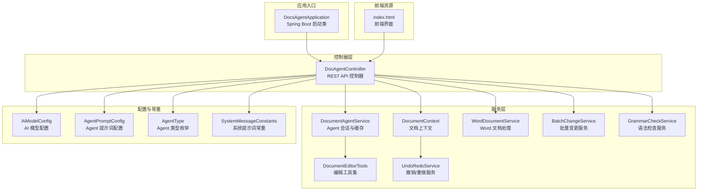
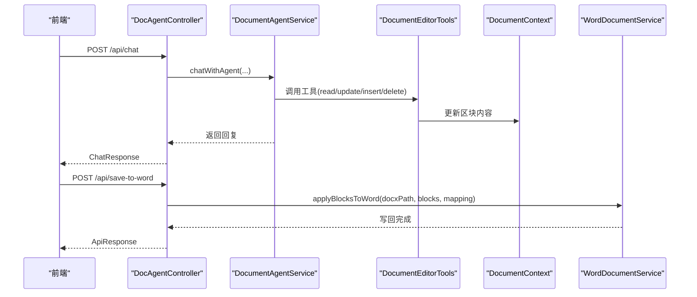
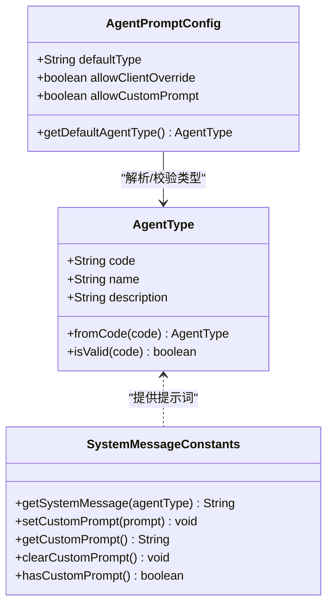
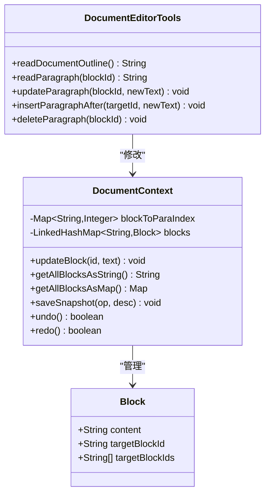
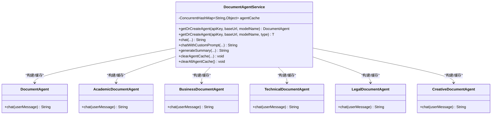
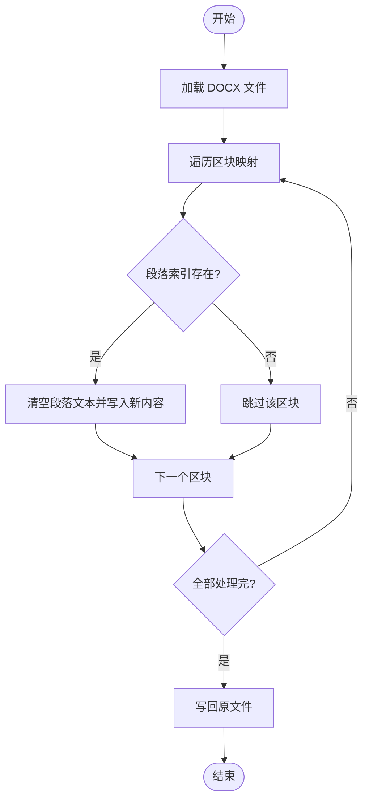
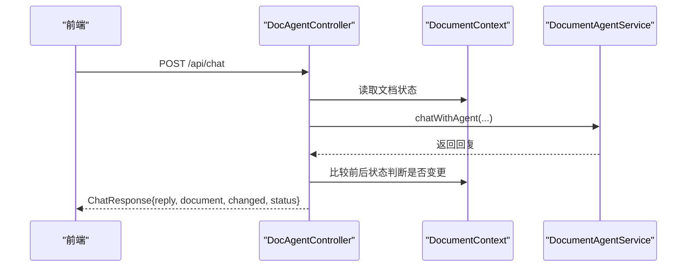
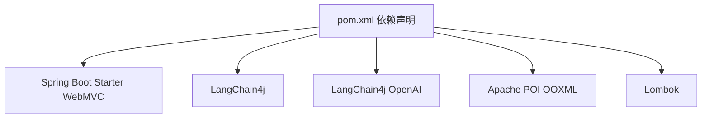

# 项目概述

<cite>
**本文档引用的文件**
- [pom.xml](file://pom.xml)
- [DocsAgentApplication.java](file://src/main/java/com/example/docs_agent/DocsAgentApplication.java)
- [application.properties](file://src/main/resources/application.properties)
- [index.html](file://src/main/resources/static/index.html)
- [AgentType.java](file://src/main/java/com/example/docs_agent/constant/AgentType.java)
- [SystemMessageConstants.java](file://src/main/java/com/example/docs_agent/constant/SystemMessageConstants.java)
- [AiModelConfig.java](file://src/main/java/com/example/docs_agent/config/AiModelConfig.java)
- [AgentPromptConfig.java](file://src/main/java/com/example/docs_agent/config/AgentPromptConfig.java)
- [DocAgentController.java](file://src/main/java/com/example/docs_agent/controller/DocAgentController.java)
- [DocumentAgentService.java](file://src/main/java/com/example/docs_agent/service/DocumentAgentService.java)
- [DocumentEditorTools.java](file://src/main/java/com/example/docs_agent/service/DocumentEditorTools.java)
- [DocumentContext.java](file://src/main/java/com/example/docs_agent/service/DocumentContext.java)
- [WordDocumentService.java](file://src/main/java/com/example/docs_agent/service/WordDocumentService.java)
- [Block.java](file://src/main/java/com/example/docs_agent/entity/Block.java)
- [ApiResponse.java](file://src/main/java/com/example/docs_agent/dto/ApiResponse.java)
</cite>

## 目录
1. [简介](#简介)
2. [项目结构](#项目结构)
3. [核心组件](#核心组件)
4. [架构总览](#架构总览)
5. [详细组件分析](#详细组件分析)
6. [依赖分析](#依赖分析)
7. [性能考虑](#性能考虑)
8. [故障排除指南](#故障排除指南)
9. [结论](#结论)
10. [附录](#附录)

## 简介
Docs-Agent 是一个基于 Spring Boot 的智能文档编辑系统，通过 LangChain4j 将大模型能力与 Office 文档处理相结合，提供面向多种场景的 AI Agent（学术论文、商业文案、技术文档、法律合同等），支持增量保存到 Word、语法检查、智能摘要生成等功能。系统采用“文档即代码”的理念，将文档抽象为可编辑的区块（Block），并通过工具化接口让 AI Agent 直接修改文档内容，实现从“对话”到“落地修改”的闭环。

## 项目结构
项目采用标准的 Spring Boot 分层结构：
- config：配置类（AI 模型参数、Agent 提示词策略）
- constant：常量定义（Agent 类型、系统提示词、API 常量）
- controller：RESTful API 控制器
- service：业务服务（Agent 会话、文档上下文、工具集、Word 文档处理等）
- dto：统一响应与请求 DTO
- entity：领域模型（Block）
- resources：静态页面、模板与配置文件

图表来源
- [DocsAgentApplication.java:1-11](file://src/main/java/com/example/docs_agent/DocsAgentApplication.java#L1-L11)
- [DocAgentController.java:1-636](file://src/main/java/com/example/docs_agent/controller/DocAgentController.java#L1-L636)
- [DocumentContext.java:1-205](file://src/main/java/com/example/docs_agent/service/DocumentContext.java#L1-L205)
- [DocumentEditorTools.java:1-105](file://src/main/java/com/example/docs_agent/service/DocumentEditorTools.java#L1-L105)
- [DocumentAgentService.java:1-389](file://src/main/java/com/example/docs_agent/service/DocumentAgentService.java#L1-L389)
- [WordDocumentService.java:1-64](file://src/main/java/com/example/docs_agent/service/WordDocumentService.java#L1-L64)
- [AiModelConfig.java:1-50](file://src/main/java/com/example/docs_agent/config/AiModelConfig.java#L1-L50)
- [AgentPromptConfig.java:1-88](file://src/main/java/com/example/docs_agent/config/AgentPromptConfig.java#L1-L88)
- [AgentType.java:1-87](file://src/main/java/com/example/docs_agent/constant/AgentType.java#L1-L87)
- [SystemMessageConstants.java:1-234](file://src/main/java/com/example/docs_agent/constant/SystemMessageConstants.java#L1-L234)
- [index.html:1-800](file://src/main/resources/static/index.html#L1-L800)

章节来源
- [pom.xml:1-111](file://pom.xml#L1-L111)
- [DocsAgentApplication.java:1-11](file://src/main/java/com/example/docs_agent/DocsAgentApplication.java#L1-L11)
- [application.properties:1-37](file://src/main/resources/application.properties#L1-L37)

## 核心组件
- 文档上下文（DocumentContext）：维护文档的内存状态，提供区块读写、撤销/重做、映射关系管理。
- 编辑工具集（DocumentEditorTools）：向 Agent 暴露只读读取与写入工具（读取、更新、插入、删除）。
- Agent 服务（DocumentAgentService）：管理多类型 Agent 的生命周期与缓存，支持默认类型、指定类型与自定义提示词。
- Word 文档服务（WordDocumentService）：基于 Apache POI 实现增量写回 Word 文档。
- 控制器（DocAgentController）：提供 REST API，包括文档状态管理、Agent 对话、批量变更、语法检查、摘要生成等。
- 配置与常量：AiModelConfig、AgentPromptConfig、AgentType、SystemMessageConstants。

章节来源
- [DocumentContext.java:1-205](file://src/main/java/com/example/docs_agent/service/DocumentContext.java#L1-L205)
- [DocumentEditorTools.java:1-105](file://src/main/java/com/example/docs_agent/service/DocumentEditorTools.java#L1-L105)
- [DocumentAgentService.java:1-389](file://src/main/java/com/example/docs_agent/service/DocumentAgentService.java#L1-L389)
- [WordDocumentService.java:1-64](file://src/main/java/com/example/docs_agent/service/WordDocumentService.java#L1-L64)
- [DocAgentController.java:1-636](file://src/main/java/com/example/docs_agent/controller/DocAgentController.java#L1-L636)
- [AiModelConfig.java:1-50](file://src/main/java/com/example/docs_agent/config/AiModelConfig.java#L1-L50)
- [AgentPromptConfig.java:1-88](file://src/main/java/com/example/docs_agent/config/AgentPromptConfig.java#L1-L88)
- [AgentType.java:1-87](file://src/main/java/com/example/docs_agent/constant/AgentType.java#L1-L87)
- [SystemMessageConstants.java:1-234](file://src/main/java/com/example/docs_agent/constant/SystemMessageConstants.java#L1-L234)

## 架构总览
系统采用“控制器-服务-工具-持久化”的分层架构。前端通过 REST API 与后端交互，后端通过 LangChain4j 与大模型通信，并通过 DocumentEditorTools 将模型的修改意图转化为对 DocumentContext 的操作，最终由 WordDocumentService 将变更增量写回到 Word 文档。

图表来源
- [DocAgentController.java:354-428](file://src/main/java/com/example/docs_agent/controller/DocAgentController.java#L354-L428)
- [DocumentAgentService.java:203-240](file://src/main/java/com/example/docs_agent/service/DocumentAgentService.java#L203-L240)
- [DocumentEditorTools.java:57-102](file://src/main/java/com/example/docs_agent/service/DocumentEditorTools.java#L57-L102)
- [DocumentContext.java:72-81](file://src/main/java/com/example/docs_agent/service/DocumentContext.java#L72-L81)
- [WordDocumentService.java:31-62](file://src/main/java/com/example/docs_agent/service/WordDocumentService.java#L31-L62)

## 详细组件分析

### Agent 类型与系统提示词
系统内置多种 Agent 类型，每种类型对应一套系统提示词，确保在不同场景下模型的行为与输出风格一致。支持通过配置允许前端覆盖类型、允许自定义提示词，并提供默认类型与提示词查询 API。

图表来源
- [AgentType.java:1-87](file://src/main/java/com/example/docs_agent/constant/AgentType.java#L1-L87)
- [SystemMessageConstants.java:1-234](file://src/main/java/com/example/docs_agent/constant/SystemMessageConstants.java#L1-L234)
- [AgentPromptConfig.java:1-88](file://src/main/java/com/example/docs_agent/config/AgentPromptConfig.java#L1-L88)

章节来源
- [AgentType.java:10-87](file://src/main/java/com/example/docs_agent/constant/AgentType.java#L10-L87)
- [SystemMessageConstants.java:16-234](file://src/main/java/com/example/docs_agent/constant/SystemMessageConstants.java#L16-L234)
- [AgentPromptConfig.java:15-88](file://src/main/java/com/example/docs_agent/config/AgentPromptConfig.java#L15-L88)

### 文档上下文与工具集
DocumentContext 将 Word 文档抽象为有序的 Block 集合，支持读取、更新、撤销/重做；DocumentEditorTools 暴露只读读取与写入工具，确保模型只能通过工具修改文档，保证一致性与可审计性。

图表来源
- [DocumentContext.java:1-205](file://src/main/java/com/example/docs_agent/service/DocumentContext.java#L1-L205)
- [DocumentEditorTools.java:1-105](file://src/main/java/com/example/docs_agent/service/DocumentEditorTools.java#L1-L105)
- [Block.java:1-47](file://src/main/java/com/example/docs_agent/entity/Block.java#L1-L47)

章节来源
- [DocumentContext.java:29-205](file://src/main/java/com/example/docs_agent/service/DocumentContext.java#L29-L205)
- [DocumentEditorTools.java:18-105](file://src/main/java/com/example/docs_agent/service/DocumentEditorTools.java#L18-L105)
- [Block.java:10-47](file://src/main/java/com/example/docs_agent/entity/Block.java#L10-L47)

### Agent 会话与缓存
DocumentAgentService 通过 LangChain4j 的 AiServices 构建不同类型的 Agent，使用 OpenAiChatModel 与大模型交互，并将 DocumentEditorTools 注册为工具。服务层维护 Agent 实例缓存，按 API Key、Base URL、模型名与 Agent 类型组合键进行缓存，避免重复初始化。

图表来源
- [DocumentAgentService.java:1-389](file://src/main/java/com/example/docs_agent/service/DocumentAgentService.java#L1-L389)

章节来源
- [DocumentAgentService.java:111-162](file://src/main/java/com/example/docs_agent/service/DocumentAgentService.java#L111-L162)
- [DocumentAgentService.java:203-240](file://src/main/java/com/example/docs_agent/service/DocumentAgentService.java#L203-L240)
- [DocumentAgentService.java:253-278](file://src/main/java/com/example/docs_agent/service/DocumentAgentService.java#L253-L278)

### Word 文档增量写回
WordDocumentService 基于 Apache POI 读取现有 Word 文档，仅对有变更的段落进行定点替换，然后写回原文件，避免全量重写带来的性能与一致性问题。

图表来源
- [WordDocumentService.java:31-62](file://src/main/java/com/example/docs_agent/service/WordDocumentService.java#L31-L62)

章节来源
- [WordDocumentService.java:31-62](file://src/main/java/com/example/docs_agent/service/WordDocumentService.java#L31-L62)

### 控制器 API 流程
控制器提供完整的文档编辑与 AI 交互 API，包括文档状态管理、Agent 对话、批量变更、语法检查、摘要生成等。以下序列图展示典型对话流程。

图表来源
- [DocAgentController.java:354-428](file://src/main/java/com/example/docs_agent/controller/DocAgentController.java#L354-L428)
- [DocumentContext.java:390-414](file://src/main/java/com/example/docs_agent/service/DocumentContext.java#L390-L414)

章节来源
- [DocAgentController.java:354-428](file://src/main/java/com/example/docs_agent/controller/DocAgentController.java#L354-L428)

## 依赖分析
项目采用 Maven 管理依赖，核心依赖包括：
- Spring Boot Web MVC：提供 Web 应用基础能力
- Lombok：减少样板代码
- LangChain4j 与 LangChain4j OpenAI：集成大模型能力
- Apache POI OOXML：处理 Word/Excel 等 Office 文档

图表来源
- [pom.xml:37-78](file://pom.xml#L37-L78)

章节来源
- [pom.xml:29-78](file://pom.xml#L29-L78)

## 性能考虑
- Agent 实例缓存：通过组合键缓存不同配置与类型的 Agent 实例，降低初始化开销。
- 文档增量写回：仅对有变更的段落进行替换，减少 IO 开销。
- 上下文限制：摘要生成前对文档长度进行限制，避免超出模型上下文窗口。
- 日志与编码：配置日志级别与控制台编码，便于在 Windows 环境下排查问题。

## 故障排除指南
- 保存 Word 失败：检查文件路径与权限，查看控制器错误响应与日志。
- 文档为空导致无法处理：确保先调用初始化接口或扫描全文后再进行对话。
- Agent 执行异常：检查 API Key、Base URL、模型名与超时配置，查看服务层异常抛出与日志。
- 自定义提示词无效：确认配置允许自定义提示词，并在设置后清理 Agent 缓存。

章节来源
- [DocAgentController.java:52-66](file://src/main/java/com/example/docs_agent/controller/DocAgentController.java#L52-L66)
- [DocAgentController.java:377-387](file://src/main/java/com/example/docs_agent/controller/DocAgentController.java#L377-L387)
- [DocumentAgentService.java:236-239](file://src/main/java/com/example/docs_agent/service/DocumentAgentService.java#L236-L239)
- [DocAgentController.java:483-494](file://src/main/java/com/example/docs_agent/controller/DocAgentController.java#L483-L494)

## 结论
Docs-Agent 将大模型能力与 Office 文档处理深度融合，通过标准化的 Agent 类型与工具化接口，实现了从“智能编辑”到“文档落地”的高效闭环。系统具备良好的扩展性与可配置性，适合在学术、商业、技术、法律等多种文档场景中使用。

## 附录

### 快速开始指南
- 环境要求
  - Java 17+
  - Maven
  - 可选：浏览器访问前端页面
- 安装步骤
  - 克隆仓库后，使用 Maven 构建并启动 Spring Boot 应用。
  - 默认端口为 8080，可通过配置文件修改。
- 基本使用示例
  - 初始化文档状态：POST /api/init-document
  - 与 Agent 对话：POST /api/chat
  - 增量保存到 Word：POST /api/save-to-word
  - 获取 Agent 类型与提示词：GET /api/agent-types, GET /api/agent-prompt/{typeCode}
  - 语法检查：POST /api/grammar-check
  - 生成摘要：POST /api/summarize

章节来源
- [application.properties:8-19](file://src/main/resources/application.properties#L8-L19)
- [DocAgentController.java:86-96](file://src/main/java/com/example/docs_agent/controller/DocAgentController.java#L86-L96)
- [DocAgentController.java:354-428](file://src/main/java/com/example/docs_agent/controller/DocAgentController.java#L354-L428)
- [DocAgentController.java:51-66](file://src/main/java/com/example/docs_agent/controller/DocAgentController.java#L51-L66)
- [DocAgentController.java:437-448](file://src/main/java/com/example/docs_agent/controller/DocAgentController.java#L437-L448)
- [DocAgentController.java:456-467](file://src/main/java/com/example/docs_agent/controller/DocAgentController.java#L456-L467)
- [DocAgentController.java:271-343](file://src/main/java/com/example/docs_agent/controller/DocAgentController.java#L271-L343)
- [DocAgentController.java:559-634](file://src/main/java/com/example/docs_agent/controller/DocAgentController.java#L559-L634)